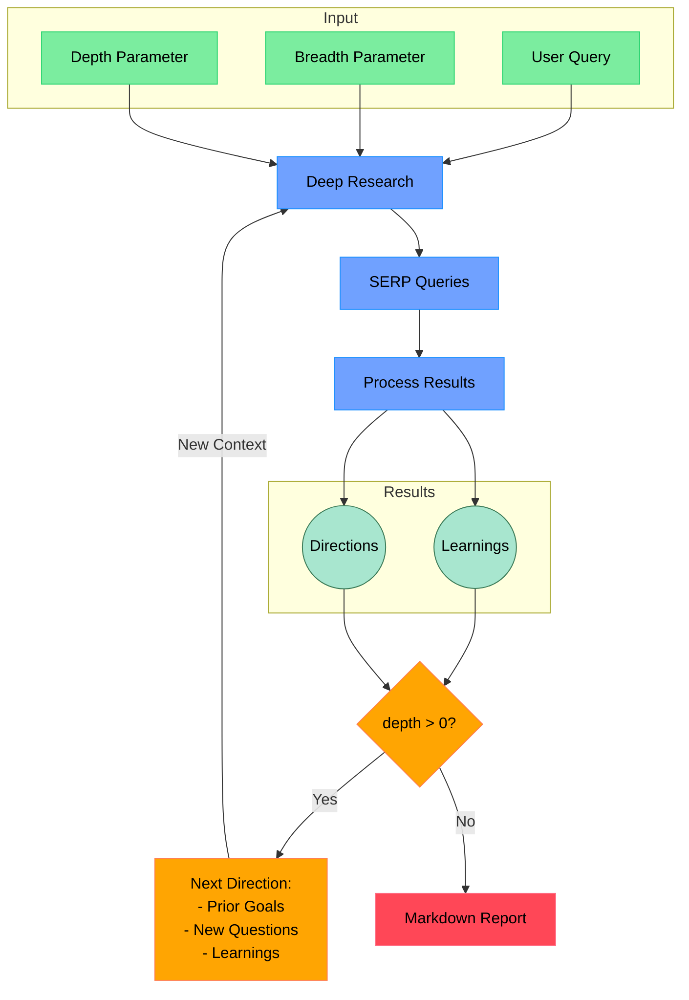

* content
{:toc}

# 大模型应用: 搜索


## 大模型搜索


### 搜索demo


#### ollama 本地搜索

【2024-3-29】[LLocalSearch](https://github.com/nilsherzig/LLocalSearch) 开源的完全本地化的AI搜索工具，无需 OpenAI 或 Google API 密钥。
- 基于 ollama, 7b 模型

项目特点：
- 🕵️ 完全本地化运行，不需要连接到外部API，因此无需API密钥。
- 💸 适用于性能相对较低的大型语言模型硬件，例如在演示视频中使用的是7b模型。 
- 🤓 提供详细的进度日志，这有助于用户更好地理解搜索和处理过程。 
- 🤔 支持用户提出后续问题，以便深入探讨或解决问题。
- 📱 界面对移动设备友好，适合在手机或平板电脑上使用。 
- 🚀 使用Docker Compose工具，可以快速且轻松地部署此服务。 
- 🌐 提供网络界面，使用户可以从任何设备轻松访问和使用。 
- 💮 该服务提供精心设计的用户界面，支持浅色和深色模式，满足不同用户的视觉偏好。

```sh
git clone https://github.com/nilsherzig/LLocalsearch.git
# 1. make sure to check the env vars inside the `docker-compose.dev.yaml`.
# 2. Make sure you've really checked the dev compose file not the normal one.
# 3. build the containers and start the services
make dev 
# Both front and backend will hot reload on code changes. 
```

#### Ask.py

【2025-1-20】[Ask.py](http://github.com/pengfeng/ask.py)：一个简单的Python程序，实现了 搜索-提取-总结 流程
- Demo: [leettools](https://svc.leettools.com/)

命令行或通过 GradIO UI 运行，控制输出行为，比如提取结构化数据或改变输出语言，还能控制搜索行为，比如限制特定网站或日期，或仅抓取指定URL列表的内容。
- 


### 搜索模型

#### WebGPT

【2021-12-17】基于GPT3模型在搜索结果方面的优化
- [WebGPT: Improving the factual accuracy of language models through web browsing](https://arxiv.org/abs/2112.09332)

把原先需要人工创造的原始数据，或需要爬取的数据，直接通过输入层，从网页端Search Query到模型，经过内部网络的隐藏单元推理后，到输出层与人工结果进行对比，然后再调参。
- 把工程方法融入到了模型训练的流程中，所以称之为“对GPT3做了一点小调整”。

数据生产分为两个部分: demostration（演示）和comparison（对比）。
- **demonstration**: 按照人类使用搜索引擎时的操作，针对给定的问题，对搜索引擎返回的结果，进行过滤。
  - OpenAI将上述复杂的过程简单抽象为了10个commands（指令）。在特定开发的标注平台，记录人类的搜索过程，并将此过程中的操作和上下文转换为带标签的语料——语料的输入是上下文，command是具体操作。值得注意的是，为了包含搜索过程中的历史操作，上下文包含了对操作的总结。
  - 
  - 
- **comparison**: 针对某个特定的问题，模型生成两个答案，标注人员先对每个答案从trustworthness（可信度）、来源对结果的支持程度进行打分。在对两个答案进行对比打分。
  - 


WebGPT 的训练是在 pre-trained GPT 的基础上进行 finetune，finetune 的方法挺有趣的，采用了 behavior cloning, reward modeling, RL, rejection sampling

模型由四个部分组成：
- Behavior cloning（以下简称BC）
- Reward model（以下简称RM）
- Reinforcement learning（以下简称RL）
- Reject Sampling（以下简称RS）

这些均由GPT3类模型微调而来。做这个选择的原因就是GPT3模型在阅读理解、答案合成等领域涌现出了零样本学习的能力

主要作用如下：
- Behavior cloning
  - 基于demonstration数据，模仿人类搜索+提取信息行为。可以简单地理解为一个分类任务的微调。
- Reward model
  - 基于comparison数据，输入问题、答案以及引用，模型给出一个得分，相当于是一个回归任务的微调。但由于得分的主观性过大，这里输入采用了同一个问题、两组答案与引用，groundTruth为comparison数据的标签，训练目标函数为交叉熵。
- Reinforcement learning
  - 这里的强化学习模型采用BC模型的参数初始化，通过RM生成奖励值，利用PPO算法更新模型参数，使得模型生成的结果得分越来越高。
- Reject Sampling
  - 拒绝采样，对BC / RL模型生成的结果进行采样，并对采样后的结果通过RM选取回报值最大的结果作为最终结果。

结果对比
- 5.1节介绍了不同部分组合的对比结果。主要对比RL、RS与baseline的BC的结果之间的对比。
- 结论比较反直觉
  - 一方面，虽然RL、RS比baseline都有提升，但RS的提升要更明显些；
  - 另一方面，经过RL、RS两步的结果没有只进行RS的结果提升大。
- 文章给出的可能原因是RS不需要更新基础的BC模型参数，而RL+RS同时对RM的结果优化，可能造成对RM的过度优化。

作者：[Century See](https://www.zhihu.com/question/506813687/answer/2926709800)


#### WebCPM

【2023-5-15】WebCPM 成功实践了 [BMTools](https://mp.weixin.qq.com/s/NLzno1XRHQLyMFfh5CeJpw), 中文领域首个基于交互式网页搜索的问答开源模型框架 `WebCPM`，这一创举填补了国产大模型该领域的空白
- [paper](https://arxiv.org/abs/2305.06849), [code](https://github.com/thunlp/WebCPM)
- WebCPM 的特点在于其信息检索基于交互式网页搜索，能够像人类一样与搜索引擎交互从而收集回答问题所需要的事实性知识并生成答案。换言之，大模型在联网功能的加持下，回答问题的实时性和准确性都得到了飞跃式增强。
- WebCPM 对标的是 WebGPT ， WebGPT 也正是微软近期推出的 New Bing 背后的新一代搜索技术。同 WebGPT一样，WebCPM 克服了传统的 LFQA（ Long-form Question Answering）长文本开放问答范式的缺陷：依赖于非交互式的检索方法，即仅使用原始问题作为查询语句来检索信息。


### Search Agent


#### Multi-Agent

论文
- 【2025-2-6】同济、新加坡南洋理工 提出 MaAS
  - 论文 [Multi-agent Architecture Search via Agentic Supernet](https://arxiv.org/pdf/2502.04180)
  - 代码 [MaAS](https://github.com/bingreeky/MaAS)

早期多智能体系统提供专业能力，但严重依赖手动配置
- 如 `CAMEL`（Li et al.， 2023）、`AutoGen`（Wu et al.， 2023）和 `MetaGPT`（Hong et al.， 2023）
- 手工配置：提示工程、智能体分析和智能体间通信流水线（Qian et al.， 2024）。
- 这种依赖限制了多智能体系统对不同领域和应用场景的快速适应

多智能体系统设计自动化
- 优化**Agent间通信**: `DsPy`（Khattab et al.， 2023）和 `EvoPrompting` （Guo et al.， 2023） 自动提示优化，`GPTSwarm`（Zog et al.，2024）和 `G-Designer`（Zhang et al.，2024b）
- **自我进化**Agent分析: `EvoAgent`（Yuan et al.，2024）和 `AutoAgents`（Chen et al.，2023a）

然而，专注于自动化系统的**特定**方面。

随后，`ADAS`（胡等人，2024a）、`AgentSqure`（Shang 等人，2024）和 `AFlow`（Zhang 等人，2024c）拓宽了设计搜索空间 --- SOTA 方法
 ODS 通过不同的**搜索范式**为给定数据集优化单个复杂（多）代理工作流程，例如: **启发式**搜索（胡 et al.， 2024a）、**蒙特卡洛树**搜索（Zhang et al.， 2024c）和**进化**（Shang et al.， 2024），超越了手动设计系统的性能
问题
- 性能受资源限制，例如令牌成本、LLM调用和推理延迟。现代方法倾向于针对复杂和资源密集型的 agen 进行优化

We introduce MaAS, an automated framework that samples query-dependent agentic systems from the supernet, delivering high-quality solutions and tailored resource allocation (e.g., LLM calls, tool calls, token cost). Comprehensive evaluation across six benchmarks demonstrates that MaAS (I) requires only 6 ∼ 45% of the inference costs of existing handcrafted or automated multi-agent systems, (II) surpasses them by 0.54% ∼ 11.82%, and (III) enjoys superior cross-dataset and cross-LLM-backbone transferability. 

MaAS 自动化框架从超网中采样query相关的智能体系统，提供高质量的解决方案和定制的资源分配（大语言模型调用、工具调用、令牌成本）。

Agent超网是一个**级联**的**多层**工作流，包括 
- ❶ 多个Agent算子: CoT （Wei et al.， 2022）、Multi-agent Debate （Du et al.， 2023）、ReAct （Yao et al.， 2023）），以及
- ❷ 算子跨层的**参数化概率分布**。
- 训练期间，MaAS 利用**控制器网络**对以query为条件的多代理架构进行采样。分布参数和运算符根据环境反馈共同更新，前者的梯度通过蒙特卡洛采样近似，后者梯度通过文本梯度估计。
- 推理过程，对于不同query，MaAS 对合适的多智能体系统进行采样，提供令人满意的分辨率和适当的推理资源，从而实现任务定制的集体智慧

六个基准综合评估: MaAS
- ❶ MaAS 高性能，比现有的**手工**或**自动化**多智能体系统高出 0.54% ∼ 11.82%;
- ❷ 节省token，在 MATh 基准上优于 SOTA 基线 AFlow，训练成本为 15%，推理成本为 25%;
- ❸ 可迁移: 跨数据集和 LLM-backbone;
- ❹ 归纳式: 对看不见的Agent运算符泛化性强

- （I）仅需现有手工制作或自动化多智能体系统推理成本的 6% - 45%
- （II）高出 0.54% - 11.82%，并且
- （III）具有卓越的跨数据集和跨大语言模型骨干的可转移性。

#### RL + Agent

【2025-4-9】 rl 和 search agent 结合。

没法互相比较算法或框架策略上的优劣、评估方法上不一致。 multihop 数据集，急需统一 leaderboard。

实验来看 纯 deep seekr1+prompt 或者 sf t在multihop上可以达到很高的指标。

- search + RL
  - 人大 [r1-seacher](https://arxiv.org/pdf/2503.05592) 
- University of Illinois at Urbana-Champaign [search-r1 paper](https://arxiv.org/pdf/2503.09516)  
- baichuan research 
  - [paper](https://arxiv.org/pdf/2503.19470) 
- search & browse + RL
  - DeepResearcher: 上海交大 [paper](https://arxiv.org/pdf/2504.03160)
- search + offline rl
  - stanford deep mind: [Synthetic Data Generation & Multi-Step RL for Reasoning & Tool Use](https://arxiv.org/pdf/2504.04736)  
- search +SFT + RL
  - 北京交通大学 AutoCoa [paper](https://arxiv.org/pdf/2503.06580)


## 搜索产品


### perplexity.ai

待补充


### 秘塔

【2024-4-11】[国产AI搜索之光，秘塔AI搜索，打败Perplexity？](https://m.cyzone.cn/article/758618.html)

秘塔科技由`闵可锐`在2018年4月创立。CEO`闵可锐`本科毕业于复旦计算机科学，是牛津大学数学专业的硕士，美国伊利诺伊大学香槟分校的博士，曾任玻森数据CTO、猎豹移动首席科学家，并在微软做过实习研究员，也参与过谷歌项目。

秘塔AI推出的[秘塔AI搜索](https://metaso.cn/), 中国版 Perplexity 的 AI搜索引擎“秘塔AI搜索”
- 注册后即可免费使用，不用科学上网，也没有语言上的理解误差，在中文语境上的表现更有优势。其slogan是：“没有广告，直达结果”。
- 示例：[o1原理](https://metaso.cn/search/8528655713793687552?q=o1%E7%9A%84%E5%8E%9F%E7%90%86)

截至2024年3月1日, 前28天，秘塔AI搜索网站共计访问478.3万次，峰值在3月18日达到45万次。

秘塔科技推出了4款产品：秘塔**AI搜索**、秘塔**写作猫**、秘塔**翻译**、秘塔**检索**。其中秘塔写作猫之前被大多文字工作者们所熟知。

秘塔AI搜索特点：
- 1、没有广告，直达结果：秘塔AI搜索界面只有一个搜索框，没有广告和闲杂信息的干扰。
- 2、结构化信息展示：秘塔AI搜索会将搜索结果整理成更方便阅读的脑图和大纲形式。
- 3、信息来源追溯：秘塔AI搜索为每条搜索结果、每条信息提供了来源链接，用户可以轻松溯源验证信息的出处和可靠性。
- 4、辅助信息梳理：秘塔AI搜索会整合和搜索主题相关的辅助信息，包括相关事件名称、事件时间线、相关人物组织等，以表格的形式呈现，让用户更全面理解搜索主题。
- 5、学术搜索模式：秘塔AI搜索在首页搜索框，将搜索范围限定为学术后，信息来源会从全网聚焦到专业期刊和论文。还增加了一个快速浏览摘要的功能，最后汇总所有的参考文献，并且是导出即可使用的规范格式。

相比于Perplexity，秘塔AI搜索实际上走了一条具有差异化的路线。Perplexity开启co-pilot之后会引导你追问下一个问题，给出的模态会更多，包括图片和视频源。

背后自研大模型 `MetaLLM`（基于Transformer底层架构投入中文语料训练），支持多轮对话式搜索，被誉为**中国版Perplexity**。


工具添加
- Chrome 插件添加: [秘塔AI](https://chromewebstore.google.com/detail/%E7%A7%98%E5%A1%94ai%E6%90%9C%E7%B4%A2/amjmldchkefejkpgebhgioimmfkakgpo)
- Chrome 站点搜索: 
  - 设置页面: chrome://settings/searchEngines
  - Site search -> Add
    - 名称：秘塔AI搜索
    - 快捷字词：metaso.cn
    - 网址格式：https://metaso.cn/?q=%s
- 其它设置[方法](https://metaso.cn/browser-setting#title2)


### devvai

【2023-11-30】最懂程序员的新一代AI搜索引擎来了，[devvai](https://devv.ai/zh) 可以基本代替使用Google/StackOverflow等等的使用场景
- 一款专门面向中文开发者群体的AI搜索引擎，接入了搜索引擎数据，回答的内容基本都是最新的，很适合用来学习，比如对编程中的某个地方不理解，可以直接使用关键词搜索，就可以获得一个相对来说比较完善的技术摘要，右侧还可以点进原文去查看具体内容！而且还全部免费
- 更快速的代码搜索体验


### Lepton Search

【2024-1-14】贾扬清内侧版 [Lepton Search](https://search.lepton.run/) 
- 类似季逸超的 [Peak Labs](https://www.peak-labs.com/en/) 推出的 [Magi](https://magi.com/)，暂停服务

500行Python代码构建的AI搜索工具，而且还会开源。后端是 `Mixtral-8x7b` 模型，托管在 LeptonAI 上，输出速度能达到每秒大约200个 token，用的搜索引擎是 Bing 的搜索 API。
- [search_with_lepton](https://github.com/leptonai/search_with_lepton)
- [体验](https://search.lepton.run/search)
- 

作者还写了一下自己的经验：
- (1) 搜索质量至关重要。优质的摘要片段是形成精准概括的关键。
- (2) 适当加入一些虚构内容实际上有助于补充摘要片段中缺失的“常识性信息”。
- (3) 在进行内容概括时，开源模型表现出了卓越的效果

### Arc Search

【2024-1-31】[基于大模型的Arc Search：颠覆百度的AI搜索来了？](https://www.toutiao.com/article/7330181327859958307)

2022 年底，一家名不见经传的初创公司——`The Browser Company` 推出了全新浏览器 `Arc Browser`，在理念和交互设计上完全不同于 Chrome 等今天常用的浏览器，很多用户、博客和媒体都给出了极高的评价。
- 「Arc Browser 是我一直在等待的 Chrome 替代品，」The Verge 的 David Pierce 评价道。

2023年，Arc Browser 进行了多次迭代，也在海外和国内都获得了许多拥趸，支持平台也从最初的 macOS 扩展到了 iOS 和 Windows。

这两天，The Browser Company 突然「推倒」了 iOS 上的 `Arc Browser`，基于生成式 AI 带来的颠覆，推出了一款全新的应用：`Arc Search`。

本质上 Arc Search 还是一款移动平台上浏览器，根据官方公告，「Arc Search」将在移动平台上全面取代「Arc Browser」。

Arc Search 有两种浏览模式
- 一是 **传统模式**，通过搜索词直接转到谷歌的搜索结果页，也可以输入网址进行访问；
- 二是 **AI模式**，类似其他生成式 AI 搜索一样，用户可以用自然语言对话的形式输入问题或者提示词。

输入问题或者提示词后，按下「Browser for Me」，AI 就通过阅读相关网页了解信息，再针对问题进行总结、回答。最终，Arc Search 会以统一的排版和格式呈现 AI 生成的回答，通常是先看到回答的「要点」和「最佳搜索结果」，接着再看到详细的回答，最后还附上一系列相关网页推荐。

举个例子，输入「为什么 Twitter 现在叫 X」后点击「Browser for Me」，就像字面意思，AI 将会为用户浏览包括 CBS 新闻、纽约时报、伦敦大学、Tech Radar 以及 YouTube 等 6 个网页的内容，然后针对问题进行提炼和总结，生成回答。
- 等待 AI 浏览、理解、再回答的过程中，Arc Search 利用 iPhone 的振动进行反馈，让用户可以明确感知到这一过程，这是一个值得称赞的细节。

不同于 ChatGPT，Arc Search 是建立在**传统搜索**方式的基础上，让 AI 浏览搜索结果页上的 6 个「最佳」结果，再利用生成式 AI 的技术优势针对问题进行总结、归纳。

Arc Search 的巧妙之处
- AI 生成回答前，先通过传统搜索引擎进行了一层「过滤」，筛选出内容质量较高的相关网页，再基于这些内容生成答案，可以在一定程度上降低大模型「幻觉」带来的影响，在回答质量、准确性上也更多一些保证。

虽然 The Browser Company 没有明确指出 Arc Search 背后调用的大模型，但按照 Arc Browser 的相关报道，Arc Search 应该也是通过 API 调用了包括 GPT-4 在内的混合模型。


## 【2025-2-2】Deep Research

参考
- 【2025-2-2】[Introducing deep research](https://openai.com/index/introducing-deep-research/)
- 【2025-2-23】[OpenAI Deep Research是什么？如何使用？你想知道的都在这儿！](https://zhuanlan.zhihu.com/p/26477947844)

Deep Research 是 OpenAI集成于ChatGPT中的一项全新功能，其独特之处在于能够自主进行网络信息检索、整合多源信息、深度分析数据，并最终提供全面深入的解答。

Deep Research 的推出，标志着OpenAI在智能体上取得了重要进展。

### 功能

该功能具备**自适应学习**、**持续进化**和**动态调整**的能力。可处理和分析来自网络的各类信息，包括文本、图像、PDF 文档等，其工作模式与人类研究人员高度相似。

在 Humanity’s Last Exam 和 GAIA 两项权威基准测试中，Deep Research的表现均显著优于同类竞争产品和以往的AI模型。
- 
- 

对于搞金融、科研、政策、工程的专业人士来说，Deep Research可能会彻底改变他们的工作方式，帮他们省下大量上网查资料的时间。

Deep Research 虽然很厉害，但离真正的通用人工智能（AGI）还差得远。只是一个辅助工具，不能代替人类研究员。AI还有很长的路要走。

### 原理

Deep Research 工作机制
- 把一个复杂任务拆成小块，然后一步步解决，与人类研究人员的思路高度一致。

接收到任务指令后，Deep Research 
- 首先进行**任务理解**和**步骤规划**
- 随后从多个在线信息源检索相关资料，整合不同来源的信息片段
- 最终基于分析结果生成研究报告。

Deep Research 跟 ChatGPT 普通功能最大的区别：能自己干活。

它会投入时间深入探索多个信息源，以构建全面深入的答案。对于那些需要深入理解和分析的复杂问题，Deep Research要好用很多。

### 问题

问题：
- • 信息准确性： 有时信息不对，对于做研究来说其实挺关键的。
- • 信息可靠性甄别： 区分可靠信息与不可靠信息方面存在一定困难。
- • 不确定性表达： 确表达不确定性的情况下，可能无法准确传达。说人话就是明明它不确定，却不说出来。
- • 报告与引文格式： 生成的报告和引文在格式上可能存在瑕疵。
- • 可用性限制： 目前仅对ChatGPT Pro用户开放，且一个月限100次。
- • 计算资源需求： 由于其复杂的运算机制，Deep Research对计算资源的需求较高，速度可能比普通ChatGPT很多。


## 开源复现

总结
1. Hugging Face 的 Open Deep Research
2. Jina AI 的 DeepResearch
3. OpenDeepResearcher
4. open-deep-research
5. deep-research

GAIA基准测试上
- Open Deep Research 的准确率为**55%**，虽然比原版 Deep Research **67%**低，但仍是提供的解决方案中性能最好的。

### Open Deep Research

openai research 发布后, 仅24h, huggingface 就完成了复现

 [Open Deep Research](https://github.com/dzhng/deep-research) 是一个 AI 驱动的**研究助手**，通过搜索引擎、网络爬虫和大语言模型进行迭代式深度研究。提供简单的深度研究代理实现，保持代码量小于 500 行以便理解和拓展。

特色包括:
- 迭代研究、智能查询生成、深度广度可控、智能跟进、生成综合报告及并发处理。

主要功能
- 迭代研究：通过迭代生成搜索查询、处理结果，并根据发现的内容进行更深入的研究。
- 智能查询生成：使用大型语言模型（LLMs）根据研究目标和先前的发现生成有针对性的搜索查询。
- 深度和广度控制：可配置的参数，用于控制研究的广度和深度。
- 智能跟进：生成后续问题，以更好地理解研究需求。
- 综合报告：生成详细的 Markdown 报告，包含研究发现和来源。
- 并发处理：并行处理多个搜索和结果，提高效率。

原理
- 输入：用户输入查询内容、广度参数和深度参数。
- 深度研究：根据输入进行深度研究，生成 SERP（搜索引擎结果页面）查询。
- 处理结果：对查询结果进行处理，提取学习内容和研究方向。
- 决策判断：根据深度参数判断是否继续深入研究。如果深度大于 0，则生成新的研究方向并继续研究；否则，生成 Markdown 报告作为最终输出。

流程图




使用
- Node.js 环境及相关 API 密钥，运行后按提示操作，最终生成 markdown 报告。


### Jina AI 的 DeepResearch

Jina AI 的 DeepResearch

- GitHub开源地址：[node-DeepResearch](https://github.com/jina-ai/node-DeepResearch)
- 体验地址：[search](https://search.jina.ai/)

方案采用 Node.js架构，可以通过循环执行搜索、阅读和推理，帮助用户快速找到所需信息。

与 OpenAI 和 Gemini 的 Deep Research 功能不同
- Jina DeepResearch 专注于通过**迭代搜索**提供精准答案，主要是针对深度网络搜索的快速、精准答案进行优化，而非生成长篇内容（更像perplexity的深度研究功能）。


### OpenDeepResearcher

HyperWriteAI CEO 在推特上分享的开源方案—— OpenDeepResearcher。
- 开源地址: [OpenDeepResearcher](https://github.com/mshumer/OpenDeepResearcher)

用户只需提供一个主题，AI 就会进行网络搜索、查看页面、提取信息，并生成详细报告。如果需要更深入的研究，可以重复执行搜索过程。

该工具采用异步处理，速度快，比较适合需要快速获取研究结果的场景。


### open-deep-research


- 开源地址：[open-deep-research](https://github.com/nickscamara/open-deep-research)

对OpenAI的 Deep Research 的**实验性克隆**，但使用 Firecrawl 而不是o3模型的微调版本。

通过Firecrawl的数据提取+搜索结合推理模型进行网络深度研究。

这个项目最大的创新: 没有使用预先训练的模型，而是采用了一个完全不同的思路。

### deep-research


- GitHub开源地址：[](https://github.com/dzhng/deep-research)

这几个开源方案中最受欢迎。

基于OpenAI 的 Deep Research 概念，与openAI低，中，高的深度研究档次类似，使用简单的架构，允许用户调整研究广度（breadth）和深度（depth），运行时间可从 5 分钟到 5 小时自动调整。它可以并行运行多个研究线程，并根据新发现不断迭代，直到达到你的研究目标。


## Manus

【2025-3-5】 Monica.im 研发的全球首款 AI Agent 产品「Manus」
- [Manus](https://manus.im/)，名字取自拉丁语中的“手”，寓意着将思想转化为行动。
- [Manus](https://manus.im/) 不仅仅是一个 AI，更是一个能帮你完成实际任务的**通用型 Agent**。无论是工作还是生活，Manus 都能成为你的得力助手
- GAIA 基准测试中取得了 SOTA（State-of-the-Art），远远甩开了 OpenAI。在解决现实世界问题方面表现卓越。

详见站内专题: [Agent应用](agent_usecase)


# 结束