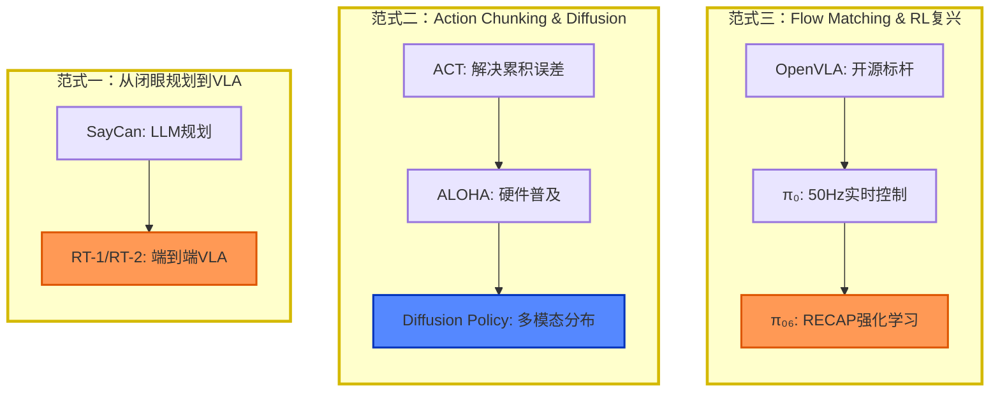

* content
{:toc}

# VLA 专题

VLA 全称 Vision Language Action, 一种端到端 （end2end）的**机器人感知规划决策**的框架技术，无论是工业界还是学术界，如火如荼

VLA（Vision-Language-Action）端到端的多模态学习模型，直接从视觉输入（相机图像）和语言指令中预测机器人的控制动作。与传统的模块化机器人系统不同，VLA将感知、推理和控制统一在单一的神经网络架构中

## 问题

传统机器人系统由三个独立模块串联：`感知`（CV模型输出检测框）→ `规划`（路径规划器）→ `控制`（PID/MPC）。

这种架构有三重结构性缺陷：

| 问题 | 根因 | 定量影响 |
| ---- | ---- | -------- |
| **信息瓶颈** | 感知输出"检测框（4个float）"，丢弃像素级纹理/姿态 | 遮挡场景成功率下降 40%+ |
| **误差累积** | 感知误差 → 规划偏移 → 控制超调，无跨模块梯度 | 定位误差每经过一个模块放大约 2.3× |
| **分布偏移脆弱性** | 模块间接口是手工定义的语义抽象，换场景即失效 | 新环境需 50-200 条新数据重调 |


## VLA 历史

2023年7月28日，谷歌 DeepMind 发布全球首个控制机器人的视觉语言动作（VLA）模型 `RT-2`。正式提出 VLA 概念；
- 采用VLM作为骨架；
- Internet-scale 预训练VLM模型在机器人控制上展示良好的泛化性及语义推理；
- 将action也表达成文本token的形式

2024年，斯坦福推出首个全面开源的通用 VLA 模型 [OpenVLA](https://arxiv.org/pdf/2406.09246?)，结合多模态编码与大语言模型架构；
- 首次展示了通过低秩适应（LoRA）和模型量化等计算高效的微调方法，实现降低计算成本且不影响成功率

其后，这个模型概念快速扩散到智驾领域。

VLA模型追溯到早期的跨模态学习架构，如视觉语言模型（VLM）。

然而，VLA模型通过引入**动作控制**，发展为更高级的通用代理（generalist agents）。

这些代理结合了视觉语言模型（VLMs）、动作规划器和层次化控制器（hierarchical controllers），能够在动态环境中执行复杂任务。

例如，VLA模型可以根据视觉输入和语言指令，规划出从识别物体到执行抓取动作的完整流程。

### 时间线

VLA研究时间线：从**模块化**到**端到端**统一模型，再到强化学习的**自我进化**（2022-2026）

- 范式一：从闭眼规划到 VLA，SayCan: LLM规划 → RT-1/RT-2: 端到端VLA
- 范式二：Action Chunking & Diffusion，ACT: 解决累积误差 → ALOHA: 硬件普及 → Diffusion Policy: 多模态分布
- 范式三：Flow Matching & RL 复兴，OpenVLA: 开源标杆 → π₀: 50Hz实时控制 → π₀₆: RECAP强化学习

三次核心的”范式跃迁”：
- 第一次跃迁（2022-2023初）——从**语言规划**到VLA：
  - 早期如SayCan虽然能让LLM进行任务分解，但它是”闭着眼睛”做规划。
  - 直到 RT-1、RT-2 出现，将视觉、语言和动作Token统一，第一次证明了VLM可以直接生成动作，实现了端到端的感知-控制。
- 第二次跃迁（2023）——Action Chunking 与 Diffusion Policy：
  - 传统的单步动作预测容易产生累积误差（Compounding Error）。
  - ACT（Action Chunking with Transformers）提出一次性预测一段动作序列（Chunk），解决了误差累积问题。结合成本不到2万美元的ALOHA开源双臂硬件，直接引爆了学界的具身研究。
  - 随后，Diffusion Policy 用扩散模型替代了传统的CVAE，彻底解决了模型在面对多种合理运动路径时容易”取平均”导致失败的问题，天然且优雅地建模了动作的多模态分布。
- 第三次跃迁（2024-2025）——Flow Matching 与 RL重返舞台：
  - π₀将Diffusion Policy的弯曲去噪路径拉直（Flow Matching），推理速度提升5-7倍，实现了50Hz的高频连续控制（能玩扑克、折衣服）。更关键的是，π*₀.₆提出了RECAP（优势条件化）方法，巧妙绕过了Flow Matching难以计算对数概率的限制，让强化学习（RL）重新与VLA深度融合。
  - 这意味着机器人不再是出厂即定型的静态工具，而是能够通过真实部署收集数据实现”越用越好”的学习型智能体，真正转动了数据飞轮（Data Flywheel）。




## VLA 介绍

VLA 模型是在视觉语言模型（VLM）的基础上发展二来。

VLA（Vision Language Action，视觉-语言-动作）模型通过整合视觉感知、自然语言理解和物理动作控制，开发出能够在复杂环境中自主执行任务的智能代理。

VLA模型不仅能够理解图像和语言指令，还能通过动作规划在物理世界中执行任务，例如让机器人根据“把咖啡杯放在桌子上”的指令完成相应操作。
- 处理图像和自然语言文本的机器学习模型
- 输入：一张或多张图片
- 输出：生成一系列标记来表示自然语言。

VLA模型核心: 将三种模态(视觉、语言和动作)整合到统一的计算框架中


然而，VLA 还利用了机器人或汽车运动轨迹的数据，进一步训练这些现有的VLM，以输出可用于机器人或汽车控制的动作序列。

通过这种方式，VLA可以解释复杂的指令并在物理世界中执行相应的动作。


### 具身AI

Embodied AI: 集成到物理实体（主要是机器人）中的智能系统（VLM）。

类似于人类从自身经历、周围环境和所处环境中学习的方式，Embodied AI通过与环境的互动以及对观察场景的视觉线索进行学习，从而能够有效地处理现实世界中的动态场景，这与人类大脑的工作方式相似。


[具身智能端到端大模型VLA (Vision Language Action)](https://blog.csdn.net/yiwei1225/article/details/144964377)

### 意义

VLA 不只是”把三个模块换成一个模型”——它改变了优化目标的结构。

关键洞察：
- 离散化 vs 连续动作—— 不是技术选秀，是精度 vs 延迟的权衡。256-bin 离散化够用于抓取，流匹配才能做亚毫米精度——但需要 4-8 倍推理时间
- Co-fine-tuning 配比—— 泛化 vs 记忆的连续谱。α=0.5 是 RT-2 的默认配置，但最优值取决于应用：家用机器人要更多 VLM 数据（零样本泛化重要），工业机器人要更多机器人数据（已知任务成功率重要）
- 规模不总是答案——OpenVLA 用 7B 参数 + 数据清洗追平 55B RT-2，说明数据质量 > 模型规模 在具身领域也成立
- 语言中转是信息瓶颈——小鹏的视觉→动作直接映射在数学上减少了方差，在工程上节省了延迟，这可能是原生 VLA 的最终形态
- BC 的因果混淆是根本约束——当前没有好的解决方案。RL 理论上能解决，但在真实机器人上用 RL 训练的样本效率比 BC 差 100-1000 倍。这可能是 VLA 最难突破的边界

【2026-6-2】[VLA（Vision-Language-Action）模型深度解析：从RT-2到端到端机器人基础模型的范式革命](https://goodisok.github.io/2026/05/09/VLA-%E8%A7%86%E8%A7%89%E8%AF%AD%E8%A8%80%E5%8A%A8%E4%BD%9C%E6%A8%A1%E5%9E%8B-%E7%AB%AF%E5%88%B0%E7%AB%AF%E6%9C%BA%E5%99%A8%E4%BA%BA%E5%9F%BA%E7%A1%80%E6%A8%A1%E5%9E%8B/index.html)


### pipeline vs end2end

VLA 用一个 Transformer 替代三个模块


### VLA as WAM

视觉语言动作模型（VLA）与世界动作模型（WAM）代表具身智能领域两种截然不同的统计学范式。

VLA基于频率主义统计学和WAM基于贝叶斯主义统计学的理论基础、技术架构和应用特点。
- VLA模型倾向于采用**频率主义**方法，通过大规模数据学习分布模式，依赖最大似然估计和大量训练数据实现泛化；
- 而WAM模型更贴近**贝叶斯主义**框架，强调因果推理与动力学建模，能够处理不确定性并进行小样本学习。

技术架构上
- VLA 通常采用编码器-解码器结构，通过行为克隆和共微调策略训练；
- WAM则基于生成模型架构，通过视频扩散和贝叶斯推理实现动作预测。

实证分析表明
- VLA在语义泛化方面表现优异，但在物理动力学泛化方面存在局限；
- WAM在跨任务和跨环境泛化方面表现突出，特别是在处理未见物理动作方面优势明显。

## VLA 任务

VLA 模型主流任务仍是**简单操作**任务 `pick&place` 等，这一类任务很早期的前LLM时代就被广泛作为RL的benchmark（如FrankaKitchen，MetaWorld等），后续在一系列里程碑事件之后逐渐跳脱出来独立成为具身智能这个独立方向的测评基准。

RT2的“Taylor Swift时刻”
- 

VLA 最初惊艳点：环境意图理解，简单地通过视觉传感器的数据完全理解复杂的环境，解析出抽象语言背后的任务需求，完成任务的拆解，能产生抽象的解决方案。

目前， <span style='color:red'>VLA的能力**远远**达不到VLM/LLM的水准</span>，VLA对标语言模型的话可能还处于GPT2水平

作者：[董子斌](https://www.zhihu.com/question/1920708362489828723/answer/1922360752716617518)


## VLA 应用

VLA模型在多个领域展现了广泛的应用潜力：
- 人形机器人：如Figure 01和Helix，能够理解自然语言指令并执行复杂任务，例如“泡一杯加两勺糖的咖啡”。这些机器人通过VLA模型实现视觉感知、语言理解和动作执行的整合。
- 自动驾驶：VLA模型通过处理视觉输入和语言指令（如“在下一个路口左转”），提升了自动驾驶系统的安全性和智能性。
- 医疗和工业机器人：在手术机器人或工业装配线上，VLA模型通过高精度动作控制和多模态理解，提高了任务效率和适应性。
- 精准农业：通过视觉识别作物状态并根据语言指令执行任务（如“喷洒特定区域”），VLA模型推动了农业自动化。
- 增强现实导航：VLA模型为用户提供基于视觉和语言的交互式导航体验，例如在复杂环境中引导用户。

1. 工业自动化
- 特斯拉Optimus：通过VLA模型理解"组装零件"指令，结合视觉识别和力控反馈完成高精度操作。例如，在汽车电池组装中，模型实时调整抓取姿态以适应零件公差。
- 谷歌Gemini Robotics：双臂机器人在本地运行VLA模型，完成皮带组装、拉开拉链等任务，仅需50次演示即可适应新技能，显著降低工业部署成本。
2. 家庭服务与日常生活
- SmolVLA：在双手动环境中动态调整抓取姿态，完成叠衣服、整理餐具等任务。例如，识别不同衣物材质后，自动调整抓取力度和角度。
- Apollo机器人：通过VLA模型执行"从冰箱取饮料"任务，结合3D场景重建和路径规划，避开障碍物并准确打开冰箱门。
3. 自动驾驶与智能交通
- Waymo EMMA：将摄像头数据和导航指令输入VLA框架，直接输出驾驶轨迹，在复杂路口实现类人决策。例如，处理"施工绕行"时，模型通过语义推理调整路线。
- 理想MindVLA：整合空间智能与语言推理，计划2026年量产。在潮汐车道场景中，模型通过分析交通标志和车辆动态，生成最优变道策略。
4. 多机器人协作
- Helix（Figure AI）：两个机器人通过自然语言指令协同完成"传递饼干"任务。例如，"将饼干递给右边的机器人"指令下，模型自动分配角色并生成协作轨迹，成功率达89.7%。
- Psi R1（灵初智能） ：基于CoAT（Chain of Action Thought）框架，实现机器人在开放场景下的长程复杂任务，如麻将翻牌、碰杠等，持续任务时长超过30分钟。

### 机械臂

机械臂定位抓取目标物体，涉及到视觉，相机，机械臂方面的知识
- 视觉：简单demo用传统视觉算法，对抓取物体有要求的可使用深度学习目标检测算法
  - 无论采取何种检测算法，输出图像的二维坐标（抓取点）即可
  - 技术方案：yolo系列算法——Official YOLOv7 
- 机械臂：机器人学基础 中空间描述坐标变换，运动学，轨迹规划等章节

机械臂定位抓取目标物体，其实就是将获取的二维图像的抓取坐标点位`(x,y)`转化成机器人空间中的`(x,y,z)`三维坐标，整个过程称为 `坐标变换`。
- 首先，明确机器人空间中存在的四个坐标系：base-机器人的基坐标系、tool / gripper-机器人末端工具坐标系、cam-相机坐标系、cal / target-标定板坐标系。
  - 而 `坐标变换` 就是利用上述四个坐标系进行 `刚性位姿变换`，获取坐标系之间的 `相对位姿`（位置和姿态）矩阵 T。
- 其次，空间中存在已知的相对位姿矩阵和未知的相对位姿矩阵，需要利用到特定的方法获取： 手眼标定、相机标定 等。

整个过程中的每步操作都会对最后抓取结果的精确度造成不同程度的影响，理想结果是 在消除定长误差下保持x,y,z轴±1mm的误差

对结果造成影响的可能：
- 工具坐标系的标定，SolvePnP算子的解AX=XB的方法等

尽可能保证每一步计算的三维空间坐标逼近真实值，可利用类似于重投影误差算子进行验算，matlab工具箱验算等

当实现对指定目标物体进行自上而下的抓取后，可拓展更多自由度的抓取...

技术实现
- [robot_grasp](https://github.com/CedricKai/robot_grasp) 两种模式下的抓取演示(自上而下，不涉及旋转): Eye-in-hand **眼在手上** + Eye-to-hand **眼在手外**

为了减少机械臂在产品分类、抓取过程中的执行时间，降低定位误差，以提高生产效率。

传统机器人仅能执行预定义轨迹任务的局限性，结合视觉识别系统的机械臂抓取方案。
- 执行抓取任务的执行装置采用六轴机械臂xArm；
- 最后，使用眼在手上(Eye-in-Hand)视觉-机械臂方案实现对多个物体的识别与抓取，并根据设定规则进行码垛

#### 灵巧手

“灵巧手”（dexterous hand）指具有类人手结构、多自由度的末端执行器，能够进行精细的抓取与操作，而不仅仅局限于平行夹紧。

模仿人类手指关节和肌腱驱动，使机器人能够执行转动、重定位、穿插等复杂操作。

根据结构和材料不同，灵巧手大致可分为刚性型、柔性型和混合型：
- 刚性型采用金属或坚硬塑料结构，关节通过电机或舵机驱动，优点是定位精度高、力矩大；
- 柔性型主要用硅胶、橡胶等软材料，可通过气动驱动或形变实现自适应抓取，天生适合对柔软或不规则物体的抓取；
- 混合型结合刚柔两者，例如刚性骨架包裹柔性层，兼顾承力和安全性。


“灵巧手”是把`感知`—`决策`—`执行`闭环落实到接触尺度的关键枢纽，其重要性体现在方法论与系统层两个层面：
- 方法论上，灵巧手将原本“抓取—位移”的低维任务，提升为包含滚动、指间重排、推挤与非抓取（non-prehensile）操作在内的操作原语集合，使机器人需正面处理接触—摩擦驱动的混合动力学、互补约束与部分可观测性（POMDP），由此推动触觉融合（tactile fusion）、接触状态估计、阻抗/顺应控制、模型—学习混合（model-based × RL/IL）与触觉伺服等核心技术的演进；
- 系统层面，灵巧手以高自由度与顺应性结构、密集触觉传感为载体，显著扩展同一硬件在开放世界中的任务覆盖率，减少对治具与专用末端执行器的依赖，提升通用机器人在装配、检修、服务与医疗辅具等高价值场景下的经济性与安全性。

更进一步，灵巧手是“通用机器人”与“具身智能”落地的瓶颈环节：只有在手内操控（in-hand manipulation）与工具使用被可靠学习与泛化之后，语言/视觉等高层规划才能通过细粒度接触行动被兑现。

因此，灵巧手既是推进机器人能力边界的技术抓手，也是将抽象智能转化为可复用、可规模化物理能力的基础设施。

更多：[最新最全Robotics顶会“灵巧手”（dexterous hand）的paper集合](https://zhuanlan.zhihu.com/p/1966166542610838718)

### 自动驾驶

2025年，随着智能驾驶开始往深度和广度两个方向去卷，智能驾驶行业往迎来一个显著信号：
> 端到端大模型迈向2.0时代，VLA（Vision-Language-Action，视觉-语言-动作模型）或将成为国内车企全面竞争的焦点。

作为继VLM（视觉-语言模型）之后的进化形态，VLA通过整合视觉感知、大语言模型的推理能力与车辆动作控制，开辟了智能驾驶的新路径。

相较传统模块化方案与初代端到端技术，VLA在**可解释性**、**泛化性**及**复杂场景适应性**上展现出显著优势。

元戎启行、理想汽车等企业已明确布局 VLA，Wayve 等国际玩家也在同步推进，而小鹏、华为等头部车企或将快速跟进。


VLA的实现面临两大挑战：真实数据与实时响应。
- 真实世界数据涵盖天气、光线、行人行为等变量，远超合成数据的覆盖能力。例如，闪电或违规横穿等关键状态难以模拟，需依赖量产车的大规模部署来积累。
- 而实时性要求模型在100毫秒内响应，涉及数十亿参数的计算则需强大算力支持。技术特性决定了VLA的成熟度与落地速度高度依赖数据规模与算力投入。

详见站内专题：[自动驾驶](driving)


### 手术机器人

人形机器人手术 

【2026-7-8】加州大学圣地亚哥分校 Michael C. Yip 实验室的博士生梁泽楷成功打破了传统手术机器人的固有范式，完成了全球首例通用人形机器人的活体微创手术。
- Nature 论文 [In vivo feasibility study of humanoid robots in surgery](https://www.nature.com/articles/s41586-026-10796-x)
- 项目主页：[humanoid-surgeon](https://humanoid-surgeon.github.io/)

研究团队设计了一种特殊的机械抓取支架，让这个身高1.5米、仅重27公斤的轻量级人形机器人，直接拿起了人类医生平时用的普通腹腔镜手术器械。医院不需要为了机器人而去更换一整套昂贵的手术供应链。

实验不仅完成了单台机器人加人类助手的手术，还成功做到了两台人形机器人并排站立像主刀和一助一样协同完成手术。

这种画面感提前宣告了未来手术室的新生态。


## 技术实现


### 机器人技术路线

【2026-6-30】[机器人AI模型路线分化：VLA与World Model之争升温](https://www.digitaltoday.co.kr/cn/view/76165/robotics-ai-model-race-world-models-vs-vla)

智源研究院具身智能大模型负责人王鹏伟，具身智能基础模型三大技术路线：
1. **分层模型路线**
  - 核心思路：将高层理解与低层控制解耦（大小脑分离架构）
  - 优势：泛化性较好，更适合工业界落地实施
  - 局限：难以处理复杂精细操作
  - 代表工作：GeminiER/HiRobot、Embodied Reasoning Model、Physical Intelligence的High Robot
2. **VLA (Vision-Language-Action) 模型路线**
  - 核心特点：端到端映射，实现"感知即行动"
  - 优势：理论性能上限更高
  - 主要瓶颈：需要海量带动作标签的训练数据
  - 具体挑战：零样本泛化能力弱，例如物体位置变动、桌面高度调整或背景变化都会显著影响性能
  - 代表工作：OpenVLA系列(0.5/0.6等版本)、GROOT N1/N1.5、Intel Pilot
3. **世界模型 (World Model) 路线**
  - 核心能力：可预测未来状态，具备丰富"想象力"
  - 工作机制：先进行虚拟推演再执行动作，提升操作精准度
  - 战略价值：有望实现真正的零样本泛化
  - 代表工作：字节GR1/GR2、Cosmos、北京人形的WoW
  - 技术分歧：关于模型应预测视觉帧还是直接预测动作存在不同实现路径

VLA 基本闭环图：模型不直接替代机器人控制栈，而是在感知、任务和动作之间生成策略输出。

从 OpenVLA、π0/π0.5 到 LingBot-VLA，可以看到明显趋势：机器人模型正在从单机单任务的模仿学习，转向多硬件、多任务、多数据源的基础模型路线。 
- OpenVLA 强调开源 VLA 与大规模机器人数据训练
- Physical Intelligence 的 π 系列强调跨形态机器人和开放世界泛化
- 而 LingBot-VLA 则更明确地把“真机后训练能否低门槛跑通”作为工程目标。

对开发者而言，真正有用的不是论文里某个平均成功率，而是换成自己的相机、夹爪、机械臂和任务后，系统是否留出了清晰的数据入口和训练入口。


VLOA 全称 Vision-Language-Object-Action（视觉-语言-物体-动作）。
- 相比VLA（视觉-语言-动作），增加了对物体的深度理解维度，让机器人不仅能看懂指令，更能精准识别和操作具体物件——就像视频里自主拼装宜家椅子那样，能分辨木榫、桌板等不同部件并完成精细装配。


### 世界模型

当前行业主要分为两条技术路径：
- 一类是由大语言模型（LLM）延伸而来的 VLA（vision-language-action models）
- 另一类则是 World Model。通过视频等数据学习物理世界，并预测机器人执行动作后环境可能出现的变化。

在 VLA 路线中，Nvidia 的 Groot 和 Physical Intelligence 的 pi 是目前市场关注度较高的代表模型。

近期硅谷对 World Model 的兴趣也在快速升温。
- AI 视频生成初创公司 Luma 已于6月设立聚焦机器人 World Model 的物理AI实验室；
- 人形机器人初创公司 1X 也宣布将成立自己的 World Model 研究所。


具身智能世界模型三大演进方向：  
- 1️⃣ **分层解耦路径**（VISTA模型）：上层拆解指令，下层执行动作，模块即插即用但通信有延迟，适合西安交大&清华联合研究；  
- 2️⃣ **统一自回归路径**（WorldVLA）：阿里达摩院单模型统合三模态，协同高效但易累积误差，论文见2025.6.27 GitHub开源；  
- 3️⃣ **闭环迭代路径**（VLAW）：清华&斯坦福让VLA与世界模型互为师生，通过真实数据修正认知偏差，工程复杂但迭代潜力大。  

支持者
- World Model 更有可能深入理解物理规律，不仅能预测物体坠落、破碎等现实情况，还能生成供机器人训练使用的仿真环境，并在机器人系统中发挥核心决策模型的作用。

卡内基梅隆大学计算机科学学院院长 Marshall Eber 表示，现有语言模型的局限性在机器人场景中暴露得尤为明显。机器人要完成拿起咖啡杯这样的动作，涉及手部如何移动、如何与杯体发生物理接触等问题，其复杂程度远高于“预测下一个词”。

不过，批评者
- World Model 目前仍然容易出错，尚无法对现实世界进行高精度模拟。
- 即便如此，在投资者下调对 VLA 预期的背景下，World Model 仍在获得越来越多关注。

详见站内专题：[世界模型](world_model)


#### 【2026-6-8】MotionWAM

【2026-6-8】Mondo 机器人与港科大推出 MotionWAM，面向人形机器人的单目视觉端到端世界行动模型，结合视觉 DiT 和动作 DiT

人形机器人研究工作：
- 通过高效的去噪特征提取设计（比Cosmos Policy快7倍），单4090显卡实现基于世界模型的WAM + SONIC底层控制的多任务丝滑推理

🤖💪人形机器人做家务活已经成为可能，虽然还很慢，但是任劳任怨
- Paper: [MotionWAM: Towards Foundation World Action Models for Real-Time Humanoid Loco-Manipulation](https://arxiv.org/abs/2606.09215)
- Project Page: [MotionWAM](https://dit4dit.github.io/MotionWAM/)


### 技术路线

目前, VLA 模型主要基于三类核心技术路线
- 根本差异: 如何处理机器人动作生成

|路线|核心机制|核心原理|优势|劣势|
| ---- | ---- | ---- | ---- | ---- |
|`自回归`路线|动作Token化 + 复用LLM下一词预测范式|将连续动作离散为动作Token，仿照文本生成从左至右逐Token预测动作|1. 可直接复用成熟LLM模型架构<br>2. 天然具备强语言理解能力|1. 串行逐一生成，推理速度慢<br>2. 存在严重误差累积问题<br>3. 不擅长高频连续动作输出|
|`扩散`路线|去噪扩散概率模型|通过加噪-迭代去噪流程，从随机噪声逐步还原完整动作序列|1. 支持并行生成整条动作序列<br>2. 动作全局一致性表现好<br>3. 适配高维、多模态动作分布|生成完整序列需要多轮迭代采样，计算开销大|
|`流匹配`路线|学习流场，建立噪声到目标动作的直接映射|扩散模型优化升级方案，不模拟扩散加噪过程，直接学习噪声到动作的线性映射路径|1. 继承扩散模型全局建模能力<br>2. 训练、采样效率优于传统扩散<br>3. 输出平滑连续的精细动作，适配高频动作场景|暂无明显短板，是当前精细连续动作生成前沿方案|

截至 2025 年 4 月，SOTA VLA 采用**双层专家系统**，结合视觉语言模型（VLM）和diffusion decoders，例如英伟达的 Groot N1 和 FigureAI 的 Helix，或者采用类似物理智能中的 π0（Pi-Zero）的基础通用策略。
- 系统 1（“快思考”）：transformer decoder或diffusion model作为低级控制和灵巧运动的动作专家。扩散模型具有丰富的图像先验，系统利用其卓越的语义场景关系，将系统 1 指导的路径或指令翻译并执行，以执行敏捷且精细的运动动作。
- 系统 2（“慢思考”）：在这里，VLM将视觉和文本作为上下文输入，以对复杂场景和中间任务进行系统决策。这指导了机器人的整体行为，因为它们对机器人的世界有着出色的了解。它们作为高级规划器，通过推理多模态输入并生成轨迹，将主要目标分解为多个中间子任务来实现。

这两个系统共同模拟了丹尼尔·卡尼曼（Daniel Kahneman）的双重过程理论，结合了高级规划器和低级快速执行。


### 数据问题

#### 仿真平台

Genesis World 1.0 

2024年12月发布的仿真平台，通过高保真多物理场模拟技术加速机器人测试，其中有穿螺丝场景
- [主页](https://www.genesis.ai/blog/the-role-of-simulation-in-scalable-robotics-genesis-world-10-and-the-path-forward)


#### 机器人看视频学习

【2026-7-6】[机器人看视频学操作！伯克利首次打通互联网视频到灵巧手真机部署链路](https://mp.weixin.qq.com/s/XfcD1_lipFIyFDnQi7SITg)

只用单目RGB视频，Do as I Do 将日常人类操作转化为 Sharpa Wave 可执行轨迹，补上类人灵巧操作从视频到机器人数据的关键链路。

孩子看别人打蛋、倒水、钉钉子，慢慢就能通过模仿学会这些动作。

但机器人不一样。今天的机器人学习，更多还是靠「做」，比如成本较高的遥操作、大量仿真执行，或是在精心布置的场景中采集真机数据。

YouTube、第一视角数据集以及生成式视频中，已经包含了海量人手与物体交互的素材。

真正的瓶颈不在**数据缺失**，而在于是否能**完成数据转换**：如何把这些带有噪声的单目RGB视频，变成多指灵巧手能够执行的动作轨迹？

灵巧机器人数据规模化，仍然绕不开三个结构性难题：
- 单目RGB视频中的手-物交互仍难以稳定重建
- 带噪声的参考轨迹会让动作重定向失效
- 遥操作本身难以规模化

【2026-6-17】UC Berkeley 提出的端到端流程，跑通了首条能够从网络视频生成真实灵巧手实机执行轨迹的完整链路：
- 先从真实场景中的单目RGB视频中重建4D手-物交互过程，再将这些交互轨迹重定向到拥有22个自由度的Sharpa Wave灵巧手上。
- 论文：[Do as IDo:Dexterous Manipulation Datafrom Everyday Human Videos](https://arxiv.org/abs/2606.19333)
- 项目 [do-as-i-do](https://do-as-i-do.com/)


## VLA 模型

资料
- 【2026-6-30】[VLA经典方法](https://kwanwaipang.github.io/Awesome-VLA/#vla%E7%BB%8F%E5%85%B8%E6%96%B9%E6%B3%95%E9%98%85%E8%AF%BB)
- 【2026-4-30】[VLA入门（附代码）](https://zhuanlan.zhihu.com/p/1900982961429549979)
- 【2026-6-3】[VLA综述：具身智能路线梳理](https://tingdeliu.github.io/VLA-Survey/#%E5%BC%95%E8%A8%80)

VLA模型有很多，常见分类：
- 基于自回归（autoregression）
- 基于diffusion的
- 基于强化学习的
- 混合的（双系统）等。

详请
- [Pure Vision Language Action (VLA) Models: A Comprehensive Survey](https://arxiv.org/pdf/2509.19012)

代表模型
- RT-2：通过在视觉语言任务（如视觉问答）和机器人轨迹数据上共同微调，实现了从网络知识到机器人控制的转移。
- OpenVLA：开源模型，基于Prismatic-7B VLM微调，训练数据包括970k机器人轨迹，涵盖多种任务和机器人平台。
  - 在通用机器人操控任务中表现出色，特别是在处理未见过的背景、物体和指令时，成功率超过50%。
  - OpenVLA的代码和模型检查点可在HuggingFace下载
- π0：双层专家系统（dual-level expert system），结合视觉语言模型和扩散解码器，优化了低层次控制和精细动作。
  - 通用策略使其在动态环境中表现出色，适合需要高精度和复杂推理的任务
- Octo：第一个开源vla实现，架构设计体现了 VLA 在”效率优先”路线上能走多深
- OpenVLA：7B 的极限，关键贡献是证明 VLA 不需要 55B 参数
  - 7B 模型用不到 1/7 的参数和 1/100 的训练数据追平了 RT-2-X。关键：视觉编码器选型。

### 主流VLA模型对比

【2026-5-5】[常用VLA模型及特点对比](https://cloud.tencent.com/developer/article/2672591)

|模型名称|发布时间|所属机构|核心技术路线|核心亮点|适用场景与主要局限|
| ---- | ---- | ---- | ---- | ---- | ---- |
|RT-2|2023-07|Google DeepMind|自回归 (VLM as Backbone)|VLA概念奠基者，开创性将互联网知识迁移至机器人控制|基础研究，评估互联网知识对机器人控制的赋能效果。局限：架构已非最优，动作生成效率低。|
|OpenVLA|2024-06|斯坦福、伯克利、丰田研究院|自回归 (VLM as Backbone)|开源标杆，基于Llama 2，97万条机器人数据微调，权重代码全开源|科研/开发者社区，跨机器人泛化性强。局限：消费级硬件完整训练仍有显存门槛。|
|π0|2024-10|PhysicalIntelligence|流匹配|业界早期流匹配VLA，50Hz实时控制，多机械臂适配|通用灵巧操作、长程家务任务。局限：早期版本细节未完全开放。|
|π0.5|2025-04|PhysicalIntelligence|流匹配|π0迭代升级版，开放世界泛化能力大幅提升，动作生成极致平滑|复杂、长程、需精细力控的灵巧操作。局限：商用完整权重未完全对外释放。|
|SmolVLA|2025-03|Hugging Face|流匹配 + 轻量化|极轻量(4.5亿总参数)，可单机MacBook本地运行，开箱即用开源栈|资源受限环境、快速原型验证、高校低成本实验室。局限：复杂开放词汇任务性能上限低于7B级大VLA。|
|X-VLA|2025-07|清华 & 上海AI Lab|流匹配 + 软提示|0.9B超轻量，跨机器人本体零样本迁移，数据效率极高|需要频繁切换不同机器人硬件的部署场景。局限：轻量化架构复杂超长任务推理偏弱。|
|WALL-A|2025-09|自变量机器人|端到端统一 + 世界模型|参数规模行业领先，世界模型与VLA深度融合，零样本泛化极强|追求极致零样本通用性、多场景复杂操作。局限：参数量大，训练与推理硬件成本高。|
|GOVLA|2025-11|智平方|全域全身 + 双系统|支持移动底盘+机械臂全身协同控制，同步输出导航轨迹+机械动作|工业制造、商用服务机器人等移动机械臂长程复合任务。局限：双系统架构训练门槛高，落地成本高。|
|HoloBrain-0|2026-01|地平线|自回归 + 具身三维先验|三维空间几何理解突出，轻量版仅0.2B参数，端侧芯片深度适配|空间感知要求高的桌面操作、嵌入式端侧机器人部署。局限：轻量化版本复杂逻辑推理能力有限。|
|Goal-VLA|2026-03|新加坡国立大学|世界模型 (生成式VLM)|规划与控制解耦，无需成对动作演示数据，零样本操作新范式|开放词汇、无演示样本的零样本机器人操作。局限：偏向学术探索，实时控制速度待优化。|
|Sim2Real-VLA|2026-04|香港中文大学（深圳）|双系统架构 (Sim2Real)|仅用仿真数据训练即可零样本部署真实机器人，大幅降低实物数据采集成本|真实机器人数据难以采集的场景、仿真到现实迁移算法研究。局限：对仿真环境物理逼真度要求极高。|
|EfficientVLA|2025-08|上海交大|推理加速框架（无训练）|即插即用加速模块，CogACT推理速度提升1.93倍，计算量降至28.9%|存量VLA模型无损快速推理加速。局限：仅为优化工具，非独立VLA模型。|
|FlashVLA|2025-10|复旦大学|推理加速框架（无训练）|首个支持动作复用的轻量化加速方案，推理计算量减少55.7%|现有各类VLA模型低成本实时推理优化。局限：仅加速工具，不具备独立建模能力。|
|VLA-Pilot|2025-06|理想汽车|端到端融合|面向自动驾驶定制VLA，融合道路视觉、车辆控制语言指令|自动驾驶车辆感知规划控制一体化。局限：仅车载场景，不通用机械臂机器人。|

更多

| 模型 | 发布时间 | 参数规模 | 核心架构/特点 | 开源状态 | 备注 |
| ---- | -------- | -------- | ------------- | -------- | ---- |
| RT-1 | 2022.12 | 130M | Transformer + 离散 Token | ✅ 数据+代码 | 奠基之作 |
| RT-2 | 2023.07 | 5B/55B | VLM 直接微调 | ❌ 闭源 | 首次验证 VLM 知识迁移 |
| OpenVLA | 2024.06 | 7B | 双编码器 (DINOv2+SigLIP) | ✅ 权重+代码 | 目前最强开源 VLA 标杆 |
| π₀ | 2024.10 | 3.8B | Flow Matching (50Hz) | ✅ 权重+代码 | 擅长折纸等精细操作 |
| GR00T N1.6 | 2026.01 | 2.2B | 双系统 (System 1+2) | ✅ 权重+代码 | 英伟达全栈生态绑定 |
| Xiaomi-R0 | 2025.02 | 4.7B | MoT 架构（分离脑/小脑） | ✅ 权重+代码 | 中国力量，低延迟优化 |
| LingBot-VLA | 2025.02 | - | 跨形态泛化 (9种机器人) | ✅ 权重+代码 | 蚂蚁集团真机预训练 |
| π₀.₅ | 2025.04 | - | 异构任务协同训练 | ❌ 闭源 | 开放世界家庭长时程任务 |
| ACoT-VLA | 2026.01 | - | 动作空间推理 | 📄 仅论文 | 显著减少长时域误差累积 |


### 模型选型

四类：
- 性能标杆型 ：追求最优泛化和动作质量 → π系列、WALL-A
- 轻量高效型 ：追求计算效率和快速落地 → SmolVLA、X-VLA
- 产业落地型 ：追求场景适配和系统集成 → GOVLA、HoloBrain-0
- 前沿探索型 ：追求技术突破 → Goal-VLA、加速框架

清洁场景 （需要机械臂精细力控、场景相对固定）：
- 首选π0系列或X-VLA ：流匹配架构能生成平滑的力控动作，泛化能力强，且对接触类任务友好。
- 若资源有限 ：从 SmolVLA 开始快速原型验证，它能在普通硬件上运行，社区生态完善。
- 若需要移动底盘+机械臂协同 ：考虑 GOVLA ，它是目前唯一能同时控制移动和操作的模型。
- 若在端侧部署、对空间感知要求高 ： HoloBrain-0 是理想选择，它的0.2B版本能在端侧芯片高效运行

|对比维度|推荐模型|
| ---- | ---- |
|泛化能力|WALL-A、π0.5、Goal-VLA、X-VLA|
|计算效率/轻量化|SmolVLA、EfficientVLA、FlashVLA、HoloBrain-0|
|动作平滑精细度|π0、π0.5、SmolVLA、X-VLA|
|三维空间几何理解|HoloBrain-0|
|全身移动底盘+机械臂协同|GOVLA|
|力控灵巧操作|π系列、X-VLA、SmolVLA|
|零样本无演示操作|Goal-VLA、WALL-A|
|开源生态、低门槛复现|OpenVLA、SmolVLA、HoloBrain-0|
|仿真转真实场景落地|Sim2Real-VLA|

### 模型架构

两种
1. **端到端架构**：整体仅单一大模型，视觉+语言+动作统一编码解码，依靠扩散/Flow/离散Token输出连续动作，优势是实时性强、精细操作表现好，短板是长时序任务易累积误差、可解释性差。
2. **分层架构**：拆分为「高层规划大模型」+「底层动作执行模型」，高层负责拆解长任务、逻辑推理，底层负责精准机械控制；优势是长时序鲁棒、可解释性高，短板是多模块带来额外推理延迟、存在模块间信息损耗。

| 维度 | End-to-End（端到端） | Hierarchical（分层式） |
| ---- | ---- | ---- |
| 设计理念 | 单一统一网络 | 分离规划与执行 |
| 推理方式 | 隐式端到端 | 显式分层推理 |
| 可解释性 | 低 | 高 |
| 适用场景 | 短时域任务 | 长时程复杂任务 |

最新研究表明，纯端到端和纯层级架构各有优劣，混合方法成为新趋势：ACoT-VLA在动作层面进行显式推理，保持统一架构

端到端架构（End-to-End Architecture）代表模型

| 模型 | 动作解码器 | 参数规模 | 特点 |
| ---- | ---- | ---- | ---- |
| OpenVLA | 离散token化 | 7B | 首个开源大规模VLA（详见第5.9节） |
| π₀ | Flow Matching | 3B (VLM) + 860M (Action) | 50Hz实时控制（详见第5.10节） |
| Diffusion Policy | DDPM | - | 多模态动作分布（详见第5.5节） |
| RDT-1B | Diffusion Transformer | 1B | 大规模扩散VLA |

分层架构（Hierarchical Architecture）代表模型

| 模型 | 高层规划 | 低层执行 | 特点 |
| ---- | ---- | ---- | ---- |
| π₀.₅ | 增强推理VLM | Flow Matching | 多步骤推理链（详见第5.11节） |
| RT-H | VLM子任务分解 | RT-1 | 层级任务执行 |
| Hi Robot | VLM规划器 | VLA执行器 | 两层显式分离 |
| LoHoVLA | 端到端学习的层级 | - | 隐式层级结构 |


### 【2026-6-16】Qwen-Robot

【2026-6-16】千问大模型团队发布 Qwen-Robot 系列模型，标志着Qwen大模型正式从数字世界迈进物理世界。


Qwen-Robot系列有三个模型：
- Qwen-RobotNav 导航：物理智能体的行动入口 — 通过可控观测编码和工具接口，把视觉语言能力接入移动控制，统一了指令跟随、点/目标导航、目标追踪和自动驾驶四类任务
- Qwen-RobotManip：物理智能体的交互基石 — 通过规范状态-动作空间和相机坐标系下的末端执行器增量位姿，把视觉语言能力接入操作控制，基于完全由开源数据构建的 >38,100 小时语料库实现了大规模多机型训练
- Qwen-RobotWorld 世界模型：物理智能体的无限世界 — 通过自然语言动作接口，把视觉语言能力接入世界动态预测，让同一个世界模型能够跨操作、驾驶和导航场景预测符合物理规律的未来。

### 【2026-2-14】蚂蚁 LingBot-VLA

现有VLA模型缺乏基于大规模真实机器人数据的系统性扩展分析和高效训练基础设施。

【2026-2-14】Robbyant 团队推出 `LingBot-VLA`，凭借 2 万小时真实世界双臂机器人数据、创新混合 Transformer 架构与极致优化的训练代码库，在三大主流机器人平台、百项任务中实现性能碾压，同时将训练吞吐量提升 1.5~2.8 倍，为 VLA 模型的工业化部署提供了兼具性能、泛化性与效率的完整解决方案。
- [LingBot-VLA](https://technology.robbyant.com/lingbot-vla)
- [深度解析：可视化展示](https://song2yu.github.io/world-model-vla/lingbot.html#summary)

构建了涵盖9种双臂机器人构型、总计约 20,000小时 的真实世界操纵数据集，并设计了多视角视频分段+大模型辅助（Qwen3-VL）的自动指令标注流程。
- 方法上，采用 Mixture-of-Transformers（`MoT`）架构，将预训练视觉语言模型（Qwen2.5-VL）与基于Flow Matching的连续动作生成模块‘action expert’协同建模，引入空间蒸馏机制融合深度信息以增强几何感知。
- 实验在3个真实机器人平台、100个多样化任务（GM-100基准）、每任务130轮执行中系统评估
- 结果表明`LingBot-VLA`显著超越现有方法；
- 同时其优化代码库在 8-GPU 集群上实现261样本/秒/GPU吞吐量，较主流VLA框架提速 1.5–2.8×。
- 该工作首次实证揭示VLA模型在真实机器人数据规模达20,000小时时仍无性能饱和迹象，为数据驱动的机器人基础模型发展提供了关键标尺与可复现基础设施。


LingBot-VLA 聚焦于 实用性：
- 大规模预训练数据：来自 9 种流行的双臂机器人配置的 20,000 小时真实世界数据。
- 卓越性能：在仿真和真实世界基准测试中明显优于竞争对手。
- 训练效率：相比现有面向 VLA 的代码库，训练速度提升 1.5 ∼ 2.8 倍（具体取决于所采用的 VLM 基础模型）。

- 代码仓库：[lingbot-vla](https://github.com/robbyant/lingbot-vla)
- 论文：[A Pragmatic VLA Foundation Model](https://arxiv.org/pdf/2601.18692)
- 并支持在 RoboTwin 2.0 等数据集上进行 post-training / fine-tuning

这次开源针对真机适配过程中的核心需求，覆盖四个关键环节：支持多 LeRobot 数据合并、关节维度映射标准化的数据处理工具，面向真机场景优化的训练配置，离线评测工具，以及支持编译加速的真机部署模块。

模型同时提供含深度和不含深度两个版本，方便开发团队根据自身需求进行选择。

作为蚂蚁灵波开源的具身基座模型，LingBot-VLA 基于 2 万小时真实机器人数据预训练，覆盖 9 种主流双臂机器人构型，具备**跨本体、跨任务**泛化能力。

真机和仿真评测中，LingBot-VLA 均优于行业基准π0.5，并已与乐聚、松灵、星海图等厂商完成多机型验证。

据悉，LingBot-VLA 仅需 **150 条**演示数据即可实现高质量的任务迁移。得益于底层代码库的深度优化，其训练效率达到 StarVLA、OpenPI 等主流框架的 1.5~2.8 倍，进一步降低模型适配所需的数据和算力成本。

模型
- LingBot-VLA-4B：不含深度信息的 LingBot-VLA, [huggingface](https://huggingface.co/robbyant/lingbot-vla-4b), [lingbot-vla-4b](https://modelscope.cn/models/Robbyant/lingbot-vla-4b)
- LingBot-VLA-4B-Depth：含深度信息的 LingBot-VLA，[huggingface](https://huggingface.co/robbyant/lingbot-vla-4b-depth), [lingbot-vla-4b-depth](https://modelscope.cn/models/Robbyant/lingbot-vla-4b-depth)

- 无深度版更适合先跑通流程和常规桌面任务
- 深度版则更适合存在**明显空间歧义**的任务，比如透明物体、低纹理物体、遮挡较多的抓取、需要判断前后关系的双臂操作。

实际选型时不必一上来就追求深度版，先用无深度版把数据、归一化、训练和部署链路跑通，往往更稳。

基准结果说明模型在官方硬件、官方数据流程、官方评测协议下表现较强，并不意味着换到任何自制平台后都能立刻达到同等效果。 

VLA 的真机迁移高度依赖相机标定、动作空间定义、夹爪控制稳定性、数据质量和任务分布覆盖。

LingBot-VLA 真正值得关注的部分不是“官方说它超过了谁”，而是把 自定义数据接入、Robot Config 映射、归一化统计、真实场景训练配置和部署脚本 都公开了，开发者可以沿着同一条链路验证自己的任务。

LingBot-VLA 官方仓库给出的基础环境是 Python 3.12.3、PyTorch 2.8.0、CUDA 12.8，并提供 install.sh

除了 LingBot-VLA 本体权重，训练和推理还会用到 Qwen/Qwen2.5-VL-3B-Instruct；如果使用深度版，还需要 MoGe-2-vitb-normal 和 LingBot-Depth 相关权重。

```py
python3 scripts/download_hf_model.py --repo_id robbyant/lingbot-vla-4b --local_dir lingbot-vla-4b
python3 scripts/download_hf_model.py --repo_id Qwen/Qwen2.5-VL-3B-Instruct --local_dir Qwen2.5-VL-3B-Instruct
```

安装

```sh
conda create -n lingbotvla python=3.12 -y
conda activate lingbotvla

git clone https://github.com/Robbyant/lingbot-vla.git
cd lingbot-vla
bash install.sh
```
启动服务

```sh
python3 scripts/download_hf_model.py \
  --repo_id robbyant/lingbot-vla-4b \
  --local_dir lingbot-vla-4b
```

如果只是验证 LingBot-VLA 是否适合场景，建议按 “先环境、再权重、再样例、再自有数据” 的顺序推进。
- 第一步只确认仓库能安装、模型能加载；
- 第二步跑官方 RoboTwin 或已有后训练 checkpoint，确认推理入口没有问题；
- 第三步再把自有数据转成 LeRobot v3.0；
  - LeRobot 已经把机器人数据中的图像、状态、动作、episode 元信息、任务文本等内容组织成相对标准的格式；LingBot-VLA 在此基础上再用 Robot Config 把不同机器人的原始字段映射到统一特征空间。
  - 接入 LingBot-VLA 时，最重要的是先写一张“字段对照表”。例如你的原始数据里可能有 `joint_pos[0:6]` 表示左臂，`joint_pos[6:12]` 表示右臂，`gripper[0:2]` 表示左右夹爪；相机可能叫 front_rgb、left_hand_rgb、right_hand_rgb。
  - 详见 [指南](https://gitcode.csdn.net/6a1ce79510ee7a33f2769aeb.html)
- 第四步才做真机后训练。


[华为升腾NPU微调方法](https://github.com/Ascend/DrivingSDK/blob/master/model_examples/Lingbot-vla/README.md)

【2026-2-16】LingBot-World 由蚂蚁集团旗下专注于具身智能的`灵波科技`（Robbyant/InclusionAI）研发并开源发布。


作为蚂蚁集团AGI战略从数字世界向物理感知延伸的关键布局，灵波科技在 2026年1月27日至30日期间连续发布四款核心模型：
- `LingBot-Depth`（空间感知模型）
- `LingBot-VLA`（具身大模型）
- `LingBot-World`（世界模型）
- `LingBot-VA`（视频-动作世界模型）

形成完整的”感知-决策-模拟”技术闭环。

灵波科技的命名融合”Robot”与”Ant”意象，体现了蚂蚁集团进军机器人与具身智能领域的战略决心。

LingBot-World 核心定位
- “业界首个在关键指标上媲美Google Genie 3的开源世界模型”。

这一定位包含三层内涵：
- 性能层面，在视频质量、动态程度、长时一致性、交互能力等维度追平Genie 3；
- 功能层面，实现高保真、高动态、可实时操控的”数字演练场”构建能力；
- 生态层面，通过开源打破闭源垄断，为具身智能、自动驾驶及游戏开发领域提供可自由获取的基础设施。

AI技术评测网站Gaga.art评价：”LingBot-World在质量上与Google Genie 3相当，同时完全面向开发者开放”。

### 宇树 UnifoLM-VLA


“如何让机器人更好地理解物理世界、完成复杂操作任务” 始终是行业攻克的核心难题。

传统 视觉 - 语言模型（VLMs） 虽在图文理解领域表现出色，却在**物理交互**场景中存在明显局限
- 无法精准感知空间关系
- 难以规划连贯动作
- 更无法应对多样化的操作需求。

[宇树](https://www.unitree.com/) 的 [GitHub主页](https://github.com/unitreerobotics)


#### 【2026-1-29】UnifoLM-VLA-0

[UnifoLM-VLA-0：一种用于通用操作的VLA模型](https://zhuanlan.zhihu.com/p/2004202221089342334)


宇树科技打破这一困境的 视觉 - 语言 - 动作（VLA）大模型，`UnifoLM-VLA-0`
- UnifoLM 系列下面向通用人形机器人操作的视觉-语言-动作（VLA）大模型。该模型旨在突破传统 VLM 在物理交互中的局限，通过在机器人操作数据上的继续预训练，实现了从通用"图文理解"向具备物理常识的"具身大脑"的进化。

- 不仅实现了从 “图文理解” 到 “具身大脑” 的进化，更以 “单一策略” 支撑起多任务操作，为通用人形机器人的发展注入了强劲动力。
- 项目主页：[unifolm-vla](https://unigen-x.github.io/unifolm-vla.github.io/) 含演示视频
- 开源链接：[unifolm-vla](https://github.com/unitreerobotics/unifolm-vla)
- 2026年1月29日 发布 UnifoLM-VLA-0 的训练与推理代码，以及对应的模型权重, 12个开源数据集

UnifoLM-VLA-0 隶属于 UnifoLM 系列，其设计初衷是专为通用人形机器人操作而设计。超越了传统视觉语言模型（VLMs）在物理交互中的局限性。通过对机器人操作数据的持续预训练，该模型从“视觉语言理解”演变为配备物理常识的“具身大脑”。


这款模型秉持 “Single Policy, Multi-Task Manipulation”（单一策略，多任务操作） 的理念。无需为不同任务单独训练模型参数，仅靠一个模型 checkpoint，就能让机器人完成多种复杂操作，极大降低了通用机器人的应用门槛。

目前，项目已开放代码、数据集（标注 HF 标识）、模型（标注 HF 标识）的相关入口，为行业研究与应用提供了便利（具体链接可关注项目官方后续更新）。

两大核心能力
1. 空间语义增强
  - 操作类任务对 “指令理解” 与 “空间感知” 的要求极高 —— 比如 “将红色方块放在黑色区域”，机器人不仅要识别 “红色方块”“黑色区域”，还要精准判断两者的相对位置、计算移动轨迹。
  - 为了满足操纵任务中对指令理解和空间理解的要求，UnifoLM-VLA-0 通过持续预训练，将文本指令与 2D/3D 空间细节进行了深度融合：无论是物体的 2D 边界框、分割掩码，还是 3D 立体结构、空间位置关系，都能与文本语义精准对齐，模型的空间感知和几何理解能力大大增强。
2. 操作泛化
  - “泛化性” 是衡量通用模型的核心指标 —— 如果一个模型只能完成某一类固定任务，就无法满足实际应用需求。
  - 通过利用全动态预测数据，UnifoLM-VLA-0 在各种操作任务中实现了很强的泛化能力。在后续的真机验证中，这一能力得到了充分体现：仅依靠单一策略，模型就能高质量完成 12 类复杂操作任务。

模型以开源 `Qwen2.5-VL-7B` 为基础 backbone。

为了让模型适配机器人操作场景，研究团队通过融合机器人场景与通用场景的多任务数据集进行持续预训练，涵盖五大类关键监督信号：
- 2D 检测与分割：精准识别物体的平面位置与轮廓；
- 任务层级分解：将复杂任务拆分为可执行的子步骤；
- 3D 目标检测：感知物体的立体结构与空间坐标；
- 空间位置推理：理解物体间的相对位置关系；
- 轨迹预测：学习物体移动的连贯路径。

同时，针对机器人操作类任务，团队还对开源机器人数据集进行了系统性清洗 —— 最终保留约340 小时的高质量真机数据，用于离散动作预测训练。在此基础上，模型融合了动作分块预测、前向与逆动力学约束，实现了对动作序列的统一建模。该方法使视觉语言模型深入理解了机器人与物体之间的物理交互动力学特性，从而具备长时程动作规划与决策能力。

#### 【2026-7-20】UnifoLM-OminiA-0.3

[宇树发布 UnifoLM-OminiA-0.3 模型，支持全模态交互理解](https://www.ithome.com/0/979/032.htm)

2026-7-20， 宇树发布 UnifoLM-OminiA-0.3，单模型统筹家居康养多任务，支持全模态交互理解，全程自主，稳定执行抗干扰。

演示视频，该模型能够完成多种实际任务，例如：
- 物品搬运：将地上的抱枕放到沙发上。
- 视觉识别与回答：识别抱枕颜色（如白色）、药盒颜色和数量（如三盒药，红、蓝、黄）。
- 精细操作：将第三层蓝色药盒拿到上面来、把衣服放进脏衣篓、将盘子放入洗碗机。
- 设备控制：调节病床高度，并在用户说“停”时立即停止运动。

该模型是宇树科技在人形机器人 G1 上应用 AGI（通用人工智能）和物理 AI 技术的重要进展，实现了机器人从感知到行动的闭环。


### 斯坦福 OpenVLA

OpenVLA 是开源的 7B 参数模型，在 Open X-具身数据集的 970K 个剧集上进行了训练，用于通用机器人操作任务。

三个组成部分：
- 视觉编码器：采用双视觉编码器方法，使用 DINOv2（约 300M）和 SigLIP（约 400M）。它接收图像并创建扁平化的补丁嵌入。DINOv2 擅长空间关系，而 SigLIP 提供强大的语言对齐属性。为了将视觉编码器适配到新任务（如动作预测），解冻并训练这些模型层是很重要的。
- 投影器：使用 MLP 投影器将视觉嵌入映射到 LLM 的共享嵌入空间。
- LLM：Llama2 7B 模型接收语言指令并进行标记化。视觉嵌入和文本标记一起作为序列传递给 LLM，以生成动作，例如位置变化、旋转和夹持器状态，这些动作可以直接用作控制机器人末端执行器的连续信号。


OpenVLA 尽管参数数量比 RT-2-X（55B）少 7 倍，但其性能却优于 RT-2-X。然而，OpenVLA 本身在未见数据集（分布外）上的表现不如 RT-2，因为它没有像 RT-2 那样在网页数据上进行训练。因此，在未见数据分布上进行微调有助于模型快速适应新episodes。

```sh
git clone https://github.com/openvla/openvla.git
```

使用

```py
from transformers import AutoModelForVision2Seq, AutoProcessor
from PIL import Image

import torch

# 加载处理器和 VLA
processor = AutoProcessor.from_pretrained("openvla/openvla-7b", trust_remote_code=True)
vla = AutoModelForVision2Seq.from_pretrained(
    "openvla/openvla-7b",
    # attn_implementation="flash_attention_2",  # [可选] 需要 `flash_attn`
    torch_dtype=torch.bfloat16,
    low_cpu_mem_usage=True,
    trust_remote_code=True
).to("cuda:0")

# 获取图像输入并格式化提示
image: Image.Image = get_from_camera(...)
prompt = "In: What action should the robot take to {<INSTRUCTION>}?\nOut:"

# 预测动作（7 自由度；为 BridgeData V2 反归一化）
inputs = processor(prompt, image).to("cuda:0", dtype=torch.bfloat16)
action = vla.predict_action(**inputs, unnorm_key="bridge_orig", do_sample=False)

# 执行...
robot.act(action, ...)
```


## 发展方向

挑战：
- 实时控制：在动态环境中，模型需要以毫秒级响应速度进行决策和动作执行。
- 多模态动作表示：如何将视觉、语言和动作信息整合成统一的表示形式，仍然是一个开放性问题。
- 系统可扩展性：模型需要适应不同类型的机器人平台（如人形机器人、无人机）和任务场景。
- 泛化能力：处理未见过的任务、对象或环境仍是难点，尤其是在开放世界中。
- 伦理风险：部署VLA模型可能涉及隐私、安全和社会影响问题，例如机器人误操作或数据滥用。

为应对这些挑战，研究提出了以下解决方案：
- Agentic AI适配：开发更自主的智能代理，能够在复杂任务中进行动态决策和规划。
- 跨实体泛化：通过跨平台训练，使模型在不同机器人类型间共享知识。
- 统一神经符号化规划：结合深度学习和符号化推理，提升模型在高层次任务中的表现。

未来，VLA模型的发展将聚焦于以下方向：
- VLA与VLM的融合：通过更紧密的模态整合，实现更强大的通用代理。
- 社会性对齐：确保模型行为符合人类价值观，减少伦理风险。
- 通用具身智能：开发能够在多种环境中自主学习和适应的具身智能代理，推动通用人工智能的实现。


# 结束
