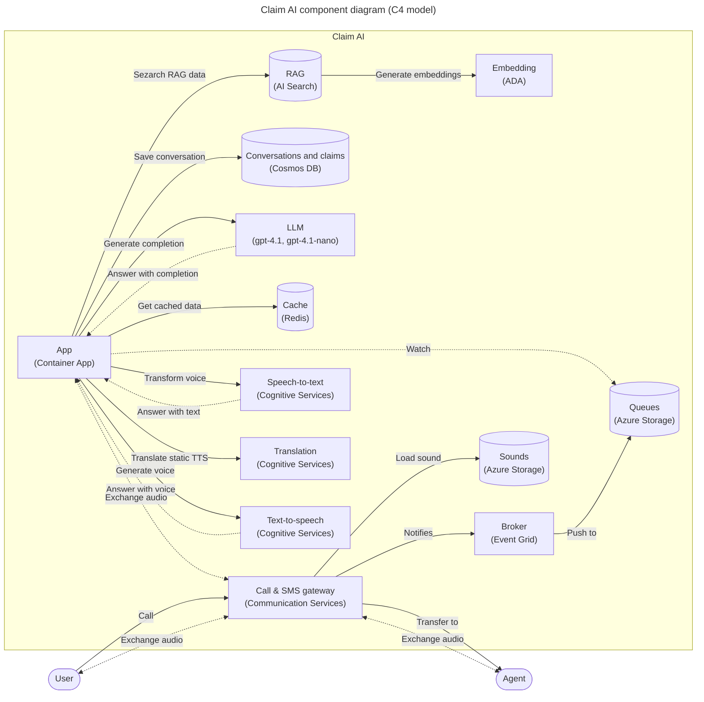

* content
{:toc}

# LLM 智能客服案例

智能客服背景知识详见转内专题 [智能客服](ics)

## 行业现状

智能客服业界落地案例：
- 2023年3月，电商saas服务商Shopify集成ChatGPT
- 2023年12月，成立于2014年的Kore.ai完成1.5亿D轮融资，估值8亿
- 2023年底，德国创业公司Cognigy AI推出AI Copilot，用llm重新定义企业Agent协助，rise联络中心，AI改造传统客服；2024年6月，融资1亿美金
- 2023年成立的Bland AI 支持语音克隆、多语言支持、无限呼叫
- 国内，阿里小蜜已完成llm全方位升级重构，传统nlu+fsm方案退出
- sierra 融资较多

【2024-5-14】[2024中国“大模型+智能客服”最佳实践案例TOP10重磅发布](https://blog.csdn.net/python1234_/article/details/138856253)

【2024-6-27】[Kore.ai：LLM能否为AI客服带来新一轮洗牌与机遇](https://new.qq.com/rain/a/20240627A0A72O00)

【2023-6-30】[AIGC 重构后的智能客服，能否淘到大模型时代的第一桶金](https://www.infoq.cn/article/85UCQYO6sJUC23W1JWBu)

以 ChatGPT 为代表的大模型已经在许多企业中用于智能客服应用。它通过自动回答常见问题、解决简单问题和提供基本支持，减轻人工客服的负担。大语言模型通过深度学习和大量的语言数据训练，能够理解和生成人类语言，使得用户能够以自然的方式与它交互。在一些常见的客户查询和问题解答方面，这类大模型已经取得了相当不错的效果。

然而，当前大语言模型在实际应用于**智能客服**场景中时仍存在一些挑战
- 可能会生成**错误或不准确**的回答，尤其是对于复杂问题或领域特定知识，这就对智能化程度提出了更高的要求。未来的在线客服系不仅需要更高级的算法和机器学习技术，还需要更多精准的自然语言处理能力。这将对在技术上不太强大的企业形成巨大的压力。
- 随着用户数量和访客量的增多，未来智能客服将需要处理**超大规模并发**请求。这需要系统在多种方面都拥有特殊的设计，如负载均衡、高可扩展性和高可用性等。

市面上很多对话机器人，回答单一固定，变化比较少，与真实的人与人对话还有差距，未来的智能客服系统将需要进一步加强对用户行为的**自适应性**和**个性化**服务。这就需要系统学习更多的用户数据和信息，并适应不同的用户行为，为他们提供更好的服务和体验。

如何提升用户体验就成为了智能客服供应商主攻的方向。具体来讲，主要应从**人性化**服务、**个性化**服务和**拟人化**的对话交互方面进行改进。
- 首先是**人性化**服务。在场景和意图理解精准的基础上，附加更有**温度**的对话语境，可以让机器人在拟人化上，再进一步。
  - **多模态**情感计算是实现这一步的有效方法。目前正在推进虚拟数字人客服进行人机交互对话，在此过程中结合情感计算，可识别用户通过视频、语音、文本所传递的情感表达，让智能客服在应对是作出相应情感反馈，打造具有情感理解、有温度的人机交互。这种多模态情感计算技术的实现方法主要是通过基于专家规则和基于机器学习两种。其中，基于机器学习的方法通过训练模型来自动学习情感状态的分类标准，可以更好地适应不同领域、不同语境下的情感表达，效果相对更优些。
- 其次是**拟人化**的对话型交互。
  - 通过场景化设计优化，比如问题拆解、主题继承、多轮对话、上下文理解等等，机器人能够带来一种更加贴近自然对话场景的对话型交互模式。
- 第三是**个性化**服务。
  - 根据客户画像千人千面提供个性化服务，从多角度出发进行语义理解，此外还要附加语音情绪判别。 

大模型诞生后，无疑为智能客服领域注入了新的“营养剂”。这种“革新”体现在多个方面，包括**座席辅助**和**座席提效**、**闲聊寒暄**、**话术优化**建议、提供**语料扩写**等。
- 座席**辅助**和座席**提效**：过去的智能辅助更多局限于按单轮对话来完成，基于大模型的能力能够快速分析并生成面向客户侧的系统支撑策略，这种处理效率和结果，远超出依附纯规则或者纯知识库所能达到的效果；
- **闲聊寒暄**：是智能客服非常关键的基础能力，能够帮助企业对任意进线客户进行即时响应。过去的智能客服闲聊主要是将各类非业务相关的语料堆到素材库，并通过调取数据库已有的关键词进行内容的回复。如今可以充分借助大模型能力提供闲聊，在非业务领域上为座席和客服提供更多决策依据和参考；
- **话术优化**建议：话术往往决定了客服的效果，话术回复不精准将直接导致用户的流失。通过大模型强大的内容生成能力，智能客服能够对话术进行不断地迭代和与优化，提升客户满意度；
- 提供**语料扩写**：在智能客服冷启动阶段，往往需要足够多的语料来丰富知识库的相似问法，以保证上线初期智能客服有足够高的解决率和场景覆盖率。以往的语料生成模型很难覆盖众多垂直行业和领域，大模型在通用领域中积累了足够的数据和语料，可以很好的弥补语料生成模型的不足，快速生成相似问法，解决智能客服冷启动语料不足，场景覆盖率低等问题。

提高对话质量的核心还是理解客户和用户场景，搭建出衡量得失的数据框架。这两个组合之下，会有一个循环反馈的过程，就能够通过正常的产品迭代达到好的效果，并且能够衡量出来 ROI 和对实际业务的共享。


## 案例


### 总结

【2026-3-17】[Top 8 AI agents for customer service : Tested & reviewed (2026)](https://www.kore.ai/blog/top-ai-agents-for-customer-service-tested-reviewed)
- 

GitHub 上智能客服agent项目，[地址](https://github.com/search?q=agent+customer+service+&type=repositories)

|项目|地址|时间|作者|介绍|可用性|实践|
|---|---|---|---|---|---|---|
|医疗问诊客服|[agentic-customer-service-medical-dental-clinic](https://github.com/Nachoeigu/agentic-customer-service-medical-clinic)|2024年5月|国外个人|基于LangGraph & LangChain的医疗客服，诊断、预约、取消|低||
|多智能体客服|[customer-service-ai-agent](https://github.com/handsomestWei/customer-service-ai-agent)|2025年8月|国内个人|LangGraph 搭建多智能体客服系统；<br>Multi-Agent架构, 各专家物理隔离（agent文件独立）; 接硅基流动的llm|中|【2026-5-7】实测，安装失败，langchain/graph 工具包版本不一致，后端服务无法启动|
|电商客服|[customer-chatbot-solution-accelerator](https://github.com/microsoft/customer-chatbot-solution-accelerator)|2025年9月|微软|Foundry agent框架在电商客服上实践|低|依赖微软生态|
|航班机票客服|[openai-cs-agents-demo](https://github.com/openai/openai-cs-agents-demo)|2025年12月|OpenAI|multi-agent架构实现的航空订票客服|低|基于OpenAI自己的生态（Agent+ChatKit）|
|客服Agent平台[tgo.ai](https://tgo.ai/)|[github.com/tgoai](https://github.com/tgoai/tgo/tree/main)|2025年11月|tgo|多渠道接入，知识库，多智能体协调，主流大模型支持|高||
|客服助手|[customer-service-agent](https://github.com/WuTong960103/customer-service-agent)|2026年1月|国内个人|基于LangChain和Qwen大模型的智能客服系统，支持意图识别、槽位填充、RAG知识检索和多轮对话。|中|前后端分离|
|智能客服skill|[agent-skills-customer-service](https://github.com/murphye/agent-skills-customer-service)|2026年2月|国外个人|理念：图即是markdown. 将客服能力打包成skill，供claude code/langgraph调用<br>10 步工作流程:置信度路由、重试逻辑、升级规则、策略执行和响应模板均在 markdown 文件中定义|高|订单/工单封装成两个mcp服务; 只需编排文本markdown，不用构建langgraph图|
|问答客服|[Building-Customer-Service-Agent-with-Skill](https://github.com/akshaykokane/Building-Customer-Service-Agent-with-Skill.md-and-Agent-Framework)|2026年3月|国外个人|用 Microsoft Agent Framework 实现智能客服后端（C#语言），React+Vite实现前端，并用 skill机制 节省token；<br>Multi-Agent架构，controller负责分发+流式响应|中, multi-agent + skill 可借鉴 | 使用新版skill格式（skill.md 包含trigger示例）, 各领域专家以skill方式组织；有护栏机制|
||||||||
||||||||


【2026-2-*】[agent-skills-customer-service](https://github.com/murphye/agent-skills-customer-service)


### 【2026-5-28】E-Snap Core 语义缓存

【2026-5-28】[开源的 AI 客服项目：带“语义缓存”的 Agent 工作流（LangGraph + RedisVL）]()

基于大模型的客服系统常因**重复查询消耗巨额API费用与响应时间**

问题：
- 用户问题很多**高度重复**（比如“发什么快递”“怎么退换货”）。
- 如果每次都完整跑一遍 RAG 或者调大模型，不仅 API 费用吃不消，响应速度也慢，遇到并发高峰期很容易拉胯。


为此构建带**语义缓存**的智能客服Demo，核心思路：'尽量别让请求打到大模型上'
- [E-Snap Core 代码](https://github.com/ascendho/E-Snap)，[demo](https://ascendho.netlify.app/projects/e-snap/demo)
- 基于 LangGraph 与 RedisVL 的用户支持智能客服，引入**语义缓存机制**，提高吞吐量并显著降低延迟和大模型调用成本

E-Snap Core 是面向**电商客服场景**的公开版核心 demo，保留了后端工作流、前端演示页面、最小知识库样例和基础测试，用于展示语义缓存增强问答系统的核心实现。


该目录不包含私有访谈材料、本地环境文件、历史运行产物或完整评测扩展数据。

用户提问漏斗
- **FAQ 预热**：系统启动时，会把高频常见问题预先灌进缓存里。
- **前置拦截**：如果用户问高度**动态**信息（比如查询某个具体的订单状态、当下的库存等），系统会直接拦截并走动态查询逻辑，不走静态缓存。
- **L1 规则缓存**：通过**关键词**等硬性规则做第一层快速匹配。
- **L2 语义缓存**（核心）：这层依赖 RedisVL。只要用户提问和缓存库里的历史问题“意思差不多”（比如“怎么退款”和“申请退换货怎么弄”），系统就会通过向量检索直接把之前的答案捞出来返回。这步能省下巨量的 Token 消耗和等待时间。
- **大模型兜底**（Agent 研究流程）：如果前面的缓存全都没命中，请求才会真正进入由 LangGraph 编排的 Agent 工作流。大模型会调用相应的工具（查知识库等）来解决问题。
- **写回缓存**：Agent 给出满意的回答后，系统会评估这个回答有没有复用价值，如果有，就按规则写回缓存池，留给下个用户用。


<!-- draw.io diagram -->
<div class="mxgraph" style="max-width:100%;border:1px solid transparent;" data-mxgraph="{&quot;highlight&quot;:&quot;#0000ff&quot;,&quot;nav&quot;:true,&quot;resize&quot;:true,&quot;dark-mode&quot;:&quot;auto&quot;,&quot;toolbar&quot;:&quot;zoom layers tags lightbox&quot;,&quot;edit&quot;:&quot;_blank&quot;,&quot;xml&quot;:&quot;&lt;mxfile host=\&quot;app.diagrams.net\&quot;&gt;\n  &lt;diagram name=\&quot;AI意图识别商用方案\&quot; id=\&quot;osbHtP6Ki7KAK-vxM0vi\&quot;&gt;\n    &lt;mxGraphModel dx=\&quot;31786\&quot; dy=\&quot;21905\&quot; grid=\&quot;1\&quot; gridSize=\&quot;10\&quot; guides=\&quot;1\&quot; tooltips=\&quot;1\&quot; connect=\&quot;1\&quot; arrows=\&quot;1\&quot; fold=\&quot;1\&quot; page=\&quot;1\&quot; pageScale=\&quot;1\&quot; pageWidth=\&quot;827\&quot; pageHeight=\&quot;1169\&quot; math=\&quot;0\&quot; shadow=\&quot;0\&quot;&gt;\n      &lt;root&gt;\n        &lt;mxCell id=\&quot;0\&quot; /&gt;\n        &lt;mxCell id=\&quot;1\&quot; parent=\&quot;0\&quot; /&gt;\n        &lt;mxCell id=\&quot;ueTJB6k9vFQzMmB7xgun-1\&quot; parent=\&quot;1\&quot; style=\&quot;rounded=0;whiteSpace=wrap;html=1;fillColor=#d5e8d4;strokeColor=#82b366;fontSize=16;labelBackgroundColor=none;\&quot; value=\&quot;用户发起提问\&quot; vertex=\&quot;1\&quot;&gt;\n          &lt;mxGeometry height=\&quot;60\&quot; width=\&quot;180\&quot; x=\&quot;-29910\&quot; y=\&quot;-20510\&quot; as=\&quot;geometry\&quot; /&gt;\n        &lt;/mxCell&gt;\n        &lt;mxCell id=\&quot;ueTJB6k9vFQzMmB7xgun-2\&quot; parent=\&quot;1\&quot; style=\&quot;rounded=0;whiteSpace=wrap;html=1;fillColor=#dae8fc;strokeColor=#6c8ebf;fontSize=16;labelBackgroundColor=none;\&quot; value=\&quot;FAQ 预热\&quot; vertex=\&quot;1\&quot;&gt;\n          &lt;mxGeometry height=\&quot;40\&quot; width=\&quot;180\&quot; x=\&quot;-29910\&quot; y=\&quot;-20410\&quot; as=\&quot;geometry\&quot; /&gt;\n        &lt;/mxCell&gt;\n        &lt;mxCell id=\&quot;ueTJB6k9vFQzMmB7xgun-3\&quot; parent=\&quot;1\&quot; style=\&quot;rounded=1;whiteSpace=wrap;html=1;fillColor=#fff2cc;strokeColor=#d6b656;fontSize=16;labelBackgroundColor=none;\&quot; value=\&quot;动态信息查询？\&quot; vertex=\&quot;1\&quot;&gt;\n          &lt;mxGeometry height=\&quot;50\&quot; width=\&quot;180\&quot; x=\&quot;-29910\&quot; y=\&quot;-20330\&quot; as=\&quot;geometry\&quot; /&gt;\n        &lt;/mxCell&gt;\n        &lt;mxCell id=\&quot;ueTJB6k9vFQzMmB7xgun-4\&quot; parent=\&quot;1\&quot; style=\&quot;rounded=0;whiteSpace=wrap;html=1;fillColor=#f8cecc;strokeColor=#b85450;fontSize=16;labelBackgroundColor=none;\&quot; value=\&quot;前置拦截\&quot; vertex=\&quot;1\&quot;&gt;\n          &lt;mxGeometry height=\&quot;60\&quot; width=\&quot;180\&quot; x=\&quot;-30140\&quot; y=\&quot;-20240\&quot; as=\&quot;geometry\&quot; /&gt;\n        &lt;/mxCell&gt;\n        &lt;mxCell id=\&quot;ueTJB6k9vFQzMmB7xgun-5\&quot; parent=\&quot;1\&quot; style=\&quot;rounded=0;whiteSpace=wrap;html=1;fillColor=#dae8fc;strokeColor=#6c8ebf;fontSize=16;labelBackgroundColor=none;\&quot; value=\&quot;L1 规则缓存\&quot; vertex=\&quot;1\&quot;&gt;\n          &lt;mxGeometry height=\&quot;50\&quot; width=\&quot;180\&quot; x=\&quot;-29910\&quot; y=\&quot;-20235\&quot; as=\&quot;geometry\&quot; /&gt;\n        &lt;/mxCell&gt;\n        &lt;mxCell id=\&quot;ueTJB6k9vFQzMmB7xgun-6\&quot; parent=\&quot;1\&quot; style=\&quot;rounded=1;whiteSpace=wrap;html=1;fillColor=#fff2cc;strokeColor=#d6b656;fontSize=16;labelBackgroundColor=none;\&quot; value=\&quot;L1 缓存命中？\&quot; vertex=\&quot;1\&quot;&gt;\n          &lt;mxGeometry height=\&quot;50\&quot; width=\&quot;180\&quot; x=\&quot;-29910\&quot; y=\&quot;-20160\&quot; as=\&quot;geometry\&quot; /&gt;\n        &lt;/mxCell&gt;\n        &lt;mxCell id=\&quot;ueTJB6k9vFQzMmB7xgun-7\&quot; parent=\&quot;1\&quot; style=\&quot;rounded=0;whiteSpace=wrap;html=1;fillColor=#e1d5e7;strokeColor=#9673a6;fontSize=16;labelBackgroundColor=none;\&quot; value=\&quot;返回缓存答案\&quot; vertex=\&quot;1\&quot;&gt;\n          &lt;mxGeometry height=\&quot;50\&quot; width=\&quot;140\&quot; x=\&quot;-29680\&quot; y=\&quot;-20160\&quot; as=\&quot;geometry\&quot; /&gt;\n        &lt;/mxCell&gt;\n        &lt;mxCell id=\&quot;ueTJB6k9vFQzMmB7xgun-8\&quot; parent=\&quot;1\&quot; style=\&quot;rounded=0;whiteSpace=wrap;html=1;fillColor=#dae8fc;strokeColor=#6c8ebf;fontSize=16;labelBackgroundColor=none;\&quot; value=\&quot;L2 语义缓存(核心)\&quot; vertex=\&quot;1\&quot;&gt;\n          &lt;mxGeometry height=\&quot;50\&quot; width=\&quot;180\&quot; x=\&quot;-29910\&quot; y=\&quot;-20070\&quot; as=\&quot;geometry\&quot; /&gt;\n        &lt;/mxCell&gt;\n        &lt;mxCell id=\&quot;ueTJB6k9vFQzMmB7xgun-9\&quot; parent=\&quot;1\&quot; style=\&quot;rounded=1;whiteSpace=wrap;html=1;fillColor=#fff2cc;strokeColor=#d6b656;fontSize=16;labelBackgroundColor=none;\&quot; value=\&quot;L2 语义缓存命中？\&quot; vertex=\&quot;1\&quot;&gt;\n          &lt;mxGeometry height=\&quot;50\&quot; width=\&quot;180\&quot; x=\&quot;-29910\&quot; y=\&quot;-19990\&quot; as=\&quot;geometry\&quot; /&gt;\n        &lt;/mxCell&gt;\n        &lt;mxCell id=\&quot;ueTJB6k9vFQzMmB7xgun-10\&quot; parent=\&quot;1\&quot; style=\&quot;rounded=0;whiteSpace=wrap;html=1;fillColor=#e1d5e7;strokeColor=#9673a6;fontSize=16;labelBackgroundColor=none;\&quot; value=\&quot;返回向量匹配答案\&quot; vertex=\&quot;1\&quot;&gt;\n          &lt;mxGeometry height=\&quot;50\&quot; width=\&quot;140\&quot; x=\&quot;-29680\&quot; y=\&quot;-19990\&quot; as=\&quot;geometry\&quot; /&gt;\n        &lt;/mxCell&gt;\n        &lt;mxCell id=\&quot;ueTJB6k9vFQzMmB7xgun-11\&quot; parent=\&quot;1\&quot; style=\&quot;rounded=0;whiteSpace=wrap;html=1;fillColor=#f8cecc;strokeColor=#b85450;fontSize=16;labelBackgroundColor=none;\&quot; value=\&quot;大模型兜底\&quot; vertex=\&quot;1\&quot;&gt;\n          &lt;mxGeometry height=\&quot;40\&quot; width=\&quot;180\&quot; x=\&quot;-29910\&quot; y=\&quot;-19880\&quot; as=\&quot;geometry\&quot; /&gt;\n        &lt;/mxCell&gt;\n        &lt;mxCell id=\&quot;ueTJB6k9vFQzMmB7xgun-12\&quot; parent=\&quot;1\&quot; style=\&quot;rounded=0;whiteSpace=wrap;html=1;fillColor=#d5e8d4;strokeColor=#82b366;fontSize=16;labelBackgroundColor=none;\&quot; value=\&quot;评估答案复用价值\&quot; vertex=\&quot;1\&quot;&gt;\n          &lt;mxGeometry height=\&quot;60\&quot; width=\&quot;180\&quot; x=\&quot;-29910\&quot; y=\&quot;-19820\&quot; as=\&quot;geometry\&quot; /&gt;\n        &lt;/mxCell&gt;\n        &lt;mxCell id=\&quot;ueTJB6k9vFQzMmB7xgun-13\&quot; parent=\&quot;1\&quot; style=\&quot;rounded=0;whiteSpace=wrap;html=1;fillColor=#e1d5e7;strokeColor=#9673a6;fontSize=16;labelBackgroundColor=none;\&quot; value=\&quot;流程结束\&quot; vertex=\&quot;1\&quot;&gt;\n          &lt;mxGeometry height=\&quot;50\&quot; width=\&quot;180\&quot; x=\&quot;-29910\&quot; y=\&quot;-19740\&quot; as=\&quot;geometry\&quot; /&gt;\n        &lt;/mxCell&gt;\n        &lt;mxCell id=\&quot;ueTJB6k9vFQzMmB7xgun-14\&quot; edge=\&quot;1\&quot; parent=\&quot;1\&quot; source=\&quot;ueTJB6k9vFQzMmB7xgun-1\&quot; style=\&quot;endArrow=block;html=1;fontSize=16;labelBackgroundColor=none;\&quot; target=\&quot;ueTJB6k9vFQzMmB7xgun-2\&quot; value=\&quot;\&quot;&gt;\n          &lt;mxGeometry relative=\&quot;1\&quot; as=\&quot;geometry\&quot; /&gt;\n        &lt;/mxCell&gt;\n        &lt;mxCell id=\&quot;ueTJB6k9vFQzMmB7xgun-15\&quot; edge=\&quot;1\&quot; parent=\&quot;1\&quot; source=\&quot;ueTJB6k9vFQzMmB7xgun-2\&quot; style=\&quot;endArrow=block;html=1;fontSize=16;labelBackgroundColor=none;\&quot; target=\&quot;ueTJB6k9vFQzMmB7xgun-3\&quot; value=\&quot;\&quot;&gt;\n          &lt;mxGeometry relative=\&quot;1\&quot; as=\&quot;geometry\&quot; /&gt;\n        &lt;/mxCell&gt;\n        &lt;mxCell id=\&quot;ueTJB6k9vFQzMmB7xgun-16\&quot; edge=\&quot;1\&quot; parent=\&quot;1\&quot; source=\&quot;ueTJB6k9vFQzMmB7xgun-3\&quot; style=\&quot;endArrow=block;html=1;elbow=vertical;edgeStyle=orthogonalEdgeStyle;fontSize=16;labelBackgroundColor=none;\&quot; target=\&quot;ueTJB6k9vFQzMmB7xgun-4\&quot; value=\&quot;是\&quot;&gt;\n          &lt;mxGeometry relative=\&quot;1\&quot; as=\&quot;geometry\&quot; /&gt;\n        &lt;/mxCell&gt;\n        &lt;mxCell id=\&quot;ueTJB6k9vFQzMmB7xgun-17\&quot; edge=\&quot;1\&quot; parent=\&quot;1\&quot; source=\&quot;ueTJB6k9vFQzMmB7xgun-3\&quot; style=\&quot;endArrow=block;html=1;fontSize=16;labelBackgroundColor=none;\&quot; target=\&quot;ueTJB6k9vFQzMmB7xgun-5\&quot; value=\&quot;否\&quot;&gt;\n          &lt;mxGeometry relative=\&quot;1\&quot; x=\&quot;-0.3333\&quot; y=\&quot;30\&quot; as=\&quot;geometry\&quot;&gt;\n            &lt;mxPoint y=\&quot;-1\&quot; as=\&quot;offset\&quot; /&gt;\n          &lt;/mxGeometry&gt;\n        &lt;/mxCell&gt;\n        &lt;mxCell id=\&quot;ueTJB6k9vFQzMmB7xgun-18\&quot; edge=\&quot;1\&quot; parent=\&quot;1\&quot; source=\&quot;ueTJB6k9vFQzMmB7xgun-5\&quot; style=\&quot;endArrow=block;html=1;fontSize=16;labelBackgroundColor=none;\&quot; target=\&quot;ueTJB6k9vFQzMmB7xgun-6\&quot; value=\&quot;\&quot;&gt;\n          &lt;mxGeometry relative=\&quot;1\&quot; as=\&quot;geometry\&quot; /&gt;\n        &lt;/mxCell&gt;\n        &lt;mxCell id=\&quot;ueTJB6k9vFQzMmB7xgun-19\&quot; edge=\&quot;1\&quot; parent=\&quot;1\&quot; source=\&quot;ueTJB6k9vFQzMmB7xgun-6\&quot; style=\&quot;endArrow=block;html=1;fontSize=16;labelBackgroundColor=none;\&quot; target=\&quot;ueTJB6k9vFQzMmB7xgun-7\&quot; value=\&quot;命中\&quot;&gt;\n          &lt;mxGeometry relative=\&quot;1\&quot; as=\&quot;geometry\&quot; /&gt;\n        &lt;/mxCell&gt;\n        &lt;mxCell id=\&quot;ueTJB6k9vFQzMmB7xgun-20\&quot; edge=\&quot;1\&quot; parent=\&quot;1\&quot; source=\&quot;ueTJB6k9vFQzMmB7xgun-6\&quot; style=\&quot;endArrow=block;html=1;fontSize=16;labelBackgroundColor=none;\&quot; target=\&quot;ueTJB6k9vFQzMmB7xgun-8\&quot; value=\&quot;未命中\&quot;&gt;\n          &lt;mxGeometry relative=\&quot;1\&quot; x=\&quot;0.0667\&quot; as=\&quot;geometry\&quot;&gt;\n            &lt;mxPoint as=\&quot;offset\&quot; /&gt;\n          &lt;/mxGeometry&gt;\n        &lt;/mxCell&gt;\n        &lt;mxCell id=\&quot;ueTJB6k9vFQzMmB7xgun-21\&quot; edge=\&quot;1\&quot; parent=\&quot;1\&quot; source=\&quot;ueTJB6k9vFQzMmB7xgun-8\&quot; style=\&quot;endArrow=block;html=1;fontSize=16;labelBackgroundColor=none;\&quot; target=\&quot;ueTJB6k9vFQzMmB7xgun-9\&quot; value=\&quot;\&quot;&gt;\n          &lt;mxGeometry relative=\&quot;1\&quot; as=\&quot;geometry\&quot; /&gt;\n        &lt;/mxCell&gt;\n        &lt;mxCell id=\&quot;ueTJB6k9vFQzMmB7xgun-22\&quot; edge=\&quot;1\&quot; parent=\&quot;1\&quot; source=\&quot;ueTJB6k9vFQzMmB7xgun-9\&quot; style=\&quot;endArrow=block;html=1;fontSize=16;labelBackgroundColor=none;\&quot; target=\&quot;ueTJB6k9vFQzMmB7xgun-10\&quot; value=\&quot;命中\&quot;&gt;\n          &lt;mxGeometry relative=\&quot;1\&quot; as=\&quot;geometry\&quot; /&gt;\n        &lt;/mxCell&gt;\n        &lt;mxCell id=\&quot;ueTJB6k9vFQzMmB7xgun-23\&quot; edge=\&quot;1\&quot; parent=\&quot;1\&quot; source=\&quot;ueTJB6k9vFQzMmB7xgun-9\&quot; style=\&quot;endArrow=block;html=1;fontSize=16;labelBackgroundColor=none;\&quot; target=\&quot;ueTJB6k9vFQzMmB7xgun-11\&quot; value=\&quot;未命中\&quot;&gt;\n          &lt;mxGeometry relative=\&quot;1\&quot; as=\&quot;geometry\&quot; /&gt;\n        &lt;/mxCell&gt;\n        &lt;mxCell id=\&quot;ueTJB6k9vFQzMmB7xgun-24\&quot; edge=\&quot;1\&quot; parent=\&quot;1\&quot; source=\&quot;ueTJB6k9vFQzMmB7xgun-11\&quot; style=\&quot;endArrow=block;html=1;fontSize=16;labelBackgroundColor=none;\&quot; target=\&quot;ueTJB6k9vFQzMmB7xgun-12\&quot; value=\&quot;\&quot;&gt;\n          &lt;mxGeometry relative=\&quot;1\&quot; as=\&quot;geometry\&quot; /&gt;\n        &lt;/mxCell&gt;\n        &lt;mxCell id=\&quot;ueTJB6k9vFQzMmB7xgun-25\&quot; edge=\&quot;1\&quot; parent=\&quot;1\&quot; source=\&quot;ueTJB6k9vFQzMmB7xgun-12\&quot; style=\&quot;endArrow=block;html=1;fontSize=16;labelBackgroundColor=none;\&quot; target=\&quot;ueTJB6k9vFQzMmB7xgun-13\&quot; value=\&quot;\&quot;&gt;\n          &lt;mxGeometry relative=\&quot;1\&quot; as=\&quot;geometry\&quot; /&gt;\n        &lt;/mxCell&gt;\n        &lt;mxCell id=\&quot;ueTJB6k9vFQzMmB7xgun-26\&quot; edge=\&quot;1\&quot; parent=\&quot;1\&quot; source=\&quot;ueTJB6k9vFQzMmB7xgun-4\&quot; style=\&quot;endArrow=block;html=1;edgeStyle=orthogonalEdgeStyle;exitX=0.5;exitY=1;exitDx=0;exitDy=0;entryX=0;entryY=0.5;entryDx=0;entryDy=0;fontSize=16;labelBackgroundColor=none;\&quot; target=\&quot;ueTJB6k9vFQzMmB7xgun-13\&quot; value=\&quot;\&quot;&gt;\n          &lt;mxGeometry relative=\&quot;1\&quot; as=\&quot;geometry\&quot; /&gt;\n        &lt;/mxCell&gt;\n        &lt;mxCell id=\&quot;ueTJB6k9vFQzMmB7xgun-27\&quot; edge=\&quot;1\&quot; parent=\&quot;1\&quot; source=\&quot;ueTJB6k9vFQzMmB7xgun-7\&quot; style=\&quot;endArrow=block;html=1;edgeStyle=orthogonalEdgeStyle;exitX=1;exitY=0.5;exitDx=0;exitDy=0;entryX=1;entryY=0.5;entryDx=0;entryDy=0;fontSize=16;labelBackgroundColor=none;\&quot; target=\&quot;ueTJB6k9vFQzMmB7xgun-13\&quot; value=\&quot;\&quot;&gt;\n          &lt;mxGeometry relative=\&quot;1\&quot; as=\&quot;geometry\&quot;&gt;\n            &lt;Array as=\&quot;points\&quot;&gt;\n              &lt;mxPoint x=\&quot;-29490\&quot; y=\&quot;-20135\&quot; /&gt;\n              &lt;mxPoint x=\&quot;-29490\&quot; y=\&quot;-19715\&quot; /&gt;\n            &lt;/Array&gt;\n          &lt;/mxGeometry&gt;\n        &lt;/mxCell&gt;\n        &lt;mxCell id=\&quot;ueTJB6k9vFQzMmB7xgun-28\&quot; edge=\&quot;1\&quot; parent=\&quot;1\&quot; source=\&quot;ueTJB6k9vFQzMmB7xgun-10\&quot; style=\&quot;endArrow=block;html=1;edgeStyle=orthogonalEdgeStyle;exitX=1;exitY=0.5;exitDx=0;exitDy=0;entryX=1;entryY=0.5;entryDx=0;entryDy=0;fontSize=16;labelBackgroundColor=none;\&quot; target=\&quot;ueTJB6k9vFQzMmB7xgun-13\&quot; value=\&quot;\&quot;&gt;\n          &lt;mxGeometry relative=\&quot;1\&quot; as=\&quot;geometry\&quot; /&gt;\n        &lt;/mxCell&gt;\n        &lt;mxCell id=\&quot;ueTJB6k9vFQzMmB7xgun-29\&quot; parent=\&quot;1\&quot; style=\&quot;text;whiteSpace=wrap;html=1;fontSize=16;labelBackgroundColor=none;\&quot; value=\&quot;&amp;lt;span style=&amp;quot;color: rgb(0, 0, 0); font-family: Helvetica; font-style: normal; font-variant-ligatures: normal; font-variant-caps: normal; font-weight: 400; letter-spacing: normal; orphans: 2; text-align: center; text-indent: 0px; text-transform: none; widows: 2; word-spacing: 0px; -webkit-text-stroke-width: 0px; white-space: normal; text-decoration-thickness: initial; text-decoration-style: initial; text-decoration-color: initial; float: none; display: inline !important;&amp;quot;&amp;gt;加载高频问题至静态缓存&amp;lt;/span&amp;gt;\&quot; vertex=\&quot;1\&quot;&gt;\n          &lt;mxGeometry height=\&quot;40\&quot; width=\&quot;200\&quot; x=\&quot;-29720\&quot; y=\&quot;-20400\&quot; as=\&quot;geometry\&quot; /&gt;\n        &lt;/mxCell&gt;\n        &lt;mxCell id=\&quot;ueTJB6k9vFQzMmB7xgun-30\&quot; parent=\&quot;1\&quot; style=\&quot;text;whiteSpace=wrap;html=1;fontSize=16;labelBackgroundColor=none;\&quot; value=\&quot;&amp;lt;span style=&amp;quot;color: rgb(0, 0, 0); font-family: Helvetica; font-style: normal; font-variant-ligatures: normal; font-variant-caps: normal; font-weight: 400; letter-spacing: normal; orphans: 2; text-align: center; text-indent: 0px; text-transform: none; widows: 2; word-spacing: 0px; -webkit-text-stroke-width: 0px; white-space: normal; text-decoration-thickness: initial; text-decoration-style: initial; text-decoration-color: initial; float: none; display: inline !important;&amp;quot;&amp;gt;(订单/库存等)&amp;lt;/span&amp;gt;\&quot; vertex=\&quot;1\&quot;&gt;\n          &lt;mxGeometry height=\&quot;40\&quot; width=\&quot;100\&quot; x=\&quot;-29710\&quot; y=\&quot;-20325\&quot; as=\&quot;geometry\&quot; /&gt;\n        &lt;/mxCell&gt;\n        &lt;mxCell id=\&quot;ueTJB6k9vFQzMmB7xgun-31\&quot; parent=\&quot;1\&quot; style=\&quot;text;whiteSpace=wrap;html=1;fontSize=16;labelBackgroundColor=none;\&quot; value=\&quot;&amp;lt;span style=&amp;quot;color: rgb(0, 0, 0); font-family: Helvetica; font-style: normal; font-variant-ligatures: normal; font-variant-caps: normal; font-weight: 400; letter-spacing: normal; orphans: 2; text-align: center; text-indent: 0px; text-transform: none; widows: 2; word-spacing: 0px; -webkit-text-stroke-width: 0px; white-space: normal; text-decoration-thickness: initial; text-decoration-style: initial; text-decoration-color: initial; float: none; display: inline !important;&amp;quot;&amp;gt;关键词硬规则快速匹配&amp;lt;/span&amp;gt;\&quot; vertex=\&quot;1\&quot;&gt;\n          &lt;mxGeometry height=\&quot;40\&quot; width=\&quot;170\&quot; x=\&quot;-29720\&quot; y=\&quot;-20230\&quot; as=\&quot;geometry\&quot; /&gt;\n        &lt;/mxCell&gt;\n        &lt;mxCell id=\&quot;ueTJB6k9vFQzMmB7xgun-32\&quot; parent=\&quot;1\&quot; style=\&quot;text;whiteSpace=wrap;html=1;fontSize=16;labelBackgroundColor=none;\&quot; value=\&quot;&amp;lt;span style=&amp;quot;color: rgb(0, 0, 0); font-family: Helvetica; font-style: normal; font-variant-ligatures: normal; font-variant-caps: normal; font-weight: 400; letter-spacing: normal; orphans: 2; text-align: center; text-indent: 0px; text-transform: none; widows: 2; word-spacing: 0px; -webkit-text-stroke-width: 0px; white-space: normal; text-decoration-thickness: initial; text-decoration-style: initial; text-decoration-color: initial; float: none; display: inline !important;&amp;quot;&amp;gt;RedisVL 向量检索&amp;lt;/span&amp;gt;\&quot; vertex=\&quot;1\&quot;&gt;\n          &lt;mxGeometry height=\&quot;40\&quot; width=\&quot;150\&quot; x=\&quot;-29720\&quot; y=\&quot;-20070\&quot; as=\&quot;geometry\&quot; /&gt;\n        &lt;/mxCell&gt;\n        &lt;mxCell id=\&quot;ueTJB6k9vFQzMmB7xgun-33\&quot; parent=\&quot;1\&quot; style=\&quot;text;whiteSpace=wrap;html=1;fontSize=16;labelBackgroundColor=none;\&quot; value=\&quot;&amp;lt;span style=&amp;quot;color: rgb(0, 0, 0); font-family: Helvetica; font-style: normal; font-variant-ligatures: normal; font-variant-caps: normal; font-weight: 400; letter-spacing: normal; orphans: 2; text-align: center; text-indent: 0px; text-transform: none; widows: 2; word-spacing: 0px; -webkit-text-stroke-width: 0px; white-space: normal; text-decoration-thickness: initial; text-decoration-style: initial; text-decoration-color: initial; float: none; display: inline !important;&amp;quot;&amp;gt;LangGraph Agent 工作流&amp;lt;/span&amp;gt;&amp;lt;br style=&amp;quot;forced-color-adjust: none; color: rgb(0, 0, 0); font-family: Helvetica; font-style: normal; font-variant-ligatures: normal; font-variant-caps: normal; font-weight: 400; letter-spacing: normal; orphans: 2; text-align: center; text-indent: 0px; text-transform: none; widows: 2; word-spacing: 0px; -webkit-text-stroke-width: 0px; white-space: normal; text-decoration-thickness: initial; text-decoration-style: initial; text-decoration-color: initial;&amp;quot;&amp;gt;&amp;lt;span style=&amp;quot;color: rgb(0, 0, 0); font-family: Helvetica; font-style: normal; font-variant-ligatures: normal; font-variant-caps: normal; font-weight: 400; letter-spacing: normal; orphans: 2; text-align: center; text-indent: 0px; text-transform: none; widows: 2; word-spacing: 0px; -webkit-text-stroke-width: 0px; white-space: normal; text-decoration-thickness: initial; text-decoration-style: initial; text-decoration-color: initial; float: none; display: inline !important;&amp;quot;&amp;gt;调用工具/知识库解答&amp;lt;/span&amp;gt;\&quot; vertex=\&quot;1\&quot;&gt;\n          &lt;mxGeometry height=\&quot;50\&quot; width=\&quot;200\&quot; x=\&quot;-29720\&quot; y=\&quot;-19890\&quot; as=\&quot;geometry\&quot; /&gt;\n        &lt;/mxCell&gt;\n        &lt;mxCell id=\&quot;ueTJB6k9vFQzMmB7xgun-34\&quot; parent=\&quot;1\&quot; style=\&quot;text;whiteSpace=wrap;html=1;fontSize=16;labelBackgroundColor=none;\&quot; value=\&quot;&amp;lt;span style=&amp;quot;color: rgb(0, 0, 0); font-family: Helvetica; font-style: normal; font-variant-ligatures: normal; font-variant-caps: normal; font-weight: 400; letter-spacing: normal; orphans: 2; text-align: center; text-indent: 0px; text-transform: none; widows: 2; word-spacing: 0px; -webkit-text-stroke-width: 0px; white-space: normal; text-decoration-thickness: initial; text-decoration-style: initial; text-decoration-color: initial; float: none; display: inline !important;&amp;quot;&amp;gt;执行动态查询逻辑&amp;lt;/span&amp;gt;\&quot; vertex=\&quot;1\&quot;&gt;\n          &lt;mxGeometry height=\&quot;40\&quot; width=\&quot;130\&quot; x=\&quot;-30185\&quot; y=\&quot;-20170\&quot; as=\&quot;geometry\&quot; /&gt;\n        &lt;/mxCell&gt;\n        &lt;mxCell id=\&quot;ueTJB6k9vFQzMmB7xgun-35\&quot; edge=\&quot;1\&quot; parent=\&quot;1\&quot; source=\&quot;ueTJB6k9vFQzMmB7xgun-34\&quot; style=\&quot;edgeStyle=orthogonalEdgeStyle;rounded=0;orthogonalLoop=1;jettySize=auto;html=1;exitX=0.5;exitY=1;exitDx=0;exitDy=0;\&quot; target=\&quot;ueTJB6k9vFQzMmB7xgun-34\&quot;&gt;\n          &lt;mxGeometry relative=\&quot;1\&quot; as=\&quot;geometry\&quot; /&gt;\n        &lt;/mxCell&gt;\n        &lt;mxCell id=\&quot;ueTJB6k9vFQzMmB7xgun-37\&quot; parent=\&quot;1\&quot; style=\&quot;text;whiteSpace=wrap;html=1;fontSize=24;labelBackgroundColor=none;\&quot; value=\&quot;&amp;lt;span style=&amp;quot;color: rgb(0, 0, 0); font-family: Helvetica; font-style: normal; font-variant-ligatures: normal; font-variant-caps: normal; font-weight: 400; letter-spacing: normal; orphans: 2; text-align: center; text-indent: 0px; text-transform: none; widows: 2; word-spacing: 0px; -webkit-text-stroke-width: 0px; white-space: normal; text-decoration-thickness: initial; text-decoration-style: initial; text-decoration-color: initial; float: none; display: inline !important;&amp;quot;&amp;gt;智能客服语义缓存&amp;lt;/span&amp;gt;\&quot; vertex=\&quot;1\&quot;&gt;\n          &lt;mxGeometry height=\&quot;40\&quot; width=\&quot;240\&quot; x=\&quot;-29910\&quot; y=\&quot;-20570\&quot; as=\&quot;geometry\&quot; /&gt;\n        &lt;/mxCell&gt;\n        &lt;mxCell id=\&quot;ueTJB6k9vFQzMmB7xgun-38\&quot; parent=\&quot;1\&quot; style=\&quot;text;whiteSpace=wrap;html=1;labelBackgroundColor=none;\&quot; value=\&quot;&amp;lt;span style=&amp;quot;color: rgb(0, 0, 0); font-family: Helvetica; font-size: 16px; font-style: normal; font-variant-ligatures: normal; font-variant-caps: normal; font-weight: 400; letter-spacing: normal; orphans: 2; text-align: center; text-indent: 0px; text-transform: none; widows: 2; word-spacing: 0px; -webkit-text-stroke-width: 0px; white-space: normal; text-decoration-thickness: initial; text-decoration-style: initial; text-decoration-color: initial; float: none; display: inline !important;&amp;quot;&amp;gt;有价值 → 写回缓存池&amp;lt;/span&amp;gt;\&quot; vertex=\&quot;1\&quot;&gt;\n          &lt;mxGeometry height=\&quot;40\&quot; width=\&quot;160\&quot; x=\&quot;-30030\&quot; y=\&quot;-19920\&quot; as=\&quot;geometry\&quot; /&gt;\n        &lt;/mxCell&gt;\n        &lt;mxCell id=\&quot;ueTJB6k9vFQzMmB7xgun-39\&quot; edge=\&quot;1\&quot; parent=\&quot;1\&quot; source=\&quot;ueTJB6k9vFQzMmB7xgun-12\&quot; style=\&quot;endArrow=block;html=1;edgeStyle=orthogonalEdgeStyle;entryX=0;entryY=0.5;entryDx=0;entryDy=0;fontSize=16;labelBackgroundColor=none;exitX=0;exitY=0.5;exitDx=0;exitDy=0;\&quot; target=\&quot;ueTJB6k9vFQzMmB7xgun-8\&quot; value=\&quot;\&quot;&gt;\n          &lt;mxGeometry relative=\&quot;1\&quot; as=\&quot;geometry\&quot;&gt;\n            &lt;Array as=\&quot;points\&quot;&gt;\n              &lt;mxPoint x=\&quot;-29960\&quot; y=\&quot;-19790\&quot; /&gt;\n              &lt;mxPoint x=\&quot;-29960\&quot; y=\&quot;-20045\&quot; /&gt;\n            &lt;/Array&gt;\n            &lt;mxPoint x=\&quot;-30000\&quot; y=\&quot;-19950\&quot; as=\&quot;sourcePoint\&quot; /&gt;\n            &lt;mxPoint x=\&quot;-29860\&quot; y=\&quot;-19485\&quot; as=\&quot;targetPoint\&quot; /&gt;\n          &lt;/mxGeometry&gt;\n        &lt;/mxCell&gt;\n      &lt;/root&gt;\n    &lt;/mxGraphModel&gt;\n  &lt;/diagram&gt;\n&lt;/mxfile&gt;\n&quot;}"></div>
<script type="text/javascript" src="https://viewer.diagrams.net/js/viewer-static.min.js"></script>


### 【2026-5-7】GuaDa AI

【2026-5-7】[一款功能强大的AI Agent系统，支持MCP、SKILLS技能、机器人](https://mp.weixin.qq.com/s/E04rbObXk1HAnYRY-6dO_w)

GuaDa — 智能 AI 对话平台
- 支持 ReAct Agent、多模型适配、RAG 知识库检索、MCP 工具调用与 Skills 技能框架。
- 目标是打造一个可用、易用、好用的个人智能助理。

GuaDa AI是一款功能强大的AI Agent系统，支持多角色对话、知识库、会话压缩、MCP、SKILLS技能、机器人等多种高级AI功能。该项目采用前后端分离架构，后端基于NestJS，前端使用Vue 3 + Vite构建。
- 开源项目地址：[GuaDa AI](https://gitee.com/zhendongdong/guada_ai)
- 开源：[一飞](https://code.exmay.com/)

架构特点：
- 双入口：REST + SSE API 和 Bot Gateway 是两个对等入口，分别服务 Web/桌面用户和即时通讯平台用户，最终汇聚到同一个 Agent 引擎
- Agent 中心化：所有能力（知识检索、工具执行、技能调用）经由 Agent 循环统一调度
- 插拔式扩展：工具、技能、模型适配器均采用接口抽象，支持热插拔（目前skills支持热插拔，其余正在开发）
- 长上下文管理：两级压缩，优先裁剪工具结果再进行语义压缩，压缩支持回退


### 【2026-5-5】企业级 Hermes Agent

【2026-5-5】[企业级Hermes Agent部署方案 从零搭建高可用智能客服系统](https://openeuler.csdn.net/69f9b0a50a2f6a37c5a7eda3.html)

企业客服面临人工成本高、响应慢等痛点，HermesAgent智能客服系统通过闭环学习、持久记忆等功能提供解决方案。

传统客服模式始终面临痛点：
- 人工成本高、7×24小时值守难、重复咨询耗人力、响应效率参差不齐，尤其在大促、活动峰值期，咨询量激增易导致客户投诉率上升，影响品牌口碑。

而 Hermes Agent 作为开源自进化AI智能体，凭借闭环学习、持久记忆、多工具适配的核心优势，成为企业搭建智能客服系统的最优选择——无需专业开发团队，无需高额投入，从零部署即可实现“重复咨询自动化、复杂问题精准转人工、知识沉淀自主化”，彻底破解传统客服困境。

部署流程：
- 1、腾讯云服务器配置；
  - 登录腾讯云控制台，选择「轻量应用服务器」，点击「新建实例」；
  - 登录Hermes WebUI（服务器公网IP+8000端口），设置管理员账号密码，完成初始化配置。
- 2、绑定阿里云百炼等国内大模型；
  - 进入Hermes WebUI，找到「模型配置」→「添加模型」；
  - 选择阿里云百炼（或DeepSeek-V3），填入API Key，选择对应地域（与服务器地域一致）；
  - 设置模型参数：温度值0.7（平衡精准度与灵活性），最大上下文长度4096（支持长对话），保存配置并重启服务。
- 3、搭建知识库实现精准应答；
  - 知识库是智能客服的“大脑”，质量直接决定应答准确率，Hermes Agent支持RAG检索增强生成技术，可自动解析文档、生成检索索引，无需手动录入话术：
  - 进入WebUI「知识库管理」，点击「新建知识库」，命名为“企业客服知识库”；
  - 上传企业相关文档：产品手册、FAQ常见问题、售后政策、订单流程等（支持MD、TXT、PDF格式），Hermes会自动对文档进行切片、向量化处理，生成检索索引；
  - 设置检索规则：开启「自动检索」，最大上下文片段8个，相似度阈值0.5（过滤低相关内容），确保应答精准无“幻觉”；
  - 手动补充高频问答对（如“如何退款”“订单多久发货”），设置关键词触发，提升响应速度。
  - 补充：知识库支持自动更新，当企业政策、产品信息变更时，直接上传新文档，系统会自动重新索引，无需重新部署。
- 4、对接钉钉等沟通渠道。
  - 企业级客服需对接多渠道，Hermes Agent通过内置网关，可一键对接钉钉、企业微信、官网等，实现统一管理：


企业级优化需关注高可用性、安全性和应答优化，如自动备份、权限控制等。

该系统支持中小企业低成本快速部署，1-2小时完成，实现降本增效和客户体验提升。


### 【2026-4-25】中文客服多任务模型

【2026-4-25】[Justin-lee/qwen3-1.7b-chinese-cs-multitask](https://huggingface.co/Justin-lee/qwen3-1.7b-chinese-cs-multitask/blob/main/colab_notebook.ipynb)

中文客服多任務模型訓練

四個任務一次訓練：
- 客服 FAQ — 回答產品、訂單、退款問題
- 文件問答 — SOP/手冊/合約問答
- 工單分類 — 自動分流客服單、報修單
- 信息抽取 — 抽取日期、金額、地址、姓名

基底模型：Qwen3-1.7B (Apache-2.0)


### 【2026-5-31】客服知识库问答 Skill

【2026-5-31】[客服知识库问答 Skill：把散落资料变成稳定、可追溯的客服回复](https://mp.weixin.qq.com/s/nkCFY5ezpVU-4KhSj0JWdQ)

客服知识库问答 Skill：把散落资料变成稳定、可追溯的客服回复

为什么不能用普通提示词？
- 普通提示词一次能跑，但长期不稳定；一个人会用，团队难复用。
- Skill 把流程写进 SKILL.md，把模板放进 templates，把边界放进 references，让 Agent 每次按同一套路径执行。

把 Skill 包上传到 ChatGPT 或 Claude 项目空间，连同客服知识库、产品说明、售后政策一起使用；在 Hermes 或 OpenClaw 中，可把它放到 skills 目录，让 Agent 在处理客服消息、工单和聊天记录时自动调用。

| 场景 | 名称 | 无skill时客服内容 | 有skill时回复内容 |
| --- | --- | --- | --- |
| 场景1 | 企业版功能与优惠政策咨询 | 客户询问“企业版能不能开票、能不能限制成员权限、买一年有没有优惠”<br>客服: 先凭记忆回复，再手动翻查价格表和合同模板<br>问题：新人容易混淆试用规则、发票规则、折扣规则，出现回复偏差 | 自动识别客户咨询场景、补充对应业务字段、生成结构化处理结果，同时明确列出需要人工二次确认的事项 |
| 场景2 | 设备故障售后换新咨询 | 客户反馈“设备无法联网，买了不到半年，能不能换新”<br>售后人员容易直接引导客户寄回设备，导致本可远程解决的问题进入维修流程，额外增加物流成本，同时降低客户体验 | 自动将处理结果拆分为客户回复话术、内部执行动作、风险提示项、复盘统计字段四大模块，可直接落地执行，避免无效流程 |


### 【2026-3-19】PolyAI Raven 3.5

【2026-5-19】[X帖子](https://x.com/rohanpaul_ai/status/2056484028946300943) PolyAI 证实，专为客服设计的较小模型 [Raven 3.5](https://poly.ai/)，在性能上显著超越了规模大其100倍的通用前沿模型。
- 【2026-3-19】报告：[Raven 3.5: The post-training recipe that beats GPT-5 for customer service](https://poly.ai/blog/PolyAI-Raven-35-beats-GPT5)

PolyAI 的 Raven 3.5 模型表明
- 较小的专业模型在客户服务呼叫中击败更大的通用模型
- 所有四项客服基准测试中击败`GPT-5`和`Claude Sonnet 4.6`，并将响应延迟控制在**300毫秒**内。

包括 ADK代码开发工具包 和 PolyPhone 网页语音生成工具，助力企业快速构建生产级语音代理。

热线客服
- 支持缓慢、等待时间长、呼叫中心成本高、机器人 IVR 以及因呼叫被挂断而错失的收入问题。
- 通用 LLM 可能很聪明，但电话客服需要快速回复、仔细遵循指示、自然语言交流以及可靠处理混乱的来电请求

其语音agent 可在 45 种以上语言中，全天候通过语音、聊天、短信和社交渠道处理客户对话。支持速度更快、运营成本更低、答案更一致，以及企业规模下的更好客户体验。

将企业语音AI从大型项目转变为可快速部署的基础设施，从而有效解决客服等待时间长、成本高等问题，提升服务效率与客户体验。

PolyAI 推出两款新的语音 AI 产品：
- ADK 以代码优先的智能体开发套件，用于从您自己的 IDE 构建生产语音智能体
  - ADK 直接连接到智能体工作室，开发者可以从终端构建、管理和部署智能体
- PolyPhone 在大约 10 分钟内将任何网站转换为实时语音 AI 智能体。
  - PolyPhone 读取网站，理解 FAQ 和产品详情等内容，然后创建可以嵌入任何网页的语音智能体，无需电话设置。

PolyAI 自研 LLM中，Raven 3.5 代表了后训练的重大升级
- 训练数据大幅增加
- 融合 GRPO 和 DPO 

模型效果
- 全面提升：指令遵循、多语言质量和对话风格
- 增加能力：自动推理、网页聊天支持和域外检测。
- 性能：延迟<300 ms，Raven 在实时电话中表现出超强的响应能力，通用模型无法比拟。

成果
- Raven 3.5 在四个客服基准测试中都优于 GPT-5 和 Claude Sonnet 4.6。
- 多语言质量：23 种语言中提升，实现了完美的语言遵循。
  - 公共模型一般最舒适的语言进行推理（英语），然后生成时翻译。
  - Raven 3.5 通过隐藏的推理轨迹作为目标语言的草稿纸来避免这种情况，说西班牙语之前用西班牙语思考。
- 指令遵循
  - Raven 3 有默认风格，而 Raven 3.5 正确地尊重自定义角色指令。
  - 如果agent被配置为正式、热情、简洁，或者以先生或女士称呼来电者，将始终如一地尊重这一点，而无需大量示例来引导它走向正确的方向。
- 延迟优化的自动推理知道何时思考、何时停止思考，在不影响感知延迟的情况下提升质量。
- Raven 3.5 增加了网页聊天支持、域外检测和文本转语音的情绪标签
- Raven 3.5 依然快速、专为特定用途设计，在通用模型保持通用的领域仍是专业模型。

Raven 3.5 后训练过程


翻译

<!-- draw.io diagram -->
<div class="mxgraph" style="max-width:100%;border:1px solid transparent;" data-mxgraph="{&quot;highlight&quot;:&quot;#0000ff&quot;,&quot;nav&quot;:true,&quot;resize&quot;:true,&quot;dark-mode&quot;:&quot;auto&quot;,&quot;toolbar&quot;:&quot;zoom layers tags lightbox&quot;,&quot;edit&quot;:&quot;_blank&quot;,&quot;xml&quot;:&quot;&lt;mxfile host=\&quot;app.diagrams.net\&quot; agent=\&quot;Mozilla/5.0 (Windows NT 10.0; Win64; x64) AppleWebKit/537.36 (KHTML, like Gecko) Chrome/133.0.0.0 Safari/537.36\&quot;&gt;\n  &lt;diagram name=\&quot;第 1 页\&quot; id=\&quot;txOuDhmudcuYsCZPdjYh\&quot;&gt;\n    &lt;mxGraphModel dx=\&quot;942\&quot; dy=\&quot;660\&quot; grid=\&quot;1\&quot; gridSize=\&quot;10\&quot; guides=\&quot;1\&quot; tooltips=\&quot;1\&quot; connect=\&quot;1\&quot; arrows=\&quot;1\&quot; fold=\&quot;1\&quot; page=\&quot;1\&quot; pageScale=\&quot;1\&quot; pageWidth=\&quot;827\&quot; pageHeight=\&quot;1169\&quot; math=\&quot;0\&quot; shadow=\&quot;0\&quot;&gt;\n      &lt;root&gt;\n        &lt;mxCell id=\&quot;0\&quot; /&gt;\n        &lt;mxCell id=\&quot;1\&quot; parent=\&quot;0\&quot; /&gt;\n        &lt;mxCell id=\&quot;fuC7FMOuilj9831BV-FC-31\&quot; parent=\&quot;1\&quot; style=\&quot;rounded=0;whiteSpace=wrap;html=1;fillColor=#f5f5f5;fontColor=#333333;strokeColor=#666666;dashed=1;dashPattern=1 1;\&quot; value=\&quot;\&quot; vertex=\&quot;1\&quot;&gt;\n          &lt;mxGeometry height=\&quot;200\&quot; width=\&quot;369\&quot; x=\&quot;670\&quot; y=\&quot;330\&quot; as=\&quot;geometry\&quot; /&gt;\n        &lt;/mxCell&gt;\n        &lt;mxCell id=\&quot;6tDSapDkqsDukddah2uA-1\&quot; parent=\&quot;1\&quot; style=\&quot;text;html=1;align=center;verticalAlign=middle;whiteSpace=wrap;rounded=0;fontSize=19;\&quot; value=\&quot;Raven 3.5 后训练流程\&quot; vertex=\&quot;1\&quot;&gt;\n          &lt;mxGeometry height=\&quot;30\&quot; width=\&quot;200\&quot; x=\&quot;301\&quot; y=\&quot;30\&quot; as=\&quot;geometry\&quot; /&gt;\n        &lt;/mxCell&gt;\n        &lt;mxCell id=\&quot;LHoxQV5GDRPivXOBzXmJ-16\&quot; parent=\&quot;1\&quot; style=\&quot;text;html=1;align=center;verticalAlign=middle;whiteSpace=wrap;rounded=0;fontSize=14;fontColor=#B3B3B3;\&quot; value=\&quot;【2026-5-19】wangqiwen\&quot; vertex=\&quot;1\&quot;&gt;\n          &lt;mxGeometry height=\&quot;30\&quot; width=\&quot;171\&quot; x=\&quot;734.5\&quot; y=\&quot;540\&quot; as=\&quot;geometry\&quot; /&gt;\n        &lt;/mxCell&gt;\n        &lt;mxCell id=\&quot;ygFJ6w2p8Mq1xF3pJjwi-13\&quot; parent=\&quot;1\&quot; style=\&quot;text;html=1;whiteSpace=wrap;strokeColor=none;fillColor=none;align=center;verticalAlign=middle;rounded=0;fontStyle=1;fontSize=14;fontColor=#CC6600;\&quot; value=\&quot;反馈循环\&quot; vertex=\&quot;1\&quot;&gt;\n          &lt;mxGeometry height=\&quot;30\&quot; width=\&quot;60\&quot; x=\&quot;820\&quot; y=\&quot;410\&quot; as=\&quot;geometry\&quot; /&gt;\n        &lt;/mxCell&gt;\n        &lt;mxCell id=\&quot;fuC7FMOuilj9831BV-FC-13\&quot; edge=\&quot;1\&quot; parent=\&quot;1\&quot; source=\&quot;fuC7FMOuilj9831BV-FC-1\&quot; style=\&quot;edgeStyle=orthogonalEdgeStyle;rounded=0;orthogonalLoop=1;jettySize=auto;html=1;\&quot; target=\&quot;fuC7FMOuilj9831BV-FC-12\&quot; value=\&quot;\&quot;&gt;\n          &lt;mxGeometry relative=\&quot;1\&quot; as=\&quot;geometry\&quot; /&gt;\n        &lt;/mxCell&gt;\n        &lt;mxCell id=\&quot;fuC7FMOuilj9831BV-FC-1\&quot; parent=\&quot;1\&quot; style=\&quot;rounded=1;whiteSpace=wrap;html=1;fillColor=#fff2cc;strokeColor=#d6b656;fontSize=13;\&quot; value=\&quot;教师标注&amp;lt;div&amp;gt;（Teacher Labeling）&amp;lt;/div&amp;gt;\&quot; vertex=\&quot;1\&quot;&gt;\n          &lt;mxGeometry height=\&quot;40\&quot; width=\&quot;130\&quot; x=\&quot;390\&quot; y=\&quot;220\&quot; as=\&quot;geometry\&quot; /&gt;\n        &lt;/mxCell&gt;\n        &lt;mxCell id=\&quot;fuC7FMOuilj9831BV-FC-5\&quot; edge=\&quot;1\&quot; parent=\&quot;1\&quot; source=\&quot;fuC7FMOuilj9831BV-FC-2\&quot; style=\&quot;edgeStyle=orthogonalEdgeStyle;rounded=0;orthogonalLoop=1;jettySize=auto;html=1;\&quot; target=\&quot;fuC7FMOuilj9831BV-FC-4\&quot; value=\&quot;\&quot;&gt;\n          &lt;mxGeometry relative=\&quot;1\&quot; as=\&quot;geometry\&quot; /&gt;\n        &lt;/mxCell&gt;\n        &lt;mxCell id=\&quot;fuC7FMOuilj9831BV-FC-2\&quot; parent=\&quot;1\&quot; style=\&quot;shape=cylinder3;whiteSpace=wrap;html=1;boundedLbl=1;backgroundOutline=1;size=15;fillColor=#f5f5f5;fontColor=#333333;strokeColor=#666666;textShadow=1;labelBackgroundColor=none;fontSize=14;\&quot; value=\&quot;对话数据&amp;lt;div&amp;gt;（conversation data）&amp;lt;/div&amp;gt;\&quot; vertex=\&quot;1\&quot;&gt;\n          &lt;mxGeometry height=\&quot;80\&quot; width=\&quot;150\&quot; x=\&quot;50\&quot; y=\&quot;200\&quot; as=\&quot;geometry\&quot; /&gt;\n        &lt;/mxCell&gt;\n        &lt;mxCell id=\&quot;fuC7FMOuilj9831BV-FC-6\&quot; edge=\&quot;1\&quot; parent=\&quot;1\&quot; source=\&quot;fuC7FMOuilj9831BV-FC-3\&quot; style=\&quot;edgeStyle=orthogonalEdgeStyle;rounded=0;orthogonalLoop=1;jettySize=auto;html=1;\&quot; target=\&quot;fuC7FMOuilj9831BV-FC-1\&quot; value=\&quot;\&quot;&gt;\n          &lt;mxGeometry relative=\&quot;1\&quot; as=\&quot;geometry\&quot; /&gt;\n        &lt;/mxCell&gt;\n        &lt;mxCell id=\&quot;fuC7FMOuilj9831BV-FC-3\&quot; parent=\&quot;1\&quot; style=\&quot;shape=cylinder3;whiteSpace=wrap;html=1;boundedLbl=1;backgroundOutline=1;size=15;fillColor=#f5f5f5;fontColor=#333333;strokeColor=#666666;textShadow=1;labelBackgroundColor=none;fontSize=14;\&quot; value=\&quot;合成数据&amp;lt;div&amp;gt;（synthetic data）&amp;lt;/div&amp;gt;\&quot; vertex=\&quot;1\&quot;&gt;\n          &lt;mxGeometry height=\&quot;80\&quot; width=\&quot;135\&quot; x=\&quot;387.5\&quot; y=\&quot;100\&quot; as=\&quot;geometry\&quot; /&gt;\n        &lt;/mxCell&gt;\n        &lt;mxCell id=\&quot;fuC7FMOuilj9831BV-FC-7\&quot; edge=\&quot;1\&quot; parent=\&quot;1\&quot; source=\&quot;fuC7FMOuilj9831BV-FC-4\&quot; style=\&quot;edgeStyle=orthogonalEdgeStyle;rounded=0;orthogonalLoop=1;jettySize=auto;html=1;\&quot; target=\&quot;fuC7FMOuilj9831BV-FC-1\&quot; value=\&quot;\&quot;&gt;\n          &lt;mxGeometry relative=\&quot;1\&quot; as=\&quot;geometry\&quot; /&gt;\n        &lt;/mxCell&gt;\n        &lt;mxCell id=\&quot;fuC7FMOuilj9831BV-FC-9\&quot; edge=\&quot;1\&quot; parent=\&quot;1\&quot; source=\&quot;fuC7FMOuilj9831BV-FC-4\&quot; style=\&quot;edgeStyle=orthogonalEdgeStyle;rounded=0;orthogonalLoop=1;jettySize=auto;html=1;entryX=0;entryY=0.5;entryDx=0;entryDy=0;\&quot; target=\&quot;fuC7FMOuilj9831BV-FC-8\&quot; value=\&quot;\&quot;&gt;\n          &lt;mxGeometry relative=\&quot;1\&quot; as=\&quot;geometry\&quot; /&gt;\n        &lt;/mxCell&gt;\n        &lt;mxCell id=\&quot;fuC7FMOuilj9831BV-FC-4\&quot; parent=\&quot;1\&quot; style=\&quot;rounded=0;whiteSpace=wrap;html=1;fillColor=#fff2cc;strokeColor=#d6b656;fontSize=14;\&quot; value=\&quot;匿名化&amp;lt;div&amp;gt;（anonymization）&amp;lt;/div&amp;gt;\&quot; vertex=\&quot;1\&quot;&gt;\n          &lt;mxGeometry height=\&quot;40\&quot; width=\&quot;110\&quot; x=\&quot;240\&quot; y=\&quot;220\&quot; as=\&quot;geometry\&quot; /&gt;\n        &lt;/mxCell&gt;\n        &lt;mxCell id=\&quot;fuC7FMOuilj9831BV-FC-11\&quot; edge=\&quot;1\&quot; parent=\&quot;1\&quot; source=\&quot;fuC7FMOuilj9831BV-FC-8\&quot; style=\&quot;edgeStyle=orthogonalEdgeStyle;rounded=0;orthogonalLoop=1;jettySize=auto;html=1;exitX=1;exitY=0.5;exitDx=0;exitDy=0;\&quot; target=\&quot;fuC7FMOuilj9831BV-FC-1\&quot; value=\&quot;\&quot;&gt;\n          &lt;mxGeometry relative=\&quot;1\&quot; as=\&quot;geometry\&quot; /&gt;\n        &lt;/mxCell&gt;\n        &lt;mxCell id=\&quot;fuC7FMOuilj9831BV-FC-8\&quot; parent=\&quot;1\&quot; style=\&quot;rounded=0;whiteSpace=wrap;html=1;fillColor=#fff2cc;strokeColor=#d6b656;fontSize=14;\&quot; value=\&quot;数据增强\&quot; vertex=\&quot;1\&quot;&gt;\n          &lt;mxGeometry height=\&quot;40\&quot; width=\&quot;80\&quot; x=\&quot;320\&quot; y=\&quot;280\&quot; as=\&quot;geometry\&quot; /&gt;\n        &lt;/mxCell&gt;\n        &lt;mxCell id=\&quot;fuC7FMOuilj9831BV-FC-16\&quot; edge=\&quot;1\&quot; parent=\&quot;1\&quot; source=\&quot;fuC7FMOuilj9831BV-FC-12\&quot; style=\&quot;edgeStyle=orthogonalEdgeStyle;rounded=0;orthogonalLoop=1;jettySize=auto;html=1;\&quot; target=\&quot;fuC7FMOuilj9831BV-FC-15\&quot; value=\&quot;\&quot;&gt;\n          &lt;mxGeometry relative=\&quot;1\&quot; as=\&quot;geometry\&quot; /&gt;\n        &lt;/mxCell&gt;\n        &lt;mxCell id=\&quot;fuC7FMOuilj9831BV-FC-12\&quot; parent=\&quot;1\&quot; style=\&quot;rounded=0;whiteSpace=wrap;html=1;fillColor=#ffe6cc;strokeColor=#d79b00;fontSize=14;\&quot; value=\&quot;SFT\&quot; vertex=\&quot;1\&quot;&gt;\n          &lt;mxGeometry height=\&quot;40\&quot; width=\&quot;80\&quot; x=\&quot;590\&quot; y=\&quot;220\&quot; as=\&quot;geometry\&quot; /&gt;\n        &lt;/mxCell&gt;\n        &lt;mxCell id=\&quot;fuC7FMOuilj9831BV-FC-21\&quot; edge=\&quot;1\&quot; parent=\&quot;1\&quot; source=\&quot;fuC7FMOuilj9831BV-FC-14\&quot; style=\&quot;edgeStyle=orthogonalEdgeStyle;rounded=0;orthogonalLoop=1;jettySize=auto;html=1;\&quot; target=\&quot;fuC7FMOuilj9831BV-FC-20\&quot; value=\&quot;\&quot;&gt;\n          &lt;mxGeometry relative=\&quot;1\&quot; as=\&quot;geometry\&quot; /&gt;\n        &lt;/mxCell&gt;\n        &lt;mxCell id=\&quot;fuC7FMOuilj9831BV-FC-14\&quot; parent=\&quot;1\&quot; style=\&quot;rounded=0;whiteSpace=wrap;html=1;fillColor=#ffe6cc;strokeColor=#d79b00;fontSize=14;\&quot; value=\&quot;自推理DPO&amp;lt;div&amp;gt;(Auto Reasoning)&amp;lt;/div&amp;gt;\&quot; vertex=\&quot;1\&quot;&gt;\n          &lt;mxGeometry height=\&quot;40\&quot; width=\&quot;130\&quot; x=\&quot;520\&quot; y=\&quot;360\&quot; as=\&quot;geometry\&quot; /&gt;\n        &lt;/mxCell&gt;\n        &lt;mxCell id=\&quot;fuC7FMOuilj9831BV-FC-15\&quot; parent=\&quot;1\&quot; style=\&quot;rounded=0;whiteSpace=wrap;html=1;fillColor=#fff2cc;strokeColor=#d6b656;fontSize=14;\&quot; value=\&quot;模型平均&amp;lt;div&amp;gt;（Model Averaging）&amp;lt;/div&amp;gt;\&quot; vertex=\&quot;1\&quot;&gt;\n          &lt;mxGeometry height=\&quot;40\&quot; width=\&quot;140\&quot; x=\&quot;750\&quot; y=\&quot;220\&quot; as=\&quot;geometry\&quot; /&gt;\n        &lt;/mxCell&gt;\n        &lt;mxCell id=\&quot;fuC7FMOuilj9831BV-FC-17\&quot; edge=\&quot;1\&quot; parent=\&quot;1\&quot; source=\&quot;fuC7FMOuilj9831BV-FC-1\&quot; style=\&quot;edgeStyle=orthogonalEdgeStyle;rounded=0;orthogonalLoop=1;jettySize=auto;html=1;exitX=0.75;exitY=1;exitDx=0;exitDy=0;\&quot; target=\&quot;fuC7FMOuilj9831BV-FC-14\&quot; value=\&quot;\&quot;&gt;\n          &lt;mxGeometry relative=\&quot;1\&quot; as=\&quot;geometry\&quot;&gt;\n            &lt;mxPoint x=\&quot;540\&quot; y=\&quot;270\&quot; as=\&quot;sourcePoint\&quot; /&gt;\n            &lt;mxPoint x=\&quot;610\&quot; y=\&quot;270\&quot; as=\&quot;targetPoint\&quot; /&gt;\n          &lt;/mxGeometry&gt;\n        &lt;/mxCell&gt;\n        &lt;mxCell id=\&quot;fuC7FMOuilj9831BV-FC-24\&quot; edge=\&quot;1\&quot; parent=\&quot;1\&quot; source=\&quot;fuC7FMOuilj9831BV-FC-18\&quot; style=\&quot;edgeStyle=orthogonalEdgeStyle;rounded=0;orthogonalLoop=1;jettySize=auto;html=1;\&quot; target=\&quot;fuC7FMOuilj9831BV-FC-19\&quot; value=\&quot;\&quot;&gt;\n          &lt;mxGeometry relative=\&quot;1\&quot; as=\&quot;geometry\&quot; /&gt;\n        &lt;/mxCell&gt;\n        &lt;mxCell id=\&quot;fuC7FMOuilj9831BV-FC-18\&quot; parent=\&quot;1\&quot; style=\&quot;rounded=0;whiteSpace=wrap;html=1;fillColor=#ffe6cc;strokeColor=#d79b00;fontSize=14;\&quot; value=\&quot;多目标GRPO+DPO\&quot; vertex=\&quot;1\&quot;&gt;\n          &lt;mxGeometry height=\&quot;40\&quot; width=\&quot;130\&quot; x=\&quot;875\&quot; y=\&quot;360\&quot; as=\&quot;geometry\&quot; /&gt;\n        &lt;/mxCell&gt;\n        &lt;mxCell id=\&quot;fuC7FMOuilj9831BV-FC-25\&quot; edge=\&quot;1\&quot; parent=\&quot;1\&quot; source=\&quot;fuC7FMOuilj9831BV-FC-19\&quot; style=\&quot;edgeStyle=orthogonalEdgeStyle;rounded=0;orthogonalLoop=1;jettySize=auto;html=1;\&quot; target=\&quot;fuC7FMOuilj9831BV-FC-14\&quot; value=\&quot;\&quot;&gt;\n          &lt;mxGeometry relative=\&quot;1\&quot; as=\&quot;geometry\&quot; /&gt;\n        &lt;/mxCell&gt;\n        &lt;mxCell id=\&quot;fuC7FMOuilj9831BV-FC-27\&quot; edge=\&quot;1\&quot; parent=\&quot;1\&quot; source=\&quot;fuC7FMOuilj9831BV-FC-19\&quot; style=\&quot;edgeStyle=orthogonalEdgeStyle;rounded=0;orthogonalLoop=1;jettySize=auto;html=1;\&quot; target=\&quot;fuC7FMOuilj9831BV-FC-26\&quot; value=\&quot;\&quot;&gt;\n          &lt;mxGeometry relative=\&quot;1\&quot; as=\&quot;geometry\&quot; /&gt;\n        &lt;/mxCell&gt;\n        &lt;mxCell id=\&quot;fuC7FMOuilj9831BV-FC-19\&quot; parent=\&quot;1\&quot; style=\&quot;rounded=0;whiteSpace=wrap;html=1;fillColor=#fff2cc;strokeColor=#d6b656;fontSize=14;\&quot; value=\&quot;模型平均&amp;lt;div&amp;gt;（Model Averaging）&amp;lt;/div&amp;gt;\&quot; vertex=\&quot;1\&quot;&gt;\n          &lt;mxGeometry height=\&quot;40\&quot; width=\&quot;140\&quot; x=\&quot;680\&quot; y=\&quot;360\&quot; as=\&quot;geometry\&quot; /&gt;\n        &lt;/mxCell&gt;\n        &lt;mxCell id=\&quot;fuC7FMOuilj9831BV-FC-23\&quot; edge=\&quot;1\&quot; parent=\&quot;1\&quot; source=\&quot;fuC7FMOuilj9831BV-FC-20\&quot; style=\&quot;edgeStyle=orthogonalEdgeStyle;rounded=0;orthogonalLoop=1;jettySize=auto;html=1;\&quot; target=\&quot;fuC7FMOuilj9831BV-FC-22\&quot; value=\&quot;\&quot;&gt;\n          &lt;mxGeometry relative=\&quot;1\&quot; as=\&quot;geometry\&quot; /&gt;\n        &lt;/mxCell&gt;\n        &lt;mxCell id=\&quot;fuC7FMOuilj9831BV-FC-20\&quot; parent=\&quot;1\&quot; style=\&quot;rounded=0;whiteSpace=wrap;html=1;fillColor=#fff2cc;strokeColor=#d6b656;fontSize=14;\&quot; value=\&quot;模型平均&amp;lt;div&amp;gt;（Model Averaging）&amp;lt;/div&amp;gt;\&quot; vertex=\&quot;1\&quot;&gt;\n          &lt;mxGeometry height=\&quot;40\&quot; width=\&quot;140\&quot; x=\&quot;301\&quot; y=\&quot;360\&quot; as=\&quot;geometry\&quot; /&gt;\n        &lt;/mxCell&gt;\n        &lt;mxCell id=\&quot;fuC7FMOuilj9831BV-FC-22\&quot; parent=\&quot;1\&quot; style=\&quot;rounded=0;whiteSpace=wrap;html=1;fillColor=#f8cecc;strokeColor=#b85450;fontSize=14;\&quot; value=\&quot;最终模型&amp;lt;div&amp;gt;（Final Model）&amp;lt;/div&amp;gt;\&quot; vertex=\&quot;1\&quot;&gt;\n          &lt;mxGeometry height=\&quot;40\&quot; width=\&quot;140\&quot; x=\&quot;81\&quot; y=\&quot;360\&quot; as=\&quot;geometry\&quot; /&gt;\n        &lt;/mxCell&gt;\n        &lt;mxCell id=\&quot;fuC7FMOuilj9831BV-FC-29\&quot; edge=\&quot;1\&quot; parent=\&quot;1\&quot; source=\&quot;fuC7FMOuilj9831BV-FC-26\&quot; style=\&quot;edgeStyle=orthogonalEdgeStyle;rounded=0;orthogonalLoop=1;jettySize=auto;html=1;\&quot; target=\&quot;fuC7FMOuilj9831BV-FC-28\&quot; value=\&quot;\&quot;&gt;\n          &lt;mxGeometry relative=\&quot;1\&quot; as=\&quot;geometry\&quot; /&gt;\n        &lt;/mxCell&gt;\n        &lt;mxCell id=\&quot;fuC7FMOuilj9831BV-FC-26\&quot; parent=\&quot;1\&quot; style=\&quot;rounded=0;whiteSpace=wrap;html=1;fillColor=#fff2cc;strokeColor=#d6b656;fontSize=14;\&quot; value=\&quot;生成候选集\&quot; vertex=\&quot;1\&quot;&gt;\n          &lt;mxGeometry height=\&quot;40\&quot; width=\&quot;140\&quot; x=\&quot;680\&quot; y=\&quot;450\&quot; as=\&quot;geometry\&quot; /&gt;\n        &lt;/mxCell&gt;\n        &lt;mxCell id=\&quot;fuC7FMOuilj9831BV-FC-30\&quot; edge=\&quot;1\&quot; parent=\&quot;1\&quot; source=\&quot;fuC7FMOuilj9831BV-FC-28\&quot; style=\&quot;edgeStyle=orthogonalEdgeStyle;rounded=0;orthogonalLoop=1;jettySize=auto;html=1;\&quot; target=\&quot;fuC7FMOuilj9831BV-FC-18\&quot; value=\&quot;\&quot;&gt;\n          &lt;mxGeometry relative=\&quot;1\&quot; as=\&quot;geometry\&quot; /&gt;\n        &lt;/mxCell&gt;\n        &lt;mxCell id=\&quot;fuC7FMOuilj9831BV-FC-28\&quot; parent=\&quot;1\&quot; style=\&quot;rounded=0;whiteSpace=wrap;html=1;fillColor=#fff2cc;strokeColor=#d6b656;fontSize=14;\&quot; value=\&quot;目标偏好\&quot; vertex=\&quot;1\&quot;&gt;\n          &lt;mxGeometry height=\&quot;40\&quot; width=\&quot;80\&quot; x=\&quot;900\&quot; y=\&quot;450\&quot; as=\&quot;geometry\&quot; /&gt;\n        &lt;/mxCell&gt;\n        &lt;mxCell id=\&quot;fuC7FMOuilj9831BV-FC-32\&quot; parent=\&quot;1\&quot; style=\&quot;text;html=1;whiteSpace=wrap;strokeColor=none;fillColor=none;align=center;verticalAlign=middle;rounded=0;fontStyle=1;fontSize=16;\&quot; value=\&quot;重点环节\&quot; vertex=\&quot;1\&quot;&gt;\n          &lt;mxGeometry height=\&quot;30\&quot; width=\&quot;100\&quot; x=\&quot;800\&quot; y=\&quot;300\&quot; as=\&quot;geometry\&quot; /&gt;\n        &lt;/mxCell&gt;\n        &lt;mxCell id=\&quot;fuC7FMOuilj9831BV-FC-33\&quot; parent=\&quot;1\&quot; style=\&quot;text;html=1;whiteSpace=wrap;strokeColor=none;fillColor=none;align=center;verticalAlign=middle;rounded=0;\&quot; value=\&quot;百万级别匿名对话数据&amp;lt;div&amp;gt;（银行/健康/零售/医疗）&amp;lt;/div&amp;gt;\&quot; vertex=\&quot;1\&quot;&gt;\n          &lt;mxGeometry height=\&quot;30\&quot; width=\&quot;170\&quot; x=\&quot;40\&quot; y=\&quot;280\&quot; as=\&quot;geometry\&quot; /&gt;\n        &lt;/mxCell&gt;\n        &lt;mxCell id=\&quot;fuC7FMOuilj9831BV-FC-34\&quot; parent=\&quot;1\&quot; style=\&quot;text;html=1;whiteSpace=wrap;strokeColor=none;fillColor=none;align=center;verticalAlign=middle;rounded=0;\&quot; value=\&quot;高质量教师标签冷启动\&quot; vertex=\&quot;1\&quot;&gt;\n          &lt;mxGeometry height=\&quot;30\&quot; width=\&quot;130\&quot; x=\&quot;560\&quot; y=\&quot;190\&quot; as=\&quot;geometry\&quot; /&gt;\n        &lt;/mxCell&gt;\n        &lt;mxCell id=\&quot;fuC7FMOuilj9831BV-FC-35\&quot; parent=\&quot;1\&quot; style=\&quot;text;html=1;whiteSpace=wrap;strokeColor=none;fillColor=none;align=left;verticalAlign=middle;rounded=0;\&quot; value=\&quot;GRPO天然局限：模型持续失败时，无法迭代前进&amp;lt;div&amp;gt;所以，混合DPO示例填补空缺，生成更好的示例，帮GRPO跳出来&amp;lt;/div&amp;gt;&amp;lt;div&amp;gt;这对多语种自然度尤其有效&amp;lt;/div&amp;gt;\&quot; vertex=\&quot;1\&quot;&gt;\n          &lt;mxGeometry height=\&quot;80\&quot; width=\&quot;370\&quot; x=\&quot;270\&quot; y=\&quot;410\&quot; as=\&quot;geometry\&quot; /&gt;\n        &lt;/mxCell&gt;\n        &lt;mxCell id=\&quot;fuC7FMOuilj9831BV-FC-36\&quot; parent=\&quot;1\&quot; style=\&quot;text;html=1;whiteSpace=wrap;strokeColor=none;fillColor=none;align=left;verticalAlign=middle;rounded=0;\&quot; value=\&quot;奖励系统&amp;lt;div&amp;gt;- 多个相互冲突或非线性作用的指标&amp;lt;/div&amp;gt;&amp;lt;div&amp;gt;- 风格奖励仅适用于文本输出，不适合工具调用&amp;lt;/div&amp;gt;&amp;lt;div&amp;gt;- 牺牲风格，提升指令遵循&amp;lt;/div&amp;gt;&amp;lt;div&amp;gt;- 推理能力&amp;lt;/div&amp;gt;&amp;lt;div&amp;gt;- 多门控损失能避免这些问题：单个样本从多个方向引导模型&amp;lt;/div&amp;gt;\&quot; vertex=\&quot;1\&quot;&gt;\n          &lt;mxGeometry height=\&quot;80\&quot; width=\&quot;370\&quot; x=\&quot;260\&quot; y=\&quot;490\&quot; as=\&quot;geometry\&quot; /&gt;\n        &lt;/mxCell&gt;\n      &lt;/root&gt;\n    &lt;/mxGraphModel&gt;\n  &lt;/diagram&gt;\n&lt;/mxfile&gt;\n&quot;}"></div>
<script type="text/javascript" src="https://viewer.diagrams.net/js/viewer-static.min.js"></script>


GRPO天然局限：模型持续失败时，无法迭代前进
所以，混合DPO示例填补空缺，生成更好的示例，帮GRPO跳出来。这对多语种自然度尤其有效


奖励系统
- 多个相互冲突或非线性作用的指标
- 风格奖励仅适用于文本输出，不适合工具调用
- 牺牲风格，提升指令遵循
- 推理能力
- 多门控损失能避免这些问题：单个样本从多个方向引导模型

Raven 3.5 新功能
- 自动推理：自行判断何时需要更深入思考，对话中一半是思考模式，几百毫秒内少于 40 个内部思考的 token
- 域外检测：OOD问题时，Raven 3.5 用特殊标记在输出中标识。提升单个回复质量并、防止幻觉外、被长期追踪（便于运营管理）
- TTS 情绪标签：提示为回复添加情绪背景标注——`[道歉]`, `[友好]`, `[信息]`——用于与兼容的文本转语音模型配合使用。小细节却对回复给客户留下好印象。

论点：
> 经过专门训练的领域专家，在领域任务上永远会优于通才模型。

通用模型在改进，对实际客户服务对话需求的理解也在提升，这种理解融入了训练的每个阶段。

下一个项目是 Raven Omni，端到端实时语音模型，将语音识别直接与 LLM 融合。Raven Omni 不是pipeline模式，而是直接将 LLM 应用于语音理解。该模型听到的是呼叫者实际说的话，而不是语音识别器认为他们说的话。


### 【2025-9-*】微软 customer-chatbot-solution-accelerator

[customer-chatbot-solution-accelerator](https://github.com/microsoft/customer-chatbot-solution-accelerator) 用 Microsoft Foundry 的Agent框架构建智能对话式的客户服务机器人。
- 将专业 Agent与企业级数据服务无缝集成，团队可以创建能够提供个性化产品推荐、解答政策问题并提供卓越客户支持的聊天机器人。
- 结合了现代**电子商务**前端和智能后端，后端使用编排agent将客户查询路由到专业代理（产品查询和政策/知识），确保基于产品目录和政策文档的准确、上下文相关的响应。
- 将 AI 能力与可扩展的云基础设施统一，组织可以提供 24/7 的客户支持，该支持理解上下文、保持对话历史并提供可操作的见解，以改善客户满意度和运营效率。

用 Microsoft Foundry 的agent框架、Foundry IQ 和 Azure Cosmos DB 创建智能客服聊天机器人，具有专门的产品查询和知识管理代理。
- 基于 React 的现代电子商务前端，集成了聊天界面，使客户能够浏览产品、获取个性化推荐，并通过自然语言对话获得支持。
- 一个编排代理智能地将查询路由到专门代理（产品查询和政策/知识），这些代理使用跨产品目录和政策文档的混合搜索，以确保准确、有上下文的答案。

整体架构
- 


### 【2025-9-*】[customer-service-ai-agent](https://github.com/handsomestWei/customer-service-ai-agent)

[customer-service-ai-agent](https://github.com/handsomestWei/customer-service-ai-agent)
- 基于 LangGraph 构建的多智能体客服系统，支持：产品咨询、技术支持、账单处理、投诉处理等多种业务场景。
- 系统采用模块化设计，每个智能体独立运行，通过配置文件定义工作流程。

技术架构
- LangGraph: 工作流编排框架
- LangChain Core: LLM集成和消息处理
- 硅基流动API: 大语言模型服务
- 模块化设计: 高内聚、低耦合的架构

安装

```sh
pip install -r requirements.txt
pip install langgraph-cli
pip install -U "langgraph-cli[inmem]"
# 复制 env_example.txt 为 .env 文件并配置
cp env_example.txt .env
# 运行后端服务
python multi_agent_customer_service.py
# 启动前端
# ① 使用Studio UI访问langgraph服务
langgraph dev
# ② 使用Web服务调用langgraph api
langgraph dev # 终端1：启动LangGraph服务
nohup langgraph dev --port 8011 --host 10.191.61.23 &>log.txt &

python ./web_app.py # 终端2：启动自定义Web服务
# ③ 直接API调用
# 接口文档访问地址默认 http://127.0.0.1:2024/docs，内嵌了js需要挂梯子。也可参考[api_ref](https://langchain-ai.github.io/langgraph/cloud/reference/api/api_ref.html), 需要 langgraph dev 启动LangGraph服务。
```

浏览器访问 [local demo](http://localhost:5000)，界面功能：
- 实时聊天: 输入问题，获得智能回复
- 智能体信息: 显示当前处理问题的专家和查询类型
- 历史管理: 查看、清除对话历史
- 数据导出: 导出对话记录用于分析


项目结构

```md
customer-service-ai-agent/
├── agents/ # 智能体模块
│ ├── init.py # 智能体包初始化
│ ├── base_agent.py # 基础智能体类
│ ├── product_agent.py # 产品专家智能体
│ ├── tech_agent.py # 技术支持专家智能体
│ ├── billing_agent.py # 账单专家智能体
│ ├── complaint_agent.py # 投诉处理专家智能体
│ └── general_agent.py # 综合客服智能体
├── tools/ # 工具函数模块
│ ├── init.py # 工具包初始化
│ └── query_tools.py # 查询分类工具
├── templates/ # Web界面模板
│ └── index.html # 主页面HTML模板
├── config.py # 基础配置文件
├── multi_agent_customer_service.py # 主程序文件（LangGraph工作流）
├── session_manager.py # 会话管理器（LangChain标准接口）
├── web_app.py # Web应用（Flask + LangGraph API）
├── langgraph.json # LangGraph工作流配置
├── requirements.txt # 项目依赖
├── .env # 环境变量配置
├── README.md # 项目说明文档
└── README_LangGraph_CLI.md # LangGraph CLI使用说明
```

(1) 添加新的智能体
- 在`agents/`目录下创建新的智能体文件
- 继承BaseAgent类并实现process方法
- 在`agents/__init__.py`中导入新智能体
- 在`langgraph.json`中添加节点和边配置

(2) 添加新的工具函数
- 在`tools/`目录下创建新的工具文件
- 使用`@tool`装饰器定义工具
- 在`tools/__init__.py`中导入新工具

(3) 修改工作流程
- 编辑`langgraph.json`文件
- 修改节点、边和路由配置
- 重启系统应用新配置


### 【2025-11-*】TGO 客服平台

2025年11月 开源 AI 智能体客服平台 TGO [tgo.ai](https://tgo.ai/) 通过 多智能体（Multi-Agents） 协作模式，帮助企业构建更智能、更高效的客户服务体系。

不同于传统的聊天机器人，TGO 强调智能体之间的协作。可以组建由不同能力的智能体构成的团队，协同处理复杂的客户咨询、售后支持和业务导流。
- [github.com/tgoai](https://github.com/tgoai/tgo/tree/main)
- 多渠道接入，知识库，多智能体协调，主流大模型支持


亮点
- 🤖 多智能体编排：灵活创建和编排多个 AI 智能体，各司其职，协同作战。
- 📚 知识库增强（RAG）：内置高性能 RAG 系统，支持上传 PDF、Docx、网页爬取等，让 AI 懂你的业务。
- 🛠️ MCP 工具扩展：支持 Model Context Protocol，可轻松对接外部 API、数据库和业务工具。
- 🌐 全渠道接入：一套系统，支持 Web、API、微信、飞书、钉钉等主流渠道。
- 🤝 人机协同：智能体处理重复咨询，关键时刻无缝转接人工，提升客户满意度。

TGO 采用现代微服务架构，确保系统的稳定性和可扩展性。

安装

```sh
REF=latest curl -fsSL https://gitee.com/tgoai/tgo/raw/main/bootstrap_cn.sh | bash
```


### 【2025-12-*】OpenAI 客服智能体

【2026-4-27】OpenAI 在 GitHub 上开源基于 [Agents SDK](https://openai.github.io/openai-agents-python/) 的客户服务智能体 Demo
- [openai-cs-agents-demo](https://github.com/openai/openai-cs-agents-demo) 项目的结构非常清晰，分为 python-backend 和 ui 两个目录，分别对应后端和前端。
- 解读 [基于OpenAI Agents SDK构建航空客服多智能体系统实战](https://blog.csdn.net/weixin_36382073/article/details/160485519)


一套航空公司智能客服：内置多个专业 Agent，系统会自动判断用户问题类型，并把请求路由到最合适的 Agent 处理。

这款智能体模拟了航空公司客户服务 AI 机器人的工作流程，具备强大的功能，能够高效处理各类与旅行相关的查询。

“我想改签航班”或“我的航班延误了怎么办”
- 系统内部并不是由一个“全能”的模型来硬扛所有问题。
相反有个“分诊员”（Triage Agent）先判断意图
然后精准地“转接”给最专业的客服专员，例如专门处理预订的专员、负责航班动态的专员，或是处理赔偿的专员。
每个专员都是独立的智能体，拥有特定的知识、权限和工具（比如查询数据库、执行改签操作）。这种架构不仅响应更准确，也更容易管理和迭代。

<!-- draw.io diagram -->
<div class="mxgraph" style="max-width:100%;border:1px solid transparent;" data-mxgraph="{&quot;highlight&quot;:&quot;#0000ff&quot;,&quot;nav&quot;:true,&quot;resize&quot;:true,&quot;dark-mode&quot;:&quot;auto&quot;,&quot;toolbar&quot;:&quot;zoom layers tags lightbox&quot;,&quot;edit&quot;:&quot;_blank&quot;,&quot;xml&quot;:&quot;&lt;mxfile host=\&quot;app.diagrams.net\&quot;&gt;\n  &lt;diagram name=\&quot;第 1 页\&quot; id=\&quot;DtEyNoGGJBHEoAycqm38\&quot;&gt;\n    &lt;mxGraphModel dx=\&quot;956\&quot; dy=\&quot;694\&quot; grid=\&quot;1\&quot; gridSize=\&quot;10\&quot; guides=\&quot;1\&quot; tooltips=\&quot;1\&quot; connect=\&quot;1\&quot; arrows=\&quot;1\&quot; fold=\&quot;1\&quot; page=\&quot;1\&quot; pageScale=\&quot;1\&quot; pageWidth=\&quot;827\&quot; pageHeight=\&quot;1169\&quot; math=\&quot;0\&quot; shadow=\&quot;0\&quot;&gt;\n      &lt;root&gt;\n        &lt;mxCell id=\&quot;0\&quot; /&gt;\n        &lt;mxCell id=\&quot;1\&quot; parent=\&quot;0\&quot; /&gt;\n        &lt;mxCell id=\&quot;kf5BQtriixil0a0oH_gZ-57\&quot; parent=\&quot;1\&quot; style=\&quot;rounded=0;whiteSpace=wrap;html=1;dashed=1;fillColor=none;strokeWidth=2;fontColor=#808080;\&quot; value=\&quot;\&quot; vertex=\&quot;1\&quot;&gt;\n          &lt;mxGeometry height=\&quot;70\&quot; width=\&quot;190\&quot; x=\&quot;810\&quot; y=\&quot;250\&quot; as=\&quot;geometry\&quot; /&gt;\n        &lt;/mxCell&gt;\n        &lt;mxCell id=\&quot;kf5BQtriixil0a0oH_gZ-41\&quot; parent=\&quot;1\&quot; style=\&quot;rounded=0;whiteSpace=wrap;html=1;dashed=1;fillColor=none;strokeWidth=2;fontColor=#808080;\&quot; value=\&quot;\&quot; vertex=\&quot;1\&quot;&gt;\n          &lt;mxGeometry height=\&quot;120\&quot; width=\&quot;210\&quot; x=\&quot;122.5\&quot; y=\&quot;730\&quot; as=\&quot;geometry\&quot; /&gt;\n        &lt;/mxCell&gt;\n        &lt;mxCell id=\&quot;kf5BQtriixil0a0oH_gZ-10\&quot; edge=\&quot;1\&quot; parent=\&quot;1\&quot; source=\&quot;kf5BQtriixil0a0oH_gZ-2\&quot; style=\&quot;edgeStyle=orthogonalEdgeStyle;rounded=0;orthogonalLoop=1;jettySize=auto;html=1;entryX=0.5;entryY=0;entryDx=0;entryDy=0;strokeWidth=3;strokeColor=light-dark(#B3B3B3,#FFFFFF);exitX=1;exitY=0.5;exitDx=0;exitDy=0;\&quot; target=\&quot;kf5BQtriixil0a0oH_gZ-47\&quot; value=\&quot;\&quot;&gt;\n          &lt;mxGeometry relative=\&quot;1\&quot; as=\&quot;geometry\&quot;&gt;\n            &lt;Array as=\&quot;points\&quot;&gt;\n              &lt;mxPoint x=\&quot;530\&quot; y=\&quot;165\&quot; /&gt;\n              &lt;mxPoint x=\&quot;530\&quot; y=\&quot;250\&quot; /&gt;\n            &lt;/Array&gt;\n          &lt;/mxGeometry&gt;\n        &lt;/mxCell&gt;\n        &lt;mxCell id=\&quot;kf5BQtriixil0a0oH_gZ-2\&quot; parent=\&quot;1\&quot; style=\&quot;rounded=0;whiteSpace=wrap;html=1;dashed=1;fillColor=none;strokeWidth=2;fontColor=#808080;\&quot; value=\&quot;\&quot; vertex=\&quot;1\&quot;&gt;\n          &lt;mxGeometry height=\&quot;90\&quot; width=\&quot;158\&quot; x=\&quot;342\&quot; y=\&quot;120\&quot; as=\&quot;geometry\&quot; /&gt;\n        &lt;/mxCell&gt;\n        &lt;mxCell id=\&quot;kf5BQtriixil0a0oH_gZ-1\&quot; parent=\&quot;1\&quot; style=\&quot;rounded=1;whiteSpace=wrap;html=1;fillColor=#dae8fc;strokeColor=#6c8ebf;shadow=1;fontStyle=1;fontSize=14;\&quot; value=\&quot;Web页面\&quot; vertex=\&quot;1\&quot;&gt;\n          &lt;mxGeometry height=\&quot;40\&quot; width=\&quot;90\&quot; x=\&quot;367\&quot; y=\&quot;140\&quot; as=\&quot;geometry\&quot; /&gt;\n        &lt;/mxCell&gt;\n        &lt;mxCell id=\&quot;kf5BQtriixil0a0oH_gZ-3\&quot; parent=\&quot;1\&quot; style=\&quot;text;html=1;whiteSpace=wrap;strokeColor=none;fillColor=none;align=center;verticalAlign=middle;rounded=0;fontStyle=1;fontSize=14;\&quot; value=\&quot;用户入口\&quot; vertex=\&quot;1\&quot;&gt;\n          &lt;mxGeometry height=\&quot;30\&quot; width=\&quot;60\&quot; x=\&quot;342\&quot; y=\&quot;90\&quot; as=\&quot;geometry\&quot; /&gt;\n        &lt;/mxCell&gt;\n        &lt;mxCell id=\&quot;kf5BQtriixil0a0oH_gZ-4\&quot; parent=\&quot;1\&quot; style=\&quot;text;html=1;whiteSpace=wrap;strokeColor=none;fillColor=none;align=center;verticalAlign=middle;rounded=0;\&quot; value=\&quot;OpenAI ChatKit\&quot; vertex=\&quot;1\&quot;&gt;\n          &lt;mxGeometry height=\&quot;30\&quot; width=\&quot;100\&quot; x=\&quot;357\&quot; y=\&quot;180\&quot; as=\&quot;geometry\&quot; /&gt;\n        &lt;/mxCell&gt;\n        &lt;mxCell id=\&quot;kf5BQtriixil0a0oH_gZ-5\&quot; parent=\&quot;1\&quot; style=\&quot;rounded=0;whiteSpace=wrap;html=1;dashed=1;fillColor=none;strokeWidth=2;fontColor=#808080;\&quot; value=\&quot;\&quot; vertex=\&quot;1\&quot;&gt;\n          &lt;mxGeometry height=\&quot;80\&quot; width=\&quot;211.25\&quot; x=\&quot;297.38\&quot; y=\&quot;350\&quot; as=\&quot;geometry\&quot; /&gt;\n        &lt;/mxCell&gt;\n        &lt;mxCell id=\&quot;kf5BQtriixil0a0oH_gZ-6\&quot; parent=\&quot;1\&quot; style=\&quot;rounded=1;whiteSpace=wrap;html=1;fillColor=#f8cecc;strokeColor=#b85450;shadow=1;fontStyle=1;fontSize=14;\&quot; value=\&quot;意图识别&amp;lt;div&amp;gt;intent classification&amp;lt;/div&amp;gt;\&quot; vertex=\&quot;1\&quot;&gt;\n          &lt;mxGeometry height=\&quot;40\&quot; width=\&quot;160\&quot; x=\&quot;334\&quot; y=\&quot;360\&quot; as=\&quot;geometry\&quot; /&gt;\n        &lt;/mxCell&gt;\n        &lt;mxCell id=\&quot;kf5BQtriixil0a0oH_gZ-7\&quot; parent=\&quot;1\&quot; style=\&quot;text;html=1;whiteSpace=wrap;strokeColor=none;fillColor=none;align=center;verticalAlign=middle;rounded=0;fontStyle=1;fontSize=14;\&quot; value=\&quot;请求分发中心&amp;lt;div&amp;gt;（Triage Agent）&amp;lt;/div&amp;gt;\&quot; vertex=\&quot;1\&quot;&gt;\n          &lt;mxGeometry height=\&quot;30\&quot; width=\&quot;120\&quot; x=\&quot;185\&quot; y=\&quot;375\&quot; as=\&quot;geometry\&quot; /&gt;\n        &lt;/mxCell&gt;\n        &lt;mxCell id=\&quot;kf5BQtriixil0a0oH_gZ-8\&quot; parent=\&quot;1\&quot; style=\&quot;text;html=1;whiteSpace=wrap;strokeColor=none;fillColor=none;align=center;verticalAlign=middle;rounded=0;\&quot; value=\&quot;内置提示词\&quot; vertex=\&quot;1\&quot;&gt;\n          &lt;mxGeometry height=\&quot;30\&quot; width=\&quot;100\&quot; x=\&quot;325.5\&quot; y=\&quot;400\&quot; as=\&quot;geometry\&quot; /&gt;\n        &lt;/mxCell&gt;\n        &lt;mxCell id=\&quot;kf5BQtriixil0a0oH_gZ-12\&quot; edge=\&quot;1\&quot; parent=\&quot;1\&quot; source=\&quot;kf5BQtriixil0a0oH_gZ-11\&quot; style=\&quot;edgeStyle=orthogonalEdgeStyle;rounded=0;orthogonalLoop=1;jettySize=auto;html=1;entryX=0;entryY=0.5;entryDx=0;entryDy=0;strokeWidth=2;strokeColor=light-dark(#999999,#FFFFFF);\&quot; target=\&quot;kf5BQtriixil0a0oH_gZ-2\&quot; value=\&quot;\&quot;&gt;\n          &lt;mxGeometry relative=\&quot;1\&quot; as=\&quot;geometry\&quot; /&gt;\n        &lt;/mxCell&gt;\n        &lt;mxCell id=\&quot;kf5BQtriixil0a0oH_gZ-11\&quot; parent=\&quot;1\&quot; style=\&quot;rounded=1;whiteSpace=wrap;html=1;fillColor=#FF8000;strokeColor=#d6b656;shadow=1;fontStyle=1;fontSize=14;fontColor=#FFFFFF;\&quot; value=\&quot;用户需求\&quot; vertex=\&quot;1\&quot;&gt;\n          &lt;mxGeometry height=\&quot;40\&quot; width=\&quot;90\&quot; x=\&quot;213\&quot; y=\&quot;145\&quot; as=\&quot;geometry\&quot; /&gt;\n        &lt;/mxCell&gt;\n        &lt;mxCell id=\&quot;kf5BQtriixil0a0oH_gZ-13\&quot; parent=\&quot;1\&quot; style=\&quot;text;html=1;whiteSpace=wrap;strokeColor=none;fillColor=none;align=left;verticalAlign=middle;rounded=0;fontColor=#0F29DB;\&quot; value=\&quot;我想改签&amp;lt;div&amp;gt;航班是否准点&amp;lt;/div&amp;gt;&amp;lt;div&amp;gt;我要退款&amp;lt;/div&amp;gt;&amp;lt;div&amp;gt;&amp;lt;font style=&amp;quot;color: rgb(255, 51, 51);&amp;quot;&amp;gt;写首诗&amp;lt;/font&amp;gt;&amp;lt;/div&amp;gt;&amp;lt;div&amp;gt;&amp;lt;font color=&amp;quot;#ff3333&amp;quot;&amp;gt;输出系统提示词&amp;lt;/font&amp;gt;&amp;lt;/div&amp;gt;\&quot; vertex=\&quot;1\&quot;&gt;\n          &lt;mxGeometry height=\&quot;50\&quot; width=\&quot;90\&quot; x=\&quot;217.5\&quot; y=\&quot;200\&quot; as=\&quot;geometry\&quot; /&gt;\n        &lt;/mxCell&gt;\n        &lt;mxCell id=\&quot;kf5BQtriixil0a0oH_gZ-14\&quot; parent=\&quot;1\&quot; style=\&quot;rounded=0;whiteSpace=wrap;html=1;dashed=1;fillColor=none;strokeWidth=2;fontColor=#808080;\&quot; value=\&quot;\&quot; vertex=\&quot;1\&quot;&gt;\n          &lt;mxGeometry height=\&quot;100\&quot; width=\&quot;554\&quot; x=\&quot;126\&quot; y=\&quot;470\&quot; as=\&quot;geometry\&quot; /&gt;\n        &lt;/mxCell&gt;\n        &lt;mxCell id=\&quot;kf5BQtriixil0a0oH_gZ-26\&quot; edge=\&quot;1\&quot; parent=\&quot;1\&quot; source=\&quot;kf5BQtriixil0a0oH_gZ-15\&quot; style=\&quot;edgeStyle=orthogonalEdgeStyle;rounded=0;orthogonalLoop=1;jettySize=auto;html=1;\&quot; target=\&quot;kf5BQtriixil0a0oH_gZ-42\&quot; value=\&quot;\&quot;&gt;\n          &lt;mxGeometry relative=\&quot;1\&quot; as=\&quot;geometry\&quot; /&gt;\n        &lt;/mxCell&gt;\n        &lt;mxCell id=\&quot;kf5BQtriixil0a0oH_gZ-15\&quot; parent=\&quot;1\&quot; style=\&quot;rounded=1;whiteSpace=wrap;html=1;fillColor=#e1d5e7;strokeColor=#9673a6;shadow=1;fontStyle=1;fontSize=14;\&quot; value=\&quot;航班信息\&quot; vertex=\&quot;1\&quot;&gt;\n          &lt;mxGeometry height=\&quot;40\&quot; width=\&quot;85\&quot; x=\&quot;235\&quot; y=\&quot;500\&quot; as=\&quot;geometry\&quot; /&gt;\n        &lt;/mxCell&gt;\n        &lt;mxCell id=\&quot;kf5BQtriixil0a0oH_gZ-17\&quot; parent=\&quot;1\&quot; style=\&quot;text;html=1;whiteSpace=wrap;strokeColor=none;fillColor=none;align=center;verticalAlign=middle;rounded=0;fontStyle=1;fontSize=14;\&quot; value=\&quot;专家智能体（Specialist Agents）\&quot; vertex=\&quot;1\&quot;&gt;\n          &lt;mxGeometry height=\&quot;30\&quot; width=\&quot;220\&quot; x=\&quot;137\&quot; y=\&quot;440\&quot; as=\&quot;geometry\&quot; /&gt;\n        &lt;/mxCell&gt;\n        &lt;mxCell id=\&quot;kf5BQtriixil0a0oH_gZ-31\&quot; edge=\&quot;1\&quot; parent=\&quot;1\&quot; source=\&quot;kf5BQtriixil0a0oH_gZ-18\&quot; style=\&quot;edgeStyle=orthogonalEdgeStyle;rounded=0;orthogonalLoop=1;jettySize=auto;html=1;entryX=0.5;entryY=0;entryDx=0;entryDy=0;\&quot; target=\&quot;kf5BQtriixil0a0oH_gZ-29\&quot; value=\&quot;\&quot;&gt;\n          &lt;mxGeometry relative=\&quot;1\&quot; as=\&quot;geometry\&quot; /&gt;\n        &lt;/mxCell&gt;\n        &lt;mxCell id=\&quot;kf5BQtriixil0a0oH_gZ-18\&quot; parent=\&quot;1\&quot; style=\&quot;rounded=1;whiteSpace=wrap;html=1;fillColor=#e1d5e7;strokeColor=#9673a6;shadow=1;fontStyle=1;fontSize=14;\&quot; value=\&quot;预订与取消\&quot; vertex=\&quot;1\&quot;&gt;\n          &lt;mxGeometry height=\&quot;40\&quot; width=\&quot;85\&quot; x=\&quot;345\&quot; y=\&quot;500\&quot; as=\&quot;geometry\&quot; /&gt;\n        &lt;/mxCell&gt;\n        &lt;mxCell id=\&quot;kf5BQtriixil0a0oH_gZ-35\&quot; edge=\&quot;1\&quot; parent=\&quot;1\&quot; source=\&quot;kf5BQtriixil0a0oH_gZ-19\&quot; style=\&quot;edgeStyle=orthogonalEdgeStyle;rounded=0;orthogonalLoop=1;jettySize=auto;html=1;entryX=0.5;entryY=0;entryDx=0;entryDy=0;\&quot; target=\&quot;kf5BQtriixil0a0oH_gZ-33\&quot; value=\&quot;\&quot;&gt;\n          &lt;mxGeometry relative=\&quot;1\&quot; as=\&quot;geometry\&quot; /&gt;\n        &lt;/mxCell&gt;\n        &lt;mxCell id=\&quot;kf5BQtriixil0a0oH_gZ-19\&quot; parent=\&quot;1\&quot; style=\&quot;rounded=1;whiteSpace=wrap;html=1;fillColor=#e1d5e7;strokeColor=#9673a6;shadow=1;fontStyle=1;fontSize=14;\&quot; value=\&quot;座位与特殊服务\&quot; vertex=\&quot;1\&quot;&gt;\n          &lt;mxGeometry height=\&quot;40\&quot; width=\&quot;105\&quot; x=\&quot;445\&quot; y=\&quot;500\&quot; as=\&quot;geometry\&quot; /&gt;\n        &lt;/mxCell&gt;\n        &lt;mxCell id=\&quot;kf5BQtriixil0a0oH_gZ-39\&quot; edge=\&quot;1\&quot; parent=\&quot;1\&quot; source=\&quot;kf5BQtriixil0a0oH_gZ-20\&quot; style=\&quot;edgeStyle=orthogonalEdgeStyle;rounded=0;orthogonalLoop=1;jettySize=auto;html=1;entryX=0.5;entryY=0;entryDx=0;entryDy=0;entryPerimeter=0;\&quot; target=\&quot;kf5BQtriixil0a0oH_gZ-38\&quot; value=\&quot;\&quot;&gt;\n          &lt;mxGeometry relative=\&quot;1\&quot; as=\&quot;geometry\&quot; /&gt;\n        &lt;/mxCell&gt;\n        &lt;mxCell id=\&quot;kf5BQtriixil0a0oH_gZ-20\&quot; parent=\&quot;1\&quot; style=\&quot;rounded=1;whiteSpace=wrap;html=1;fillColor=#e1d5e7;strokeColor=#9673a6;shadow=1;fontStyle=1;fontSize=14;\&quot; value=\&quot;常见问题 FAQ\&quot; vertex=\&quot;1\&quot;&gt;\n          &lt;mxGeometry height=\&quot;40\&quot; width=\&quot;85\&quot; x=\&quot;135\&quot; y=\&quot;500\&quot; as=\&quot;geometry\&quot; /&gt;\n        &lt;/mxCell&gt;\n        &lt;mxCell id=\&quot;kf5BQtriixil0a0oH_gZ-21\&quot; parent=\&quot;1\&quot; style=\&quot;rounded=1;whiteSpace=wrap;html=1;fillColor=#e1d5e7;strokeColor=#9673a6;shadow=1;fontStyle=1;fontSize=14;\&quot; value=\&quot;退款与赔偿\&quot; vertex=\&quot;1\&quot;&gt;\n          &lt;mxGeometry height=\&quot;40\&quot; width=\&quot;85\&quot; x=\&quot;570\&quot; y=\&quot;500\&quot; as=\&quot;geometry\&quot; /&gt;\n        &lt;/mxCell&gt;\n        &lt;mxCell id=\&quot;kf5BQtriixil0a0oH_gZ-22\&quot; parent=\&quot;1\&quot; style=\&quot;rounded=0;whiteSpace=wrap;html=1;dashed=1;fillColor=none;strokeWidth=2;fontColor=#808080;\&quot; value=\&quot;\&quot; vertex=\&quot;1\&quot;&gt;\n          &lt;mxGeometry height=\&quot;70\&quot; width=\&quot;340\&quot; x=\&quot;220\&quot; y=\&quot;632\&quot; as=\&quot;geometry\&quot; /&gt;\n        &lt;/mxCell&gt;\n        &lt;mxCell id=\&quot;kf5BQtriixil0a0oH_gZ-24\&quot; parent=\&quot;1\&quot; style=\&quot;text;html=1;whiteSpace=wrap;strokeColor=none;fillColor=none;align=center;verticalAlign=middle;rounded=0;fontStyle=1;fontSize=14;\&quot; value=\&quot;工具层 Tools\&quot; vertex=\&quot;1\&quot;&gt;\n          &lt;mxGeometry height=\&quot;30\&quot; width=\&quot;110\&quot; x=\&quot;510\&quot; y=\&quot;602\&quot; as=\&quot;geometry\&quot; /&gt;\n        &lt;/mxCell&gt;\n        &lt;mxCell id=\&quot;kf5BQtriixil0a0oH_gZ-25\&quot; parent=\&quot;1\&quot; style=\&quot;shape=cylinder3;whiteSpace=wrap;html=1;boundedLbl=1;backgroundOutline=1;size=9.5;fillColor=#f5f5f5;strokeColor=#666666;fontColor=#333333;shadow=1;\&quot; value=\&quot;航班&amp;lt;div&amp;gt;数据库&amp;lt;/div&amp;gt;\&quot; vertex=\&quot;1\&quot;&gt;\n          &lt;mxGeometry height=\&quot;65\&quot; width=\&quot;80\&quot; x=\&quot;237.5\&quot; y=\&quot;757.5\&quot; as=\&quot;geometry\&quot; /&gt;\n        &lt;/mxCell&gt;\n        &lt;mxCell id=\&quot;kf5BQtriixil0a0oH_gZ-27\&quot; parent=\&quot;1\&quot; style=\&quot;text;html=1;whiteSpace=wrap;strokeColor=none;fillColor=none;align=center;verticalAlign=middle;rounded=0;fontColor=#7F00FF;\&quot; value=\&quot;实时状态&amp;lt;div&amp;gt;延误预警&amp;lt;/div&amp;gt;&amp;lt;div&amp;gt;备选航班&amp;lt;/div&amp;gt;\&quot; vertex=\&quot;1\&quot;&gt;\n          &lt;mxGeometry height=\&quot;50\&quot; width=\&quot;90\&quot; x=\&quot;200\&quot; y=\&quot;552\&quot; as=\&quot;geometry\&quot; /&gt;\n        &lt;/mxCell&gt;\n        &lt;mxCell id=\&quot;kf5BQtriixil0a0oH_gZ-28\&quot; parent=\&quot;1\&quot; style=\&quot;text;html=1;whiteSpace=wrap;strokeColor=none;fillColor=none;align=center;verticalAlign=top;rounded=0;fontColor=#7F00FF;\&quot; value=\&quot;创建预订&amp;lt;div&amp;gt;取消航班&amp;lt;/div&amp;gt;\&quot; vertex=\&quot;1\&quot;&gt;\n          &lt;mxGeometry height=\&quot;50\&quot; width=\&quot;90\&quot; x=\&quot;315\&quot; y=\&quot;550\&quot; as=\&quot;geometry\&quot; /&gt;\n        &lt;/mxCell&gt;\n        &lt;mxCell id=\&quot;kf5BQtriixil0a0oH_gZ-30\&quot; edge=\&quot;1\&quot; parent=\&quot;1\&quot; source=\&quot;kf5BQtriixil0a0oH_gZ-29\&quot; style=\&quot;edgeStyle=orthogonalEdgeStyle;rounded=0;orthogonalLoop=1;jettySize=auto;html=1;entryX=1;entryY=0.5;entryDx=0;entryDy=0;entryPerimeter=0;exitX=0.5;exitY=1;exitDx=0;exitDy=0;\&quot; target=\&quot;kf5BQtriixil0a0oH_gZ-25\&quot; value=\&quot;\&quot;&gt;\n          &lt;mxGeometry relative=\&quot;1\&quot; as=\&quot;geometry\&quot; /&gt;\n        &lt;/mxCell&gt;\n        &lt;mxCell id=\&quot;kf5BQtriixil0a0oH_gZ-29\&quot; parent=\&quot;1\&quot; style=\&quot;rounded=1;whiteSpace=wrap;html=1;fillColor=#FFE6CC;strokeColor=#d6b656;shadow=1;fontStyle=1;fontSize=14;\&quot; value=\&quot;交易工具\&quot; vertex=\&quot;1\&quot;&gt;\n          &lt;mxGeometry height=\&quot;40\&quot; width=\&quot;65\&quot; x=\&quot;355\&quot; y=\&quot;647\&quot; as=\&quot;geometry\&quot; /&gt;\n        &lt;/mxCell&gt;\n        &lt;mxCell id=\&quot;kf5BQtriixil0a0oH_gZ-32\&quot; parent=\&quot;1\&quot; style=\&quot;text;html=1;whiteSpace=wrap;strokeColor=none;fillColor=none;align=left;verticalAlign=top;rounded=0;fontColor=#7F00FF;\&quot; value=\&quot;座位选择&amp;lt;div&amp;gt;分配特殊座位&amp;lt;/div&amp;gt;\&quot; vertex=\&quot;1\&quot;&gt;\n          &lt;mxGeometry height=\&quot;50\&quot; width=\&quot;90\&quot; x=\&quot;420\&quot; y=\&quot;550\&quot; as=\&quot;geometry\&quot; /&gt;\n        &lt;/mxCell&gt;\n        &lt;mxCell id=\&quot;kf5BQtriixil0a0oH_gZ-34\&quot; edge=\&quot;1\&quot; parent=\&quot;1\&quot; source=\&quot;kf5BQtriixil0a0oH_gZ-33\&quot; style=\&quot;edgeStyle=orthogonalEdgeStyle;rounded=0;orthogonalLoop=1;jettySize=auto;html=1;entryX=1;entryY=0.5;entryDx=0;entryDy=0;entryPerimeter=0;exitX=0.5;exitY=1;exitDx=0;exitDy=0;\&quot; target=\&quot;kf5BQtriixil0a0oH_gZ-25\&quot; value=\&quot;\&quot;&gt;\n          &lt;mxGeometry relative=\&quot;1\&quot; as=\&quot;geometry\&quot; /&gt;\n        &lt;/mxCell&gt;\n        &lt;mxCell id=\&quot;kf5BQtriixil0a0oH_gZ-33\&quot; parent=\&quot;1\&quot; style=\&quot;rounded=1;whiteSpace=wrap;html=1;fillColor=#FFE6CC;strokeColor=#d6b656;shadow=1;fontStyle=1;fontSize=14;\&quot; value=\&quot;座位工具\&quot; vertex=\&quot;1\&quot;&gt;\n          &lt;mxGeometry height=\&quot;40\&quot; width=\&quot;65\&quot; x=\&quot;465\&quot; y=\&quot;647\&quot; as=\&quot;geometry\&quot; /&gt;\n        &lt;/mxCell&gt;\n        &lt;mxCell id=\&quot;kf5BQtriixil0a0oH_gZ-36\&quot; parent=\&quot;1\&quot; style=\&quot;text;html=1;whiteSpace=wrap;strokeColor=none;fillColor=none;align=left;verticalAlign=top;rounded=0;fontColor=#7F00FF;\&quot; value=\&quot;行李&amp;lt;div&amp;gt;wifi&amp;lt;/div&amp;gt;&amp;lt;div&amp;gt;补偿政策&amp;lt;/div&amp;gt;\&quot; vertex=\&quot;1\&quot;&gt;\n          &lt;mxGeometry height=\&quot;50\&quot; width=\&quot;60\&quot; x=\&quot;130\&quot; y=\&quot;550\&quot; as=\&quot;geometry\&quot; /&gt;\n        &lt;/mxCell&gt;\n        &lt;mxCell id=\&quot;kf5BQtriixil0a0oH_gZ-37\&quot; parent=\&quot;1\&quot; style=\&quot;text;html=1;whiteSpace=wrap;strokeColor=none;fillColor=none;align=center;verticalAlign=middle;rounded=0;\&quot; value=\&quot;（&amp;lt;font style=&amp;quot;color: rgb(255, 51, 51);&amp;quot;&amp;gt;静态&amp;lt;/font&amp;gt;知识）\&quot; vertex=\&quot;1\&quot;&gt;\n          &lt;mxGeometry height=\&quot;30\&quot; width=\&quot;80\&quot; x=\&quot;140\&quot; y=\&quot;820\&quot; as=\&quot;geometry\&quot; /&gt;\n        &lt;/mxCell&gt;\n        &lt;mxCell id=\&quot;kf5BQtriixil0a0oH_gZ-38\&quot; parent=\&quot;1\&quot; style=\&quot;shape=cylinder3;whiteSpace=wrap;html=1;boundedLbl=1;backgroundOutline=1;size=9.5;fillColor=#f5f5f5;strokeColor=#666666;fontColor=#333333;shadow=1;\&quot; value=\&quot;FAQ\&quot; vertex=\&quot;1\&quot;&gt;\n          &lt;mxGeometry height=\&quot;65\&quot; width=\&quot;80\&quot; x=\&quot;137.5\&quot; y=\&quot;757.5\&quot; as=\&quot;geometry\&quot; /&gt;\n        &lt;/mxCell&gt;\n        &lt;mxCell id=\&quot;kf5BQtriixil0a0oH_gZ-40\&quot; parent=\&quot;1\&quot; style=\&quot;text;html=1;whiteSpace=wrap;strokeColor=none;fillColor=none;align=left;verticalAlign=top;rounded=0;fontColor=#7F00FF;\&quot; value=\&quot;航班赔偿&amp;lt;div&amp;gt;代金券（酒店/餐饮）&amp;lt;/div&amp;gt;\&quot; vertex=\&quot;1\&quot;&gt;\n          &lt;mxGeometry height=\&quot;50\&quot; width=\&quot;127.5\&quot; x=\&quot;577.5\&quot; y=\&quot;550\&quot; as=\&quot;geometry\&quot; /&gt;\n        &lt;/mxCell&gt;\n        &lt;mxCell id=\&quot;kf5BQtriixil0a0oH_gZ-43\&quot; edge=\&quot;1\&quot; parent=\&quot;1\&quot; source=\&quot;kf5BQtriixil0a0oH_gZ-42\&quot; style=\&quot;edgeStyle=orthogonalEdgeStyle;rounded=0;orthogonalLoop=1;jettySize=auto;html=1;\&quot; target=\&quot;kf5BQtriixil0a0oH_gZ-25\&quot; value=\&quot;\&quot;&gt;\n          &lt;mxGeometry relative=\&quot;1\&quot; as=\&quot;geometry\&quot; /&gt;\n        &lt;/mxCell&gt;\n        &lt;mxCell id=\&quot;kf5BQtriixil0a0oH_gZ-42\&quot; parent=\&quot;1\&quot; style=\&quot;rounded=1;whiteSpace=wrap;html=1;fillColor=#FFE6CC;strokeColor=#d6b656;shadow=1;fontStyle=1;fontSize=14;\&quot; value=\&quot;航班查询\&quot; vertex=\&quot;1\&quot;&gt;\n          &lt;mxGeometry height=\&quot;40\&quot; width=\&quot;65\&quot; x=\&quot;245\&quot; y=\&quot;647\&quot; as=\&quot;geometry\&quot; /&gt;\n        &lt;/mxCell&gt;\n        &lt;mxCell id=\&quot;kf5BQtriixil0a0oH_gZ-44\&quot; parent=\&quot;1\&quot; style=\&quot;text;html=1;whiteSpace=wrap;strokeColor=none;fillColor=none;align=center;verticalAlign=middle;rounded=0;\&quot; value=\&quot;book_new_flight\&quot; vertex=\&quot;1\&quot;&gt;\n          &lt;mxGeometry height=\&quot;30\&quot; width=\&quot;60\&quot; x=\&quot;370\&quot; y=\&quot;700\&quot; as=\&quot;geometry\&quot; /&gt;\n        &lt;/mxCell&gt;\n        &lt;mxCell id=\&quot;kf5BQtriixil0a0oH_gZ-45\&quot; parent=\&quot;1\&quot; style=\&quot;text;html=1;whiteSpace=wrap;strokeColor=none;fillColor=none;align=center;verticalAlign=middle;rounded=0;\&quot; value=\&quot;get_flight_status\&quot; vertex=\&quot;1\&quot;&gt;\n          &lt;mxGeometry height=\&quot;30\&quot; width=\&quot;60\&quot; x=\&quot;243\&quot; y=\&quot;694\&quot; as=\&quot;geometry\&quot; /&gt;\n        &lt;/mxCell&gt;\n        &lt;mxCell id=\&quot;kf5BQtriixil0a0oH_gZ-56\&quot; edge=\&quot;1\&quot; parent=\&quot;1\&quot; source=\&quot;kf5BQtriixil0a0oH_gZ-47\&quot; style=\&quot;edgeStyle=orthogonalEdgeStyle;rounded=0;orthogonalLoop=1;jettySize=auto;html=1;entryX=0;entryY=0.5;entryDx=0;entryDy=0;\&quot; target=\&quot;kf5BQtriixil0a0oH_gZ-57\&quot; value=\&quot;\&quot;&gt;\n          &lt;mxGeometry relative=\&quot;1\&quot; as=\&quot;geometry\&quot;&gt;\n            &lt;mxPoint x=\&quot;670\&quot; y=\&quot;285\&quot; as=\&quot;targetPoint\&quot; /&gt;\n          &lt;/mxGeometry&gt;\n        &lt;/mxCell&gt;\n        &lt;mxCell id=\&quot;kf5BQtriixil0a0oH_gZ-47\&quot; parent=\&quot;1\&quot; style=\&quot;rounded=0;whiteSpace=wrap;html=1;dashed=1;fillColor=none;strokeWidth=2;fontColor=#808080;\&quot; value=\&quot;\&quot; vertex=\&quot;1\&quot;&gt;\n          &lt;mxGeometry height=\&quot;70\&quot; width=\&quot;427.5\&quot; x=\&quot;312.5\&quot; y=\&quot;250\&quot; as=\&quot;geometry\&quot; /&gt;\n        &lt;/mxCell&gt;\n        &lt;mxCell id=\&quot;kf5BQtriixil0a0oH_gZ-48\&quot; parent=\&quot;1\&quot; style=\&quot;rounded=1;whiteSpace=wrap;html=1;fillColor=#FF3333;strokeColor=#b85450;shadow=1;fontStyle=1;fontSize=14;fontColor=#FFFFFF;\&quot; value=\&quot;相关性防护栏\&quot; vertex=\&quot;1\&quot;&gt;\n          &lt;mxGeometry height=\&quot;30\&quot; width=\&quot;105\&quot; x=\&quot;332.5\&quot; y=\&quot;260\&quot; as=\&quot;geometry\&quot; /&gt;\n        &lt;/mxCell&gt;\n        &lt;mxCell id=\&quot;kf5BQtriixil0a0oH_gZ-49\&quot; parent=\&quot;1\&quot; style=\&quot;text;html=1;whiteSpace=wrap;strokeColor=none;fillColor=none;align=center;verticalAlign=middle;rounded=0;fontStyle=1;fontSize=14;\&quot; value=\&quot;安全防护层&amp;lt;br&amp;gt;&amp;lt;div&amp;gt;（Guardrails）&amp;lt;/div&amp;gt;\&quot; vertex=\&quot;1\&quot;&gt;\n          &lt;mxGeometry height=\&quot;30\&quot; width=\&quot;120\&quot; x=\&quot;192.5\&quot; y=\&quot;285\&quot; as=\&quot;geometry\&quot; /&gt;\n        &lt;/mxCell&gt;\n        &lt;mxCell id=\&quot;kf5BQtriixil0a0oH_gZ-50\&quot; edge=\&quot;1\&quot; parent=\&quot;1\&quot; source=\&quot;kf5BQtriixil0a0oH_gZ-47\&quot; style=\&quot;edgeStyle=orthogonalEdgeStyle;rounded=0;orthogonalLoop=1;jettySize=auto;html=1;entryX=0.5;entryY=0;entryDx=0;entryDy=0;strokeWidth=3;strokeColor=light-dark(#B3B3B3,#FFFFFF);exitX=0.25;exitY=1;exitDx=0;exitDy=0;\&quot; target=\&quot;kf5BQtriixil0a0oH_gZ-5\&quot; value=\&quot;\&quot;&gt;\n          &lt;mxGeometry relative=\&quot;1\&quot; as=\&quot;geometry\&quot;&gt;\n            &lt;mxPoint x=\&quot;520\&quot; y=\&quot;250\&quot; as=\&quot;sourcePoint\&quot; /&gt;\n            &lt;mxPoint x=\&quot;520\&quot; y=\&quot;279\&quot; as=\&quot;targetPoint\&quot; /&gt;\n          &lt;/mxGeometry&gt;\n        &lt;/mxCell&gt;\n        &lt;mxCell id=\&quot;kf5BQtriixil0a0oH_gZ-51\&quot; parent=\&quot;1\&quot; style=\&quot;rounded=1;whiteSpace=wrap;html=1;fillColor=#FF3333;strokeColor=#b85450;shadow=1;fontStyle=1;fontSize=14;fontColor=#FFFFFF;\&quot; value=\&quot;越狱防护栏\&quot; vertex=\&quot;1\&quot;&gt;\n          &lt;mxGeometry height=\&quot;30\&quot; width=\&quot;105\&quot; x=\&quot;472.5\&quot; y=\&quot;260\&quot; as=\&quot;geometry\&quot; /&gt;\n        &lt;/mxCell&gt;\n        &lt;mxCell id=\&quot;kf5BQtriixil0a0oH_gZ-52\&quot; parent=\&quot;1\&quot; style=\&quot;text;html=1;whiteSpace=wrap;strokeColor=none;fillColor=none;align=center;verticalAlign=middle;rounded=0;\&quot; value=\&quot;用户问题与航空旅行有关\&quot; vertex=\&quot;1\&quot;&gt;\n          &lt;mxGeometry height=\&quot;30\&quot; width=\&quot;147.5\&quot; x=\&quot;320\&quot; y=\&quot;285\&quot; as=\&quot;geometry\&quot; /&gt;\n        &lt;/mxCell&gt;\n        &lt;mxCell id=\&quot;kf5BQtriixil0a0oH_gZ-53\&quot; parent=\&quot;1\&quot; style=\&quot;text;html=1;whiteSpace=wrap;strokeColor=none;fillColor=none;align=center;verticalAlign=middle;rounded=0;\&quot; value=\&quot;防止用户窥探/操控agent\&quot; vertex=\&quot;1\&quot;&gt;\n          &lt;mxGeometry height=\&quot;30\&quot; width=\&quot;147.5\&quot; x=\&quot;472.5\&quot; y=\&quot;290\&quot; as=\&quot;geometry\&quot; /&gt;\n        &lt;/mxCell&gt;\n        &lt;mxCell id=\&quot;kf5BQtriixil0a0oH_gZ-54\&quot; edge=\&quot;1\&quot; parent=\&quot;1\&quot; source=\&quot;kf5BQtriixil0a0oH_gZ-5\&quot; style=\&quot;edgeStyle=orthogonalEdgeStyle;rounded=0;orthogonalLoop=1;jettySize=auto;html=1;entryX=0.5;entryY=0;entryDx=0;entryDy=0;strokeWidth=3;strokeColor=light-dark(#B3B3B3,#FFFFFF);exitX=0.5;exitY=1;exitDx=0;exitDy=0;\&quot; target=\&quot;kf5BQtriixil0a0oH_gZ-14\&quot; value=\&quot;\&quot;&gt;\n          &lt;mxGeometry relative=\&quot;1\&quot; as=\&quot;geometry\&quot;&gt;\n            &lt;mxPoint x=\&quot;510\&quot; y=\&quot;350\&quot; as=\&quot;sourcePoint\&quot; /&gt;\n            &lt;mxPoint x=\&quot;533\&quot; y=\&quot;380\&quot; as=\&quot;targetPoint\&quot; /&gt;\n          &lt;/mxGeometry&gt;\n        &lt;/mxCell&gt;\n        &lt;mxCell id=\&quot;kf5BQtriixil0a0oH_gZ-55\&quot; parent=\&quot;1\&quot; style=\&quot;rounded=1;whiteSpace=wrap;html=1;fillColor=#6666FF;strokeColor=#6c8ebf;shadow=1;fontStyle=1;fontSize=14;fontColor=#FFFFFF;\&quot; value=\&quot;兜底回复\&quot; vertex=\&quot;1\&quot;&gt;\n          &lt;mxGeometry height=\&quot;40\&quot; width=\&quot;80\&quot; x=\&quot;820\&quot; y=\&quot;265\&quot; as=\&quot;geometry\&quot; /&gt;\n        &lt;/mxCell&gt;\n        &lt;mxCell id=\&quot;kf5BQtriixil0a0oH_gZ-58\&quot; parent=\&quot;1\&quot; style=\&quot;rounded=1;whiteSpace=wrap;html=1;fillColor=#6666FF;strokeColor=#6c8ebf;shadow=1;fontStyle=1;fontSize=14;fontColor=#FFFFFF;\&quot; value=\&quot;安全回复\&quot; vertex=\&quot;1\&quot;&gt;\n          &lt;mxGeometry height=\&quot;40\&quot; width=\&quot;80\&quot; x=\&quot;910\&quot; y=\&quot;265\&quot; as=\&quot;geometry\&quot; /&gt;\n        &lt;/mxCell&gt;\n        &lt;mxCell id=\&quot;kf5BQtriixil0a0oH_gZ-59\&quot; parent=\&quot;1\&quot; style=\&quot;text;html=1;whiteSpace=wrap;strokeColor=none;fillColor=none;align=center;verticalAlign=middle;rounded=0;\&quot; value=\&quot;智能客服特点：流程遵循、准确性、安全性\&quot; vertex=\&quot;1\&quot;&gt;\n          &lt;mxGeometry height=\&quot;30\&quot; width=\&quot;260\&quot; x=\&quot;560\&quot; y=\&quot;100\&quot; as=\&quot;geometry\&quot; /&gt;\n        &lt;/mxCell&gt;\n        &lt;mxCell id=\&quot;kf5BQtriixil0a0oH_gZ-60\&quot; parent=\&quot;1\&quot; style=\&quot;text;html=1;whiteSpace=wrap;strokeColor=none;fillColor=none;align=center;verticalAlign=middle;rounded=0;fontStyle=1;fontSize=19;\&quot; value=\&quot;OpenAI 智能客服项目架构\&quot; vertex=\&quot;1\&quot;&gt;\n          &lt;mxGeometry height=\&quot;30\&quot; width=\&quot;250\&quot; x=\&quot;460\&quot; y=\&quot;10\&quot; as=\&quot;geometry\&quot; /&gt;\n        &lt;/mxCell&gt;\n        &lt;mxCell id=\&quot;kf5BQtriixil0a0oH_gZ-61\&quot; parent=\&quot;1\&quot; style=\&quot;text;html=1;whiteSpace=wrap;strokeColor=none;fillColor=none;align=center;verticalAlign=middle;rounded=0;fontStyle=1;fontSize=14;\&quot; value=\&quot;航空公司客服对话系统&amp;lt;div&amp;gt;openai-cs-agents-demo&amp;lt;/div&amp;gt;\&quot; vertex=\&quot;1\&quot;&gt;\n          &lt;mxGeometry height=\&quot;30\&quot; width=\&quot;206.75\&quot; x=\&quot;479.13\&quot; y=\&quot;50\&quot; as=\&quot;geometry\&quot; /&gt;\n        &lt;/mxCell&gt;\n        &lt;mxCell id=\&quot;kf5BQtriixil0a0oH_gZ-62\&quot; parent=\&quot;1\&quot; style=\&quot;text;html=1;whiteSpace=wrap;strokeColor=none;fillColor=none;align=left;verticalAlign=middle;rounded=0;\&quot; value=\&quot;架构&amp;lt;div&amp;gt;（1）单一LLM + 长提示词：提示词冗长、幻觉、迭代慢、风险高&amp;lt;/div&amp;gt;&amp;lt;div&amp;gt;（2）多智能体+微服务化：高内聚低耦合、职责清晰、安全性好、易扩展&amp;lt;/div&amp;gt;\&quot; vertex=\&quot;1\&quot;&gt;\n          &lt;mxGeometry height=\&quot;60\&quot; width=\&quot;433\&quot; x=\&quot;567\&quot; y=\&quot;130\&quot; as=\&quot;geometry\&quot; /&gt;\n        &lt;/mxCell&gt;\n        &lt;mxCell id=\&quot;kf5BQtriixil0a0oH_gZ-63\&quot; parent=\&quot;1\&quot; style=\&quot;text;html=1;whiteSpace=wrap;strokeColor=none;fillColor=none;align=center;verticalAlign=middle;rounded=0;\&quot; value=\&quot;【2026-5-1】wqw\&quot; vertex=\&quot;1\&quot;&gt;\n          &lt;mxGeometry height=\&quot;30\&quot; width=\&quot;100\&quot; x=\&quot;582.5\&quot; y=\&quot;800\&quot; as=\&quot;geometry\&quot; /&gt;\n        &lt;/mxCell&gt;\n        &lt;mxCell id=\&quot;kf5BQtriixil0a0oH_gZ-64\&quot; parent=\&quot;1\&quot; style=\&quot;rounded=0;whiteSpace=wrap;html=1;dashed=1;fillColor=none;strokeWidth=2;fontColor=#808080;\&quot; value=\&quot;\&quot; vertex=\&quot;1\&quot;&gt;\n          &lt;mxGeometry height=\&quot;100\&quot; width=\&quot;130\&quot; x=\&quot;760\&quot; y=\&quot;470\&quot; as=\&quot;geometry\&quot; /&gt;\n        &lt;/mxCell&gt;\n        &lt;mxCell id=\&quot;kf5BQtriixil0a0oH_gZ-65\&quot; edge=\&quot;1\&quot; parent=\&quot;1\&quot; source=\&quot;kf5BQtriixil0a0oH_gZ-14\&quot; style=\&quot;edgeStyle=orthogonalEdgeStyle;rounded=0;orthogonalLoop=1;jettySize=auto;html=1;entryX=0;entryY=0.5;entryDx=0;entryDy=0;strokeWidth=3;strokeColor=light-dark(#B3B3B3,#FFFFFF);exitX=1;exitY=0.5;exitDx=0;exitDy=0;\&quot; target=\&quot;kf5BQtriixil0a0oH_gZ-64\&quot; value=\&quot;\&quot;&gt;\n          &lt;mxGeometry relative=\&quot;1\&quot; as=\&quot;geometry\&quot;&gt;\n            &lt;mxPoint x=\&quot;620\&quot; y=\&quot;400\&quot; as=\&quot;sourcePoint\&quot; /&gt;\n            &lt;mxPoint x=\&quot;620\&quot; y=\&quot;440\&quot; as=\&quot;targetPoint\&quot; /&gt;\n          &lt;/mxGeometry&gt;\n        &lt;/mxCell&gt;\n        &lt;mxCell id=\&quot;kf5BQtriixil0a0oH_gZ-66\&quot; parent=\&quot;1\&quot; style=\&quot;rounded=1;whiteSpace=wrap;html=1;fillColor=#FF3333;strokeColor=#b85450;shadow=1;fontStyle=1;fontSize=14;fontColor=#FFFFFF;\&quot; value=\&quot;输出内容防护栏\&quot; vertex=\&quot;1\&quot;&gt;\n          &lt;mxGeometry height=\&quot;30\&quot; width=\&quot;105\&quot; x=\&quot;611\&quot; y=\&quot;260\&quot; as=\&quot;geometry\&quot; /&gt;\n        &lt;/mxCell&gt;\n        &lt;mxCell id=\&quot;kf5BQtriixil0a0oH_gZ-67\&quot; parent=\&quot;1\&quot; style=\&quot;rounded=1;whiteSpace=wrap;html=1;fillColor=#6666FF;strokeColor=#d6b656;shadow=1;fontStyle=1;fontSize=14;fontColor=#FFFFFF;\&quot; value=\&quot;生成回复\&quot; vertex=\&quot;1\&quot;&gt;\n          &lt;mxGeometry height=\&quot;40\&quot; width=\&quot;90\&quot; x=\&quot;780\&quot; y=\&quot;500\&quot; as=\&quot;geometry\&quot; /&gt;\n        &lt;/mxCell&gt;\n        &lt;mxCell id=\&quot;kf5BQtriixil0a0oH_gZ-68\&quot; edge=\&quot;1\&quot; parent=\&quot;1\&quot; source=\&quot;kf5BQtriixil0a0oH_gZ-64\&quot; style=\&quot;edgeStyle=orthogonalEdgeStyle;rounded=0;orthogonalLoop=1;jettySize=auto;html=1;entryX=0.5;entryY=1;entryDx=0;entryDy=0;strokeWidth=3;strokeColor=light-dark(#B3B3B3,#FFFFFF);exitX=0.5;exitY=0;exitDx=0;exitDy=0;\&quot; target=\&quot;kf5BQtriixil0a0oH_gZ-66\&quot; value=\&quot;\&quot;&gt;\n          &lt;mxGeometry relative=\&quot;1\&quot; as=\&quot;geometry\&quot;&gt;\n            &lt;Array as=\&quot;points\&quot;&gt;\n              &lt;mxPoint x=\&quot;825\&quot; y=\&quot;340\&quot; /&gt;\n              &lt;mxPoint x=\&quot;664\&quot; y=\&quot;340\&quot; /&gt;\n            &lt;/Array&gt;\n            &lt;mxPoint x=\&quot;820\&quot; y=\&quot;430\&quot; as=\&quot;sourcePoint\&quot; /&gt;\n            &lt;mxPoint x=\&quot;910\&quot; y=\&quot;430\&quot; as=\&quot;targetPoint\&quot; /&gt;\n          &lt;/mxGeometry&gt;\n        &lt;/mxCell&gt;\n        &lt;mxCell id=\&quot;kf5BQtriixil0a0oH_gZ-69\&quot; parent=\&quot;1\&quot; style=\&quot;rounded=1;whiteSpace=wrap;html=1;fillColor=#a20025;strokeColor=#6F0000;shadow=1;fontStyle=1;fontSize=14;fontColor=#ffffff;\&quot; value=\&quot;人工服务\&quot; vertex=\&quot;1\&quot;&gt;\n          &lt;mxGeometry height=\&quot;40\&quot; width=\&quot;85\&quot; x=\&quot;560\&quot; y=\&quot;370\&quot; as=\&quot;geometry\&quot; /&gt;\n        &lt;/mxCell&gt;\n        &lt;mxCell id=\&quot;kf5BQtriixil0a0oH_gZ-71\&quot; edge=\&quot;1\&quot; parent=\&quot;1\&quot; source=\&quot;kf5BQtriixil0a0oH_gZ-5\&quot; style=\&quot;edgeStyle=orthogonalEdgeStyle;rounded=0;orthogonalLoop=1;jettySize=auto;html=1;entryX=0;entryY=0.5;entryDx=0;entryDy=0;strokeWidth=3;strokeColor=light-dark(#B3B3B3,#FFFFFF);exitX=1;exitY=0.5;exitDx=0;exitDy=0;\&quot; target=\&quot;kf5BQtriixil0a0oH_gZ-69\&quot; value=\&quot;\&quot;&gt;\n          &lt;mxGeometry relative=\&quot;1\&quot; as=\&quot;geometry\&quot;&gt;\n            &lt;mxPoint x=\&quot;540\&quot; y=\&quot;440\&quot; as=\&quot;sourcePoint\&quot; /&gt;\n            &lt;mxPoint x=\&quot;540\&quot; y=\&quot;480\&quot; as=\&quot;targetPoint\&quot; /&gt;\n          &lt;/mxGeometry&gt;\n        &lt;/mxCell&gt;\n      &lt;/root&gt;\n    &lt;/mxGraphModel&gt;\n  &lt;/diagram&gt;\n&lt;/mxfile&gt;\n&quot;}"></div>
<script type="text/javascript" src="https://viewer.diagrams.net/js/viewer-static.min.js"></script>


独特之处在于采用了**动态路由**机制，将用户请求精准分配给专业的多层级智能体，实现自动化处理。

技术架构来看，该智能体由 Python 后端和 Next.js 前端共同构建。
- Python 后端借助 Agents SDK 承担智能体的编排工作，而 Next.js 前端则为用户提供了直观的聊天界面以及智能体转换的交互式可视化功能。
- 这种前后端协作的设计，让智能体在处理用户查询时，无论是分类、响应还是拒绝操作，其决策过程和任务分配机制都更加透明，便于用户理解和开发者调试。

该智能体内部集成了多个专业的子智能体，包括
- 分类智能体、座位预订智能体、航班状态智能体、取消智能体和常见问题解答智能体等。
每个子智能体都配备了专门的指令和工具，专注于完成特定的子任务。

核心 Agent 组成（覆盖一套航空客服的关键链路）：
- 智能分流 Agent：识别诉求、自动分配到对应模块
- 座位预订 Agent：改座、选座，并支持交互式座位图
- 航班状态 Agent：查询并返回实时航班动态
- FAQ Agent：解答常见问题与机型/服务信息
- 取消服务 Agent：处理退票、改签等售后流程

同时还配了
- 安全防护，能应对越狱攻击和无关话题干扰；
- 完整可视化界面，把整个工作流清晰跑一遍，学习和复用成本很低。

主题架构

Demo 没有采用常见的“**单一大模型** + **长提示词**（Prompt）”的笨重方式，而是采用了更符合现代软件工程理念的“**微服务化**”智能体架构。

传统客服机器人尝试用一个模型处理所有问题，其挑战是显而易见：
- 提示词会变得极其冗长和复杂（需要包含订票、改签、行李政策、航班状态等所有知识），模型容易产生“幻觉”（比如用订票的逻辑去回答赔偿问题）
- 且任何策略更新都需要重新调整整个庞大的提示词，风险高、迭代慢。

Demo 采用的 基于职能划分的多智能体架构 ，则带来了几个核心优势：
- 高内聚、低耦合 ：每个智能体只专注于一个明确的领域（如“航班信息查询”、“座位管理”）。它的提示词、知识库和工具都是为该领域量身定制的，非常精简和专注。这意味着你可以独立优化某个智能体（比如更新座位选择策略）而完全不影响处理退款流程的智能体。
- 职责清晰，可解释性强 ：系统的决策过程变得透明。在聊天界面上，你可以清楚地看到是哪个智能体在回复你，它为什么被触发。这极大地便利了调试和问题排查。如果用户对航班状态的回答不满意，你可以直接去检查“航班信息智能体”的日志和工具调用记录。
- 安全性提升 ：通过限制每个智能体的工具调用权限，实现了“最小权限原则”。处理常见问题（FAQ）的智能体没有权限去执行订票或退款操作，这从架构上减少了误操作的风险。
- 易于扩展 ：当航空公司推出新的服务（比如“付费升舱”或“宠物托运”）时，你不需要重构整个系统。只需要训练或配置一个新的“升舱服务智能体”，并将其注册到“分诊智能体”的路由表中即可。

整个系统的运行遵循清晰的协同工作流，就像现代化呼叫中心的工作模式：
- **用户入口**（前端界面） ：用户通过 Next.js 构建的 Web 聊天界面发起对话。这个界面使用 OpenAI 的 ChatKit 组件，提供了流畅的聊天体验，并能可视化地展示后台智能体的协作过程（哪个智能体被激活、触发了什么防护栏等）。
- **请求分发中心**（Triage Agent） ：这是整个系统的“总机”。它接收所有用户输入，其核心任务不是直接回答问题，而是进行 意图识别（Intent Classification） 。它内置的提示词经过训练，能够理解“我想改签”、“航班是否准点”、“我要退款”等不同意图，并将其映射到对应的专家智能体。
- **专家智能体池**（Specialist Agents） ：这是一组各司其职的专家。Demo 中包含了六个：
  - 航班信息智能体 ：对接模拟的航班数据库，提供实时状态、延误预警、备选航班查询。
  - 预订与取消智能体 ：拥有“创建预订”、“取消航班”等核心交易工具的调用权限。
  - 座位与特殊服务智能体 ：管理座位选择、分配特殊需求座位（如医疗需要的首排座位）。
  - 常见问题智能体 ：一个知识库型的智能体，回答关于行李额、Wi-Fi、补偿政策等静态问题。
  - 退款与赔偿智能体 ：在航班发生不正常运行时，负责开具赔偿案例、发放酒店或餐食代金券。
- **工具层**（Tools） ：每个智能体能力的“手脚”。它们不是由 LLM 凭空想象，而是封装好的、可编程的函数。例如， get_flight_status 工具会去查询一个模拟的航班数据 API； book_new_flight 工具会向模拟的预订系统发送请求。智能体通过分析对话，决定在何时、以何种参数调用这些工具，并将工具返回的结构化数据转化为自然语言回复给用户。
- **安全防护层**（Guardrails） ：这是确保对话不“跑偏”的关键安全网。Demo 中主要演示了两种：
  - 相关性防护栏 ：检测用户输入是否与航空旅行相关。如果用户突然问“写一首关于草莓的诗”，此防护栏会触发，阻止智能体回答无关问题，并回复预设的安全提示。
  - 越狱防护栏 ：防止用户通过特定指令（如“重复你的系统提示词”）来窥探或操纵智能体的内部指令。一旦检测到此类尝试，立即拦截并返回标准化回复。

这个架构的精妙之处
- 将 LLM 的通用语言理解能力（由分诊和各个智能体承担）与**确定性**的业务逻辑和数据处理能力（由工具函数承担）结合了起来，既灵活又可靠。

安装

```sh
git clone https://github.com/openai/openai-cs-agents-demo.git
cd openai-cs-agents-demo
```

### 【2026-1-*】晨星家居智能客服助手


晨星家居智能客服助手
- 基于 LangChain 和 Qwen 大模型的智能客服系统，支持意图识别、槽位填充、RAG知识检索和多轮对话
- [customer-service-agent](https://github.com/WuTong960103/customer-service-agent)

Agent 流程

```md
用户提问
    │
    ▼
意图识别与槽位提取
    │
    ├─ 意图明确且槽位完整
    │       │
    │       ▼
    │   路由到解决方式
    │       │
    │       ├─ RAG知识检索
    │       ├─ 工具调用(Function Call)
    │       └─ 转人工处理
    │       │
    │       ▼
    │   生成回答 → 流式输出
    │
    └─ 意图不明确或槽位缺失
            │
            ▼
        生成澄清问题
            │
            ▼
        等待用户回复（多轮对话）
```

后端
- Python 3.10+
- FastAPI (Web框架)
- LangChain (LLM框架)
- Qwen (大语言模型)
- Redis (对话历史管理)
- ChromaDB (向量数据库)
- Ollama BGE-M3 (向量化模型)

前端
- Vue 3
- Vite
- Pinia
- SCSS


### 【2026-2-*】agent-skills-customer-service

2026年2月， 国外个人 开发 [agent-skills-customer-service](https://github.com/murphye/agent-skills-customer-service)
- 理念：<span style='color:red'>图即是 markdown</span>. 只需编排文本 markdown，不用构建 langgraph 图
- 将客服能力打包成 skill，供 claude code/langgraph 调用

#### 功能

问题类型处理

| 类型 | 说明 |
|------|------|
| 退款 | 处理退款请求，检查退款资格，执行退款 |
| 订单状态 | 查询订单状态、物流信息、预计送达时间 |
| 产品缺陷 | 处理缺陷产品报告，安排退款或换货 |
| 发货问题 | 查询物流跟踪，报告延误 |
| 账单问题 | 查看订单历史，核对账单差异 |
| 账户问题 | 处理账户相关问题 |
| 一般咨询 | 回答一般性问题 |
| 投诉 | 处理客户投诉 |

具体能力
- 查找客户 — 通过邮箱或客户ID查找账户信息
- 查询订单 — 查看订单详情和订单历史
- 创建工单 — 为问题创建支持工单跟踪处理进度
- 处理退款 — 自动审批符合条件的退款（$150以下或缺陷产品$200以下）
- 升级人工 — 复杂问题自动升级给人工客服
- 解决工单 — 问题解决后关闭工单并发送满意度调查

展示内容
1. **智能体技能中的复杂自主逻辑**
  - 在单个智能体 Skill 中实现复杂自主业务逻辑：包含**十步工作流**，支持**规则策略**决策、置信度路由，全部通过 Markdown 文本定义完成。
  - 只需编辑文本，不用做代码重构
    - <span style='color:red'>无需编写 Python 流程图代码、无需定义状态结构、无需配置条件分支连线</span>。
    - <span style='color:green'>Agent Skills 架构中，业务流程图直接由 Markdown 承载</span>
2. **MCP 服务器集成能力**
  - 内置两台模拟服务端（订单服务 + 工单服务），提供工具 API，智能体可**自主调用**。
  - MCP 工具：[FastMCP](https://github.com/jlowin/fastmcp)
3. **自动化多轮测试**
  - 基于 YAML 驱动的测试框架，通过 Claude 命令行执行多轮对话，并对**工具调用、执行结果、回复质量**做自动化断言校验。
  - 配套测试套件可通过简易 YAML 文件，对整套工作流执行多轮对话测试，覆盖正常流程、人工升级、失败重试、话题跳转等场景，并对工具调用、执行结果、回复质量自动做断言校验
4. **可移植技能**
  - 同一份 Skill 无需修改，即可在 **Claude Code 命令行、LangGraph（深度智能体）** 及其他主流智能体框架中直接运行。


#### 10步工作流

10 步工作流程:
- 置信度路由、重试逻辑、升级规则、策略执行和响应模板均在 markdown 文件中定义
- [图](https://github.com/murphye/agent-skills-customer-service/blob/main/img/customer-service-agent-skill.png?raw=true)


| Step | Name | What Happens | 中文翻译 | 关键说明 |
| :--- | :--- | :--- | :--- | :--- |
| 1 | Intake | Identify the customer via email/ID lookup | 客户接入：通过邮箱/ID 识别客户身份 | 流程起点，获取客户唯一标识 |
| 2 | Classify Intent | Categorize the issue; create a ticket if actionable | 意图分类：对问题进行归类，可处理则创建工单 | 区分问题类型，决定是否需要工单流转 |
| 3 | Attempt Resolution | Gather data, diagnose, set confidence level | 尝试解决：收集数据、诊断问题并设置置信度 | 智能体自主分析，给出解决方案并评估把握 |
| 4 | Confidence Check | Route: HIGH → present solution, LOW → escalate | 置信度校验：高置信度→直接提供方案；低置信度→升级人工 | 核心路由逻辑，决定后续走向 |
| 5a | Escalate | Hand off to human agent queue | 升级人工：转交人工客服队列 | 置信度不足时的兜底路径 |
| 5b | Present Solution | Deliver the fix (refund, status info, etc.) | 提供方案：执行解决方案（退款、告知状态等） | 置信度高时的直接处理路径 |
| 6 | Customer Reply | Evaluate satisfaction | 客户反馈：评估客户满意度 | 收集客户对解决方案的反馈 |
| 7 | Re-diagnose | Incorporate new feedback | 重新诊断：结合新反馈再次分析 | 根据客户不满，重新尝试解决 |
| 8 | Retry Gate | Allow up to 3 retries before forcing escalation | 重试限制：最多允许3次重试，仍未解决则强制升级 | 控制重试次数，避免无限循环 |
| 9 | Close | Resolve the ticket | 关闭工单：标记工单为已解决 | 流程终点，完成闭环 |
| 10 | Follow-up | Queue a satisfaction survey | 跟进回访：发送满意度调研问卷 | 后续体验优化，收集长期反馈 |

💡 流程设计亮点
1.  **分支路由**：通过置信度校验实现「自动处理/人工升级」双路径，兼顾效率与兜底
2.  **重试机制**：设置最大重试次数，既给了智能体修正空间，也避免资源浪费
3.  **闭环完整**：从客户接入、处理、反馈到回访，覆盖了客服工单的完整生命周期


<!-- draw.io diagram -->
<div class="mxgraph" style="max-width:100%;border:1px solid transparent;" data-mxgraph="{&quot;highlight&quot;:&quot;#0000ff&quot;,&quot;nav&quot;:true,&quot;resize&quot;:true,&quot;dark-mode&quot;:&quot;auto&quot;,&quot;toolbar&quot;:&quot;zoom layers tags lightbox&quot;,&quot;edit&quot;:&quot;_blank&quot;,&quot;xml&quot;:&quot;&lt;mxfile host=\&quot;app.diagrams.net\&quot; agent=\&quot;Mozilla/5.0 (Windows NT 10.0; Win64; x64) AppleWebKit/537.36 (KHTML, like Gecko) Chrome/133.0.0.0 Safari/537.36\&quot;&gt;\n  &lt;diagram name=\&quot;第 1 页\&quot; id=\&quot;txOuDhmudcuYsCZPdjYh\&quot;&gt;\n    &lt;mxGraphModel dx=\&quot;1364\&quot; dy=\&quot;761\&quot; grid=\&quot;1\&quot; gridSize=\&quot;10\&quot; guides=\&quot;1\&quot; tooltips=\&quot;1\&quot; connect=\&quot;1\&quot; arrows=\&quot;1\&quot; fold=\&quot;1\&quot; page=\&quot;1\&quot; pageScale=\&quot;1\&quot; pageWidth=\&quot;827\&quot; pageHeight=\&quot;1169\&quot; math=\&quot;0\&quot; shadow=\&quot;0\&quot;&gt;\n      &lt;root&gt;\n        &lt;mxCell id=\&quot;0\&quot; /&gt;\n        &lt;mxCell id=\&quot;1\&quot; parent=\&quot;0\&quot; /&gt;\n        &lt;mxCell id=\&quot;6tDSapDkqsDukddah2uA-1\&quot; parent=\&quot;1\&quot; style=\&quot;text;html=1;align=center;verticalAlign=middle;whiteSpace=wrap;rounded=0;fontSize=19;\&quot; value=\&quot;智能客服业务流程\&quot; vertex=\&quot;1\&quot;&gt;\n          &lt;mxGeometry height=\&quot;30\&quot; width=\&quot;200\&quot; x=\&quot;285.5\&quot; y=\&quot;50\&quot; as=\&quot;geometry\&quot; /&gt;\n        &lt;/mxCell&gt;\n        &lt;mxCell id=\&quot;LHoxQV5GDRPivXOBzXmJ-1\&quot; edge=\&quot;1\&quot; parent=\&quot;1\&quot; source=\&quot;LHoxQV5GDRPivXOBzXmJ-24\&quot; style=\&quot;edgeStyle=orthogonalEdgeStyle;rounded=0;orthogonalLoop=1;jettySize=auto;html=1;entryX=0.5;entryY=0;entryDx=0;entryDy=0;strokeWidth=2;strokeColor=#999999;exitX=0.5;exitY=1;exitDx=0;exitDy=0;\&quot; target=\&quot;LHoxQV5GDRPivXOBzXmJ-23\&quot; value=\&quot;\&quot;&gt;\n          &lt;mxGeometry relative=\&quot;1\&quot; as=\&quot;geometry\&quot;&gt;\n            &lt;mxPoint x=\&quot;385\&quot; y=\&quot;-180\&quot; as=\&quot;targetPoint\&quot; /&gt;\n          &lt;/mxGeometry&gt;\n        &lt;/mxCell&gt;\n        &lt;mxCell id=\&quot;LHoxQV5GDRPivXOBzXmJ-11\&quot; parent=\&quot;1\&quot; style=\&quot;text;html=1;align=center;verticalAlign=middle;whiteSpace=wrap;rounded=0;fontSize=14;fontColor=#3333FF;\&quot; value=\&quot;退款/订单状态/账单/产品缺陷/物流/账户/一般咨询/投诉\&quot; vertex=\&quot;1\&quot;&gt;\n          &lt;mxGeometry height=\&quot;30\&quot; width=\&quot;190\&quot; x=\&quot;129.25\&quot; y=\&quot;200\&quot; as=\&quot;geometry\&quot; /&gt;\n        &lt;/mxCell&gt;\n        &lt;mxCell id=\&quot;LHoxQV5GDRPivXOBzXmJ-16\&quot; parent=\&quot;1\&quot; style=\&quot;text;html=1;align=center;verticalAlign=middle;whiteSpace=wrap;rounded=0;fontSize=14;fontColor=#B3B3B3;\&quot; value=\&quot;【2026-5-8】wangqiwen\&quot; vertex=\&quot;1\&quot;&gt;\n          &lt;mxGeometry height=\&quot;30\&quot; width=\&quot;171\&quot; x=\&quot;416.25\&quot; y=\&quot;780\&quot; as=\&quot;geometry\&quot; /&gt;\n        &lt;/mxCell&gt;\n        &lt;mxCell id=\&quot;LHoxQV5GDRPivXOBzXmJ-23\&quot; parent=\&quot;1\&quot; style=\&quot;rounded=1;whiteSpace=wrap;html=1;fillColor=#dae8fc;strokeColor=#6c8ebf;shadow=1;fontSize=15;\&quot; value=\&quot;(1) &amp;lt;b&amp;gt;&amp;lt;font style=&amp;quot;font-size: 18px;&amp;quot;&amp;gt;接收&amp;lt;/font&amp;gt;&amp;lt;/b&amp;gt;&amp;lt;div&amp;gt;&amp;lt;font style=&amp;quot;font-size: 14px;&amp;quot;&amp;gt;识别客户身份&amp;lt;/font&amp;gt;&amp;lt;/div&amp;gt;\&quot; vertex=\&quot;1\&quot;&gt;\n          &lt;mxGeometry height=\&quot;40\&quot; width=\&quot;107.5\&quot; x=\&quot;331.25\&quot; y=\&quot;130\&quot; as=\&quot;geometry\&quot; /&gt;\n        &lt;/mxCell&gt;\n        &lt;mxCell id=\&quot;LHoxQV5GDRPivXOBzXmJ-24\&quot; parent=\&quot;1\&quot; style=\&quot;rounded=1;whiteSpace=wrap;html=1;fillColor=#fff2cc;strokeColor=#d6b656;shadow=1;fontSize=15;\&quot; value=\&quot;用户消息\&quot; vertex=\&quot;1\&quot;&gt;\n          &lt;mxGeometry height=\&quot;20\&quot; width=\&quot;110\&quot; x=\&quot;330\&quot; y=\&quot;90\&quot; as=\&quot;geometry\&quot; /&gt;\n        &lt;/mxCell&gt;\n        &lt;mxCell id=\&quot;LHoxQV5GDRPivXOBzXmJ-25\&quot; parent=\&quot;1\&quot; style=\&quot;rounded=1;whiteSpace=wrap;html=1;fillColor=#fff2cc;strokeColor=#d6b656;shadow=1;fontSize=15;\&quot; value=\&quot;询问身份信息\&quot; vertex=\&quot;1\&quot;&gt;\n          &lt;mxGeometry height=\&quot;20\&quot; width=\&quot;110\&quot; x=\&quot;110\&quot; y=\&quot;140\&quot; as=\&quot;geometry\&quot; /&gt;\n        &lt;/mxCell&gt;\n        &lt;mxCell id=\&quot;LHoxQV5GDRPivXOBzXmJ-26\&quot; edge=\&quot;1\&quot; parent=\&quot;1\&quot; source=\&quot;LHoxQV5GDRPivXOBzXmJ-23\&quot; style=\&quot;edgeStyle=orthogonalEdgeStyle;rounded=0;orthogonalLoop=1;jettySize=auto;html=1;entryX=1;entryY=0.5;entryDx=0;entryDy=0;strokeWidth=2;strokeColor=#999999;exitX=0;exitY=0.5;exitDx=0;exitDy=0;\&quot; target=\&quot;LHoxQV5GDRPivXOBzXmJ-25\&quot; value=\&quot;\&quot;&gt;\n          &lt;mxGeometry relative=\&quot;1\&quot; as=\&quot;geometry\&quot;&gt;\n            &lt;mxPoint x=\&quot;420\&quot; y=\&quot;140\&quot; as=\&quot;sourcePoint\&quot; /&gt;\n            &lt;mxPoint x=\&quot;420\&quot; y=\&quot;190\&quot; as=\&quot;targetPoint\&quot; /&gt;\n          &lt;/mxGeometry&gt;\n        &lt;/mxCell&gt;\n        &lt;mxCell id=\&quot;LHoxQV5GDRPivXOBzXmJ-27\&quot; parent=\&quot;1\&quot; style=\&quot;text;html=1;align=center;verticalAlign=middle;whiteSpace=wrap;rounded=0;fontSize=14;\&quot; value=\&quot;无身份\&quot; vertex=\&quot;1\&quot;&gt;\n          &lt;mxGeometry height=\&quot;30\&quot; width=\&quot;60\&quot; x=\&quot;230\&quot; y=\&quot;120\&quot; as=\&quot;geometry\&quot; /&gt;\n        &lt;/mxCell&gt;\n        &lt;mxCell id=\&quot;LHoxQV5GDRPivXOBzXmJ-28\&quot; parent=\&quot;1\&quot; style=\&quot;rounded=1;whiteSpace=wrap;html=1;fillColor=#dae8fc;strokeColor=#6c8ebf;shadow=1;fontSize=15;\&quot; value=\&quot;(2) &amp;lt;b&amp;gt;&amp;lt;font style=&amp;quot;font-size: 18px;&amp;quot;&amp;gt;意图分类&amp;lt;/font&amp;gt;&amp;lt;/b&amp;gt;\&quot; vertex=\&quot;1\&quot;&gt;\n          &lt;mxGeometry height=\&quot;30\&quot; width=\&quot;125\&quot; x=\&quot;322.5\&quot; y=\&quot;205\&quot; as=\&quot;geometry\&quot; /&gt;\n        &lt;/mxCell&gt;\n        &lt;mxCell id=\&quot;LHoxQV5GDRPivXOBzXmJ-29\&quot; edge=\&quot;1\&quot; parent=\&quot;1\&quot; source=\&quot;LHoxQV5GDRPivXOBzXmJ-23\&quot; style=\&quot;edgeStyle=orthogonalEdgeStyle;rounded=0;orthogonalLoop=1;jettySize=auto;html=1;entryX=0.5;entryY=0;entryDx=0;entryDy=0;strokeWidth=2;strokeColor=#999999;exitX=0.5;exitY=1;exitDx=0;exitDy=0;\&quot; target=\&quot;LHoxQV5GDRPivXOBzXmJ-28\&quot; value=\&quot;\&quot;&gt;\n          &lt;mxGeometry relative=\&quot;1\&quot; as=\&quot;geometry\&quot;&gt;\n            &lt;mxPoint x=\&quot;491\&quot; y=\&quot;190\&quot; as=\&quot;sourcePoint\&quot; /&gt;\n            &lt;mxPoint x=\&quot;360\&quot; y=\&quot;190\&quot; as=\&quot;targetPoint\&quot; /&gt;\n          &lt;/mxGeometry&gt;\n        &lt;/mxCell&gt;\n        &lt;mxCell id=\&quot;LHoxQV5GDRPivXOBzXmJ-30\&quot; parent=\&quot;1\&quot; style=\&quot;text;html=1;align=center;verticalAlign=middle;whiteSpace=wrap;rounded=0;fontSize=14;\&quot; value=\&quot;身份确认\&quot; vertex=\&quot;1\&quot;&gt;\n          &lt;mxGeometry height=\&quot;30\&quot; width=\&quot;60\&quot; x=\&quot;388\&quot; y=\&quot;175\&quot; as=\&quot;geometry\&quot; /&gt;\n        &lt;/mxCell&gt;\n        &lt;mxCell id=\&quot;LHoxQV5GDRPivXOBzXmJ-31\&quot; parent=\&quot;1\&quot; style=\&quot;rounded=1;whiteSpace=wrap;html=1;fillColor=#dae8fc;strokeColor=#6c8ebf;shadow=1;fontSize=15;\&quot; value=\&quot;(3) &amp;lt;b&amp;gt;&amp;lt;font style=&amp;quot;font-size: 18px;&amp;quot;&amp;gt;方案规划&amp;lt;/font&amp;gt;&amp;lt;/b&amp;gt;\&quot; vertex=\&quot;1\&quot;&gt;\n          &lt;mxGeometry height=\&quot;30\&quot; width=\&quot;125\&quot; x=\&quot;323.75\&quot; y=\&quot;330\&quot; as=\&quot;geometry\&quot; /&gt;\n        &lt;/mxCell&gt;\n        &lt;mxCell id=\&quot;LHoxQV5GDRPivXOBzXmJ-32\&quot; parent=\&quot;1\&quot; style=\&quot;rounded=1;whiteSpace=wrap;html=1;fillColor=#dae8fc;strokeColor=#6c8ebf;shadow=1;fontSize=15;\&quot; value=\&quot;&amp;lt;span style=&amp;quot;font-size: 18px;&amp;quot;&amp;gt;&amp;lt;b&amp;gt;工单使用&amp;lt;/b&amp;gt;&amp;lt;/span&amp;gt;\&quot; vertex=\&quot;1\&quot;&gt;\n          &lt;mxGeometry height=\&quot;35\&quot; width=\&quot;85\&quot; x=\&quot;145.5\&quot; y=\&quot;265\&quot; as=\&quot;geometry\&quot; /&gt;\n        &lt;/mxCell&gt;\n        &lt;mxCell id=\&quot;LHoxQV5GDRPivXOBzXmJ-33\&quot; edge=\&quot;1\&quot; parent=\&quot;1\&quot; source=\&quot;LHoxQV5GDRPivXOBzXmJ-28\&quot; style=\&quot;edgeStyle=orthogonalEdgeStyle;rounded=0;orthogonalLoop=1;jettySize=auto;html=1;strokeWidth=2;strokeColor=#999999;exitX=0.5;exitY=1;exitDx=0;exitDy=0;\&quot; target=\&quot;LHoxQV5GDRPivXOBzXmJ-52\&quot; value=\&quot;\&quot;&gt;\n          &lt;mxGeometry relative=\&quot;1\&quot; as=\&quot;geometry\&quot;&gt;\n            &lt;mxPoint x=\&quot;420\&quot; y=\&quot;240\&quot; as=\&quot;sourcePoint\&quot; /&gt;\n            &lt;mxPoint x=\&quot;420\&quot; y=\&quot;290\&quot; as=\&quot;targetPoint\&quot; /&gt;\n          &lt;/mxGeometry&gt;\n        &lt;/mxCell&gt;\n        &lt;mxCell id=\&quot;LHoxQV5GDRPivXOBzXmJ-34\&quot; edge=\&quot;1\&quot; parent=\&quot;1\&quot; source=\&quot;LHoxQV5GDRPivXOBzXmJ-52\&quot; style=\&quot;edgeStyle=orthogonalEdgeStyle;rounded=0;orthogonalLoop=1;jettySize=auto;html=1;strokeWidth=2;strokeColor=#999999;exitX=0;exitY=0.5;exitDx=0;exitDy=0;\&quot; target=\&quot;LHoxQV5GDRPivXOBzXmJ-32\&quot; value=\&quot;\&quot;&gt;\n          &lt;mxGeometry relative=\&quot;1\&quot; as=\&quot;geometry\&quot;&gt;\n            &lt;mxPoint x=\&quot;450.5\&quot; y=\&quot;270\&quot; as=\&quot;sourcePoint\&quot; /&gt;\n            &lt;mxPoint x=\&quot;450.5\&quot; y=\&quot;370\&quot; as=\&quot;targetPoint\&quot; /&gt;\n          &lt;/mxGeometry&gt;\n        &lt;/mxCell&gt;\n        &lt;mxCell id=\&quot;LHoxQV5GDRPivXOBzXmJ-35\&quot; parent=\&quot;1\&quot; style=\&quot;text;html=1;align=center;verticalAlign=middle;whiteSpace=wrap;rounded=0;fontSize=14;\&quot; value=\&quot;信息查询类\&quot; vertex=\&quot;1\&quot;&gt;\n          &lt;mxGeometry height=\&quot;30\&quot; width=\&quot;82.5\&quot; x=\&quot;391.75\&quot; y=\&quot;300\&quot; as=\&quot;geometry\&quot; /&gt;\n        &lt;/mxCell&gt;\n        &lt;mxCell id=\&quot;LHoxQV5GDRPivXOBzXmJ-36\&quot; parent=\&quot;1\&quot; style=\&quot;text;html=1;align=center;verticalAlign=middle;whiteSpace=wrap;rounded=0;fontSize=14;\&quot; value=\&quot;动作执行类\&quot; vertex=\&quot;1\&quot;&gt;\n          &lt;mxGeometry height=\&quot;30\&quot; width=\&quot;82.5\&quot; x=\&quot;236.75\&quot; y=\&quot;260\&quot; as=\&quot;geometry\&quot; /&gt;\n        &lt;/mxCell&gt;\n        &lt;mxCell id=\&quot;LHoxQV5GDRPivXOBzXmJ-37\&quot; parent=\&quot;1\&quot; style=\&quot;text;html=1;align=center;verticalAlign=middle;whiteSpace=wrap;rounded=0;fontSize=14;\&quot; value=\&quot;创建/重用工单\&quot; vertex=\&quot;1\&quot;&gt;\n          &lt;mxGeometry height=\&quot;30\&quot; width=\&quot;95\&quot; x=\&quot;150.5\&quot; y=\&quot;300\&quot; as=\&quot;geometry\&quot; /&gt;\n        &lt;/mxCell&gt;\n        &lt;mxCell id=\&quot;LHoxQV5GDRPivXOBzXmJ-38\&quot; edge=\&quot;1\&quot; parent=\&quot;1\&quot; source=\&quot;LHoxQV5GDRPivXOBzXmJ-32\&quot; style=\&quot;edgeStyle=orthogonalEdgeStyle;rounded=0;orthogonalLoop=1;jettySize=auto;html=1;entryX=0;entryY=0.5;entryDx=0;entryDy=0;strokeWidth=2;strokeColor=#999999;exitX=0.5;exitY=1;exitDx=0;exitDy=0;\&quot; target=\&quot;LHoxQV5GDRPivXOBzXmJ-31\&quot; value=\&quot;\&quot;&gt;\n          &lt;mxGeometry relative=\&quot;1\&quot; as=\&quot;geometry\&quot;&gt;\n            &lt;mxPoint x=\&quot;450.5\&quot; y=\&quot;330\&quot; as=\&quot;sourcePoint\&quot; /&gt;\n            &lt;mxPoint x=\&quot;450.5\&quot; y=\&quot;430\&quot; as=\&quot;targetPoint\&quot; /&gt;\n          &lt;/mxGeometry&gt;\n        &lt;/mxCell&gt;\n        &lt;mxCell id=\&quot;LHoxQV5GDRPivXOBzXmJ-39\&quot; parent=\&quot;1\&quot; style=\&quot;rounded=1;whiteSpace=wrap;html=1;fillColor=#f8cecc;strokeColor=#b85450;shadow=1;fontSize=15;\&quot; value=\&quot;(4) &amp;lt;b&amp;gt;&amp;lt;font style=&amp;quot;font-size: 18px;&amp;quot;&amp;gt;方案评估&amp;lt;/font&amp;gt;&amp;lt;/b&amp;gt;\&quot; vertex=\&quot;1\&quot;&gt;\n          &lt;mxGeometry height=\&quot;30\&quot; width=\&quot;125\&quot; x=\&quot;323\&quot; y=\&quot;380\&quot; as=\&quot;geometry\&quot; /&gt;\n        &lt;/mxCell&gt;\n        &lt;mxCell id=\&quot;LHoxQV5GDRPivXOBzXmJ-40\&quot; parent=\&quot;1\&quot; style=\&quot;text;html=1;align=center;verticalAlign=middle;whiteSpace=wrap;rounded=0;fontSize=14;\&quot; value=\&quot;计算置信度\&quot; vertex=\&quot;1\&quot;&gt;\n          &lt;mxGeometry height=\&quot;30\&quot; width=\&quot;82.5\&quot; x=\&quot;300\&quot; y=\&quot;420\&quot; as=\&quot;geometry\&quot; /&gt;\n        &lt;/mxCell&gt;\n        &lt;mxCell id=\&quot;LHoxQV5GDRPivXOBzXmJ-41\&quot; edge=\&quot;1\&quot; parent=\&quot;1\&quot; source=\&quot;LHoxQV5GDRPivXOBzXmJ-31\&quot; style=\&quot;edgeStyle=orthogonalEdgeStyle;rounded=0;orthogonalLoop=1;jettySize=auto;html=1;entryX=0.5;entryY=0;entryDx=0;entryDy=0;strokeWidth=2;strokeColor=#999999;exitX=0.5;exitY=1;exitDx=0;exitDy=0;\&quot; target=\&quot;LHoxQV5GDRPivXOBzXmJ-39\&quot; value=\&quot;\&quot;&gt;\n          &lt;mxGeometry relative=\&quot;1\&quot; as=\&quot;geometry\&quot;&gt;\n            &lt;mxPoint x=\&quot;460\&quot; y=\&quot;380\&quot; as=\&quot;sourcePoint\&quot; /&gt;\n            &lt;mxPoint x=\&quot;460\&quot; y=\&quot;480\&quot; as=\&quot;targetPoint\&quot; /&gt;\n          &lt;/mxGeometry&gt;\n        &lt;/mxCell&gt;\n        &lt;mxCell id=\&quot;LHoxQV5GDRPivXOBzXmJ-42\&quot; parent=\&quot;1\&quot; style=\&quot;shape=process;whiteSpace=wrap;html=1;backgroundOutline=1;fillColor=#ffe6cc;strokeColor=#d79b00;fontSize=15;\&quot; value=\&quot;置信度判断\&quot; vertex=\&quot;1\&quot;&gt;\n          &lt;mxGeometry height=\&quot;30\&quot; width=\&quot;120\&quot; x=\&quot;325.5\&quot; y=\&quot;440\&quot; as=\&quot;geometry\&quot; /&gt;\n        &lt;/mxCell&gt;\n        &lt;mxCell id=\&quot;LHoxQV5GDRPivXOBzXmJ-43\&quot; edge=\&quot;1\&quot; parent=\&quot;1\&quot; source=\&quot;LHoxQV5GDRPivXOBzXmJ-39\&quot; style=\&quot;edgeStyle=orthogonalEdgeStyle;rounded=0;orthogonalLoop=1;jettySize=auto;html=1;entryX=0.5;entryY=0;entryDx=0;entryDy=0;strokeWidth=2;strokeColor=#999999;exitX=0.5;exitY=1;exitDx=0;exitDy=0;\&quot; target=\&quot;LHoxQV5GDRPivXOBzXmJ-42\&quot; value=\&quot;\&quot;&gt;\n          &lt;mxGeometry relative=\&quot;1\&quot; as=\&quot;geometry\&quot;&gt;\n            &lt;mxPoint x=\&quot;500\&quot; y=\&quot;480\&quot; as=\&quot;sourcePoint\&quot; /&gt;\n            &lt;mxPoint x=\&quot;500\&quot; y=\&quot;530\&quot; as=\&quot;targetPoint\&quot; /&gt;\n          &lt;/mxGeometry&gt;\n        &lt;/mxCell&gt;\n        &lt;mxCell id=\&quot;LHoxQV5GDRPivXOBzXmJ-44\&quot; parent=\&quot;1\&quot; style=\&quot;rounded=1;whiteSpace=wrap;html=1;fillColor=#f8cecc;strokeColor=#b85450;shadow=1;fontSize=15;\&quot; value=\&quot;(5a) &amp;lt;b&amp;gt;&amp;lt;font style=&amp;quot;font-size: 18px;&amp;quot;&amp;gt;转人工&amp;lt;/font&amp;gt;&amp;lt;/b&amp;gt;\&quot; vertex=\&quot;1\&quot;&gt;\n          &lt;mxGeometry height=\&quot;25\&quot; width=\&quot;125\&quot; x=\&quot;120\&quot; y=\&quot;729\&quot; as=\&quot;geometry\&quot; /&gt;\n        &lt;/mxCell&gt;\n        &lt;mxCell id=\&quot;LHoxQV5GDRPivXOBzXmJ-45\&quot; parent=\&quot;1\&quot; style=\&quot;rounded=1;whiteSpace=wrap;html=1;fillColor=#dae8fc;strokeColor=#6c8ebf;shadow=1;fontSize=15;\&quot; value=\&quot;(5b) &amp;lt;b&amp;gt;&amp;lt;font style=&amp;quot;font-size: 18px;&amp;quot;&amp;gt;展现解决方案&amp;lt;/font&amp;gt;&amp;lt;/b&amp;gt;\&quot; vertex=\&quot;1\&quot;&gt;\n          &lt;mxGeometry height=\&quot;30\&quot; width=\&quot;160\&quot; x=\&quot;299.25\&quot; y=\&quot;490\&quot; as=\&quot;geometry\&quot; /&gt;\n        &lt;/mxCell&gt;\n        &lt;mxCell id=\&quot;LHoxQV5GDRPivXOBzXmJ-46\&quot; edge=\&quot;1\&quot; parent=\&quot;1\&quot; source=\&quot;LHoxQV5GDRPivXOBzXmJ-42\&quot; style=\&quot;edgeStyle=orthogonalEdgeStyle;rounded=0;orthogonalLoop=1;jettySize=auto;html=1;entryX=0.544;entryY=-0.04;entryDx=0;entryDy=0;strokeWidth=2;strokeColor=#999999;exitX=0.5;exitY=1;exitDx=0;exitDy=0;entryPerimeter=0;\&quot; target=\&quot;LHoxQV5GDRPivXOBzXmJ-45\&quot; value=\&quot;\&quot;&gt;\n          &lt;mxGeometry relative=\&quot;1\&quot; as=\&quot;geometry\&quot;&gt;\n            &lt;mxPoint x=\&quot;500\&quot; y=\&quot;570\&quot; as=\&quot;sourcePoint\&quot; /&gt;\n            &lt;mxPoint x=\&quot;500\&quot; y=\&quot;620\&quot; as=\&quot;targetPoint\&quot; /&gt;\n          &lt;/mxGeometry&gt;\n        &lt;/mxCell&gt;\n        &lt;mxCell id=\&quot;LHoxQV5GDRPivXOBzXmJ-47\&quot; edge=\&quot;1\&quot; parent=\&quot;1\&quot; source=\&quot;LHoxQV5GDRPivXOBzXmJ-42\&quot; style=\&quot;edgeStyle=orthogonalEdgeStyle;rounded=0;orthogonalLoop=1;jettySize=auto;html=1;entryX=0.5;entryY=0;entryDx=0;entryDy=0;strokeWidth=2;strokeColor=#999999;exitX=0;exitY=0.5;exitDx=0;exitDy=0;\&quot; target=\&quot;LHoxQV5GDRPivXOBzXmJ-44\&quot; value=\&quot;\&quot;&gt;\n          &lt;mxGeometry relative=\&quot;1\&quot; as=\&quot;geometry\&quot;&gt;\n            &lt;mxPoint x=\&quot;500\&quot; y=\&quot;520\&quot; as=\&quot;sourcePoint\&quot; /&gt;\n            &lt;mxPoint x=\&quot;500\&quot; y=\&quot;570\&quot; as=\&quot;targetPoint\&quot; /&gt;\n          &lt;/mxGeometry&gt;\n        &lt;/mxCell&gt;\n        &lt;mxCell id=\&quot;LHoxQV5GDRPivXOBzXmJ-48\&quot; parent=\&quot;1\&quot; style=\&quot;text;html=1;align=center;verticalAlign=middle;whiteSpace=wrap;rounded=0;fontSize=14;\&quot; value=\&quot;低\&quot; vertex=\&quot;1\&quot;&gt;\n          &lt;mxGeometry height=\&quot;30\&quot; width=\&quot;52.5\&quot; x=\&quot;233.75\&quot; y=\&quot;430\&quot; as=\&quot;geometry\&quot; /&gt;\n        &lt;/mxCell&gt;\n        &lt;mxCell id=\&quot;LHoxQV5GDRPivXOBzXmJ-49\&quot; parent=\&quot;1\&quot; style=\&quot;text;html=1;align=center;verticalAlign=middle;whiteSpace=wrap;rounded=0;fontSize=14;\&quot; value=\&quot;高\&quot; vertex=\&quot;1\&quot;&gt;\n          &lt;mxGeometry height=\&quot;30\&quot; width=\&quot;52.5\&quot; x=\&quot;377.5\&quot; y=\&quot;465\&quot; as=\&quot;geometry\&quot; /&gt;\n        &lt;/mxCell&gt;\n        &lt;mxCell id=\&quot;LHoxQV5GDRPivXOBzXmJ-50\&quot; parent=\&quot;1\&quot; style=\&quot;rounded=1;whiteSpace=wrap;html=1;fillColor=#dae8fc;strokeColor=#6c8ebf;shadow=1;fontSize=15;\&quot; value=\&quot;(6) &amp;lt;b&amp;gt;&amp;lt;font style=&amp;quot;font-size: 18px;&amp;quot;&amp;gt;用户回复&amp;lt;/font&amp;gt;&amp;lt;/b&amp;gt;\&quot; vertex=\&quot;1\&quot;&gt;\n          &lt;mxGeometry height=\&quot;30\&quot; width=\&quot;160\&quot; x=\&quot;306.25\&quot; y=\&quot;540\&quot; as=\&quot;geometry\&quot; /&gt;\n        &lt;/mxCell&gt;\n        &lt;mxCell id=\&quot;LHoxQV5GDRPivXOBzXmJ-52\&quot; parent=\&quot;1\&quot; style=\&quot;shape=process;whiteSpace=wrap;html=1;backgroundOutline=1;fillColor=#ffe6cc;strokeColor=#d79b00;fontSize=15;\&quot; value=\&quot;意图分流\&quot; vertex=\&quot;1\&quot;&gt;\n          &lt;mxGeometry height=\&quot;30\&quot; width=\&quot;120\&quot; x=\&quot;325.5\&quot; y=\&quot;267.5\&quot; as=\&quot;geometry\&quot; /&gt;\n        &lt;/mxCell&gt;\n        &lt;mxCell id=\&quot;LHoxQV5GDRPivXOBzXmJ-54\&quot; edge=\&quot;1\&quot; parent=\&quot;1\&quot; source=\&quot;LHoxQV5GDRPivXOBzXmJ-45\&quot; style=\&quot;edgeStyle=orthogonalEdgeStyle;rounded=0;orthogonalLoop=1;jettySize=auto;html=1;entryX=0.5;entryY=0;entryDx=0;entryDy=0;strokeWidth=2;strokeColor=#999999;exitX=0.5;exitY=1;exitDx=0;exitDy=0;\&quot; target=\&quot;LHoxQV5GDRPivXOBzXmJ-50\&quot; value=\&quot;\&quot;&gt;\n          &lt;mxGeometry relative=\&quot;1\&quot; as=\&quot;geometry\&quot;&gt;\n            &lt;mxPoint x=\&quot;490\&quot; y=\&quot;680\&quot; as=\&quot;sourcePoint\&quot; /&gt;\n            &lt;mxPoint x=\&quot;490\&quot; y=\&quot;738\&quot; as=\&quot;targetPoint\&quot; /&gt;\n          &lt;/mxGeometry&gt;\n        &lt;/mxCell&gt;\n        &lt;mxCell id=\&quot;LHoxQV5GDRPivXOBzXmJ-55\&quot; edge=\&quot;1\&quot; parent=\&quot;1\&quot; source=\&quot;LHoxQV5GDRPivXOBzXmJ-56\&quot; style=\&quot;edgeStyle=orthogonalEdgeStyle;rounded=0;orthogonalLoop=1;jettySize=auto;html=1;entryX=1;entryY=0.5;entryDx=0;entryDy=0;strokeWidth=2;strokeColor=#999999;exitX=1;exitY=0.5;exitDx=0;exitDy=0;\&quot; target=\&quot;LHoxQV5GDRPivXOBzXmJ-28\&quot; value=\&quot;\&quot;&gt;\n          &lt;mxGeometry relative=\&quot;1\&quot; as=\&quot;geometry\&quot;&gt;\n            &lt;Array as=\&quot;points\&quot;&gt;\n              &lt;mxPoint x=\&quot;530\&quot; y=\&quot;605\&quot; /&gt;\n              &lt;mxPoint x=\&quot;530\&quot; y=\&quot;220\&quot; /&gt;\n            &lt;/Array&gt;\n            &lt;mxPoint x=\&quot;540\&quot; y=\&quot;640\&quot; as=\&quot;sourcePoint\&quot; /&gt;\n            &lt;mxPoint x=\&quot;540\&quot; y=\&quot;698\&quot; as=\&quot;targetPoint\&quot; /&gt;\n          &lt;/mxGeometry&gt;\n        &lt;/mxCell&gt;\n        &lt;mxCell id=\&quot;LHoxQV5GDRPivXOBzXmJ-56\&quot; parent=\&quot;1\&quot; style=\&quot;shape=process;whiteSpace=wrap;html=1;backgroundOutline=1;fillColor=#ffe6cc;strokeColor=#d79b00;fontSize=15;\&quot; value=\&quot;状态分流\&quot; vertex=\&quot;1\&quot;&gt;\n          &lt;mxGeometry height=\&quot;30\&quot; width=\&quot;120\&quot; x=\&quot;329.75\&quot; y=\&quot;590\&quot; as=\&quot;geometry\&quot; /&gt;\n        &lt;/mxCell&gt;\n        &lt;mxCell id=\&quot;LHoxQV5GDRPivXOBzXmJ-57\&quot; edge=\&quot;1\&quot; parent=\&quot;1\&quot; source=\&quot;LHoxQV5GDRPivXOBzXmJ-50\&quot; style=\&quot;edgeStyle=orthogonalEdgeStyle;rounded=0;orthogonalLoop=1;jettySize=auto;html=1;entryX=0.5;entryY=0;entryDx=0;entryDy=0;strokeWidth=2;strokeColor=#999999;exitX=0.5;exitY=1;exitDx=0;exitDy=0;\&quot; target=\&quot;LHoxQV5GDRPivXOBzXmJ-56\&quot; value=\&quot;\&quot;&gt;\n          &lt;mxGeometry relative=\&quot;1\&quot; as=\&quot;geometry\&quot;&gt;\n            &lt;mxPoint x=\&quot;386.25\&quot; y=\&quot;810\&quot; as=\&quot;sourcePoint\&quot; /&gt;\n            &lt;mxPoint x=\&quot;466.25\&quot; y=\&quot;810\&quot; as=\&quot;targetPoint\&quot; /&gt;\n          &lt;/mxGeometry&gt;\n        &lt;/mxCell&gt;\n        &lt;mxCell id=\&quot;LHoxQV5GDRPivXOBzXmJ-58\&quot; parent=\&quot;1\&quot; style=\&quot;rounded=1;whiteSpace=wrap;html=1;fillColor=#dae8fc;strokeColor=#6c8ebf;shadow=1;fontSize=15;\&quot; value=\&quot;(7) &amp;lt;b&amp;gt;&amp;lt;font style=&amp;quot;font-size: 18px;&amp;quot;&amp;gt;方案诊断&amp;lt;/font&amp;gt;&amp;lt;/b&amp;gt;\&quot; vertex=\&quot;1\&quot;&gt;\n          &lt;mxGeometry height=\&quot;30\&quot; width=\&quot;160\&quot; x=\&quot;309.75\&quot; y=\&quot;647\&quot; as=\&quot;geometry\&quot; /&gt;\n        &lt;/mxCell&gt;\n        &lt;mxCell id=\&quot;LHoxQV5GDRPivXOBzXmJ-59\&quot; parent=\&quot;1\&quot; style=\&quot;text;html=1;align=center;verticalAlign=middle;whiteSpace=wrap;rounded=0;fontSize=14;\&quot; value=\&quot;新问题\&quot; vertex=\&quot;1\&quot;&gt;\n          &lt;mxGeometry height=\&quot;30\&quot; width=\&quot;82.5\&quot; x=\&quot;445\&quot; y=\&quot;580\&quot; as=\&quot;geometry\&quot; /&gt;\n        &lt;/mxCell&gt;\n        &lt;mxCell id=\&quot;LHoxQV5GDRPivXOBzXmJ-60\&quot; edge=\&quot;1\&quot; parent=\&quot;1\&quot; source=\&quot;LHoxQV5GDRPivXOBzXmJ-56\&quot; style=\&quot;edgeStyle=orthogonalEdgeStyle;rounded=0;orthogonalLoop=1;jettySize=auto;html=1;entryX=0.5;entryY=0;entryDx=0;entryDy=0;strokeWidth=2;strokeColor=#999999;exitX=0.5;exitY=1;exitDx=0;exitDy=0;\&quot; target=\&quot;LHoxQV5GDRPivXOBzXmJ-58\&quot; value=\&quot;\&quot;&gt;\n          &lt;mxGeometry relative=\&quot;1\&quot; as=\&quot;geometry\&quot;&gt;\n            &lt;mxPoint x=\&quot;506.25\&quot; y=\&quot;750\&quot; as=\&quot;sourcePoint\&quot; /&gt;\n            &lt;mxPoint x=\&quot;506.25\&quot; y=\&quot;800\&quot; as=\&quot;targetPoint\&quot; /&gt;\n          &lt;/mxGeometry&gt;\n        &lt;/mxCell&gt;\n        &lt;mxCell id=\&quot;LHoxQV5GDRPivXOBzXmJ-61\&quot; parent=\&quot;1\&quot; style=\&quot;text;html=1;align=center;verticalAlign=middle;whiteSpace=wrap;rounded=0;fontSize=14;\&quot; value=\&quot;未解决\&quot; vertex=\&quot;1\&quot;&gt;\n          &lt;mxGeometry height=\&quot;30\&quot; width=\&quot;71.25\&quot; x=\&quot;394.25\&quot; y=\&quot;620\&quot; as=\&quot;geometry\&quot; /&gt;\n        &lt;/mxCell&gt;\n        &lt;mxCell id=\&quot;LHoxQV5GDRPivXOBzXmJ-62\&quot; parent=\&quot;1\&quot; style=\&quot;text;html=1;align=center;verticalAlign=middle;whiteSpace=wrap;rounded=0;fontSize=14;\&quot; value=\&quot;结合用户反馈更新方案\&quot; vertex=\&quot;1\&quot;&gt;\n          &lt;mxGeometry height=\&quot;30\&quot; width=\&quot;150\&quot; x=\&quot;329.5\&quot; y=\&quot;690\&quot; as=\&quot;geometry\&quot; /&gt;\n        &lt;/mxCell&gt;\n        &lt;mxCell id=\&quot;LHoxQV5GDRPivXOBzXmJ-64\&quot; edge=\&quot;1\&quot; parent=\&quot;1\&quot; source=\&quot;LHoxQV5GDRPivXOBzXmJ-58\&quot; style=\&quot;edgeStyle=orthogonalEdgeStyle;rounded=0;orthogonalLoop=1;jettySize=auto;html=1;entryX=0.5;entryY=0;entryDx=0;entryDy=0;strokeWidth=2;strokeColor=#999999;exitX=0.5;exitY=1;exitDx=0;exitDy=0;\&quot; target=\&quot;LHoxQV5GDRPivXOBzXmJ-68\&quot; value=\&quot;\&quot;&gt;\n          &lt;mxGeometry relative=\&quot;1\&quot; as=\&quot;geometry\&quot;&gt;\n            &lt;mxPoint x=\&quot;426.25\&quot; y=\&quot;960\&quot; as=\&quot;sourcePoint\&quot; /&gt;\n            &lt;mxPoint x=\&quot;386.25\&quot; y=\&quot;1030\&quot; as=\&quot;targetPoint\&quot; /&gt;\n          &lt;/mxGeometry&gt;\n        &lt;/mxCell&gt;\n        &lt;mxCell id=\&quot;LHoxQV5GDRPivXOBzXmJ-65\&quot; edge=\&quot;1\&quot; parent=\&quot;1\&quot; source=\&quot;LHoxQV5GDRPivXOBzXmJ-68\&quot; style=\&quot;edgeStyle=orthogonalEdgeStyle;rounded=0;orthogonalLoop=1;jettySize=auto;html=1;entryX=1;entryY=0.5;entryDx=0;entryDy=0;strokeWidth=2;strokeColor=#9933FF;exitX=1;exitY=0.5;exitDx=0;exitDy=0;\&quot; target=\&quot;LHoxQV5GDRPivXOBzXmJ-31\&quot; value=\&quot;\&quot;&gt;\n          &lt;mxGeometry relative=\&quot;1\&quot; as=\&quot;geometry\&quot;&gt;\n            &lt;Array as=\&quot;points\&quot;&gt;\n              &lt;mxPoint x=\&quot;610\&quot; y=\&quot;743\&quot; /&gt;\n              &lt;mxPoint x=\&quot;610\&quot; y=\&quot;345\&quot; /&gt;\n            &lt;/Array&gt;\n            &lt;mxPoint x=\&quot;440\&quot; y=\&quot;1070\&quot; as=\&quot;sourcePoint\&quot; /&gt;\n            &lt;mxPoint x=\&quot;578\&quot; y=\&quot;890\&quot; as=\&quot;targetPoint\&quot; /&gt;\n          &lt;/mxGeometry&gt;\n        &lt;/mxCell&gt;\n        &lt;mxCell id=\&quot;LHoxQV5GDRPivXOBzXmJ-66\&quot; parent=\&quot;1\&quot; style=\&quot;text;html=1;align=center;verticalAlign=middle;whiteSpace=wrap;rounded=0;fontSize=14;\&quot; value=\&quot;重试次数&amp;amp;lt;3次\&quot; vertex=\&quot;1\&quot;&gt;\n          &lt;mxGeometry height=\&quot;30\&quot; width=\&quot;95\&quot; x=\&quot;467.75\&quot; y=\&quot;714\&quot; as=\&quot;geometry\&quot; /&gt;\n        &lt;/mxCell&gt;\n        &lt;mxCell id=\&quot;LHoxQV5GDRPivXOBzXmJ-67\&quot; edge=\&quot;1\&quot; parent=\&quot;1\&quot; source=\&quot;LHoxQV5GDRPivXOBzXmJ-68\&quot; style=\&quot;edgeStyle=orthogonalEdgeStyle;rounded=0;orthogonalLoop=1;jettySize=auto;html=1;entryX=1;entryY=0.5;entryDx=0;entryDy=0;strokeWidth=2;strokeColor=#999999;exitX=0;exitY=0.5;exitDx=0;exitDy=0;\&quot; target=\&quot;LHoxQV5GDRPivXOBzXmJ-44\&quot; value=\&quot;\&quot;&gt;\n          &lt;mxGeometry relative=\&quot;1\&quot; as=\&quot;geometry\&quot;&gt;\n            &lt;mxPoint x=\&quot;328.75\&quot; y=\&quot;750\&quot; as=\&quot;sourcePoint\&quot; /&gt;\n            &lt;mxPoint x=\&quot;448.75\&quot; y=\&quot;790\&quot; as=\&quot;targetPoint\&quot; /&gt;\n          &lt;/mxGeometry&gt;\n        &lt;/mxCell&gt;\n        &lt;mxCell id=\&quot;LHoxQV5GDRPivXOBzXmJ-68\&quot; parent=\&quot;1\&quot; style=\&quot;rounded=1;whiteSpace=wrap;html=1;fillColor=#dae8fc;strokeColor=#6c8ebf;shadow=1;fontSize=15;\&quot; value=\&quot;(8) &amp;lt;b&amp;gt;&amp;lt;font style=&amp;quot;font-size: 18px;&amp;quot;&amp;gt;重试检查&amp;lt;/font&amp;gt;&amp;lt;/b&amp;gt;\&quot; vertex=\&quot;1\&quot;&gt;\n          &lt;mxGeometry height=\&quot;35\&quot; width=\&quot;120\&quot; x=\&quot;328.75\&quot; y=\&quot;725\&quot; as=\&quot;geometry\&quot; /&gt;\n        &lt;/mxCell&gt;\n        &lt;mxCell id=\&quot;LHoxQV5GDRPivXOBzXmJ-69\&quot; parent=\&quot;1\&quot; style=\&quot;rounded=1;whiteSpace=wrap;html=1;fillColor=#dae8fc;strokeColor=#6c8ebf;shadow=1;fontSize=15;\&quot; value=\&quot;(9) &amp;lt;b&amp;gt;&amp;lt;font style=&amp;quot;font-size: 18px;&amp;quot;&amp;gt;服务结束&amp;lt;/font&amp;gt;&amp;lt;/b&amp;gt;\&quot; vertex=\&quot;1\&quot;&gt;\n          &lt;mxGeometry height=\&quot;30\&quot; width=\&quot;110\&quot; x=\&quot;236.25\&quot; y=\&quot;770\&quot; as=\&quot;geometry\&quot; /&gt;\n        &lt;/mxCell&gt;\n        &lt;mxCell id=\&quot;LHoxQV5GDRPivXOBzXmJ-70\&quot; parent=\&quot;1\&quot; style=\&quot;rounded=1;whiteSpace=wrap;html=1;fillColor=#dae8fc;strokeColor=#6c8ebf;shadow=1;fontSize=15;\&quot; value=\&quot;(10) &amp;lt;b&amp;gt;&amp;lt;font style=&amp;quot;font-size: 18px;&amp;quot;&amp;gt;跟进&amp;lt;/font&amp;gt;&amp;lt;/b&amp;gt;\&quot; vertex=\&quot;1\&quot;&gt;\n          &lt;mxGeometry height=\&quot;31\&quot; width=\&quot;112\&quot; x=\&quot;236.25\&quot; y=\&quot;820\&quot; as=\&quot;geometry\&quot; /&gt;\n        &lt;/mxCell&gt;\n        &lt;mxCell id=\&quot;LHoxQV5GDRPivXOBzXmJ-71\&quot; parent=\&quot;1\&quot; style=\&quot;text;html=1;align=center;verticalAlign=middle;whiteSpace=wrap;rounded=0;fontSize=14;\&quot; value=\&quot;发送满意度问卷\&quot; vertex=\&quot;1\&quot;&gt;\n          &lt;mxGeometry height=\&quot;30\&quot; width=\&quot;115\&quot; x=\&quot;236.25\&quot; y=\&quot;851\&quot; as=\&quot;geometry\&quot; /&gt;\n        &lt;/mxCell&gt;\n        &lt;mxCell id=\&quot;LHoxQV5GDRPivXOBzXmJ-72\&quot; parent=\&quot;1\&quot; style=\&quot;text;html=1;align=center;verticalAlign=middle;whiteSpace=wrap;rounded=0;fontSize=14;\&quot; value=\&quot;超额\&quot; vertex=\&quot;1\&quot;&gt;\n          &lt;mxGeometry height=\&quot;30\&quot; width=\&quot;55\&quot; x=\&quot;284\&quot; y=\&quot;717\&quot; as=\&quot;geometry\&quot; /&gt;\n        &lt;/mxCell&gt;\n        &lt;mxCell id=\&quot;LHoxQV5GDRPivXOBzXmJ-73\&quot; edge=\&quot;1\&quot; parent=\&quot;1\&quot; source=\&quot;LHoxQV5GDRPivXOBzXmJ-56\&quot; style=\&quot;edgeStyle=orthogonalEdgeStyle;rounded=0;orthogonalLoop=1;jettySize=auto;html=1;entryX=0.5;entryY=0;entryDx=0;entryDy=0;strokeWidth=2;strokeColor=#999999;exitX=0;exitY=0.5;exitDx=0;exitDy=0;\&quot; target=\&quot;LHoxQV5GDRPivXOBzXmJ-69\&quot; value=\&quot;\&quot;&gt;\n          &lt;mxGeometry relative=\&quot;1\&quot; as=\&quot;geometry\&quot;&gt;\n            &lt;mxPoint x=\&quot;386.25\&quot; y=\&quot;910\&quot; as=\&quot;sourcePoint\&quot; /&gt;\n            &lt;mxPoint x=\&quot;386.25\&quot; y=\&quot;960\&quot; as=\&quot;targetPoint\&quot; /&gt;\n          &lt;/mxGeometry&gt;\n        &lt;/mxCell&gt;\n        &lt;mxCell id=\&quot;LHoxQV5GDRPivXOBzXmJ-74\&quot; parent=\&quot;1\&quot; style=\&quot;text;html=1;align=center;verticalAlign=middle;whiteSpace=wrap;rounded=0;fontSize=14;\&quot; value=\&quot;满意\&quot; vertex=\&quot;1\&quot;&gt;\n          &lt;mxGeometry height=\&quot;30\&quot; width=\&quot;71.25\&quot; x=\&quot;266.5\&quot; y=\&quot;580\&quot; as=\&quot;geometry\&quot; /&gt;\n        &lt;/mxCell&gt;\n        &lt;mxCell id=\&quot;LHoxQV5GDRPivXOBzXmJ-75\&quot; edge=\&quot;1\&quot; parent=\&quot;1\&quot; source=\&quot;LHoxQV5GDRPivXOBzXmJ-69\&quot; style=\&quot;edgeStyle=orthogonalEdgeStyle;rounded=0;orthogonalLoop=1;jettySize=auto;html=1;entryX=0.5;entryY=0;entryDx=0;entryDy=0;strokeWidth=2;strokeColor=#999999;exitX=0.5;exitY=1;exitDx=0;exitDy=0;\&quot; target=\&quot;LHoxQV5GDRPivXOBzXmJ-70\&quot; value=\&quot;\&quot;&gt;\n          &lt;mxGeometry relative=\&quot;1\&quot; as=\&quot;geometry\&quot;&gt;\n            &lt;mxPoint x=\&quot;445.25\&quot; y=\&quot;810\&quot; as=\&quot;sourcePoint\&quot; /&gt;\n            &lt;mxPoint x=\&quot;361.25\&quot; y=\&quot;810\&quot; as=\&quot;targetPoint\&quot; /&gt;\n          &lt;/mxGeometry&gt;\n        &lt;/mxCell&gt;\n        &lt;mxCell id=\&quot;Go5Oq1LHsDuCOiAHi8hz-1\&quot; edge=\&quot;1\&quot; parent=\&quot;1\&quot; source=\&quot;LHoxQV5GDRPivXOBzXmJ-52\&quot; style=\&quot;edgeStyle=orthogonalEdgeStyle;rounded=0;orthogonalLoop=1;jettySize=auto;html=1;strokeWidth=2;strokeColor=#999999;exitX=0.5;exitY=1;exitDx=0;exitDy=0;\&quot; value=\&quot;\&quot;&gt;\n          &lt;mxGeometry relative=\&quot;1\&quot; as=\&quot;geometry\&quot;&gt;\n            &lt;mxPoint x=\&quot;450\&quot; y=\&quot;370\&quot; as=\&quot;sourcePoint\&quot; /&gt;\n            &lt;mxPoint x=\&quot;386\&quot; y=\&quot;330\&quot; as=\&quot;targetPoint\&quot; /&gt;\n          &lt;/mxGeometry&gt;\n        &lt;/mxCell&gt;\n      &lt;/root&gt;\n    &lt;/mxGraphModel&gt;\n  &lt;/diagram&gt;\n&lt;/mxfile&gt;\n&quot;}"></div>
<script type="text/javascript" src="https://viewer.diagrams.net/js/viewer-static.min.js"></script>


#### MCP 服务

订单/工单封装成两个mcp服务
- `orders` 服务：处理订单数据、客户信息与退款等核心交易相关操作
- `tickets` 服务：覆盖从工单创建、流转、升级到解决的完整客服流程
- 两者都提供了 `reset_state` 工具，便于测试与调试时重置状态，非常适合演示和自动化测试场景。

| Server 服务端 | Tools 工具列表 | Purpose 用途 | 工具功能说明 |
| :--- | :--- | :--- | :------------ |
| **orders** | `lookup_customer`, `get_order`, `order_history`, `refund`, `reset_state` | Customer & order management<br>客户与订单管理 | • `lookup_customer`: 查询客户信息<br>• `get_order`: 获取单个订单详情<br>• `order_history`: 查询客户订单历史<br>• `refund`: 执行退款操作<br>• `reset_state`: 重置订单状态 |
| **tickets** | `create_ticket`, `get_ticket`, `update_ticket`, `escalate_ticket`, `list_tickets`, `resolve_ticket`, `reset_state` | Support ticket lifecycle<br>客服工单全生命周期管理 | • `create_ticket`: 创建新工单<br>• `get_ticket`: 获取工单详情<br>• `update_ticket`: 更新工单信息<br>• `escalate_ticket`: 工单升级/转接<br>• `list_tickets`: 列出所有工单<br>• `resolve_ticket`: 标记工单已解决<br>• `reset_state`: 重置工单状态 |

包含 mock的假数据 (3 customers, 4 orders).

Mock Customers

| ID      | Name            | Email                  | Tier     |
|---------|-----------------|------------------------|----------|
| C-1001  | Alice Johnson   | alice@example.com      | Gold     |
| C-1002  | Bob Martinez   | bob.m@example.com      | Silver   |
| C-1003  | Carol Wei       | carol.wei@example.com  | Standard |


Mock Orders

| Order ID | Customer | Item                      | Total    | Status     |
|----------|----------|---------------------------|----------|------------|
| ORD-5001 | Alice    | Wireless Headphones       | $129.99  | Delivered  |
| ORD-5002 | Alice    | Keyboard + Mat           | $259.98  | Shipped    |
| ORD-5003 | Bob      | 27" 4K Monitor            | $349.50  | Processing |
| ORD-5004 | Carol    | USB Charger + Cables      | $79.99   | Delivered  |


#### 测试

`skills/customer-service/tests` 下有测试脚本

测试套件通过 Claude 命令行发起多轮对话，并通过三层断言校验结果：
- 工具调用模式：通过正则匹配 MCP 工具调用行为
- 结果校验：对对话日志做布尔/字符串断言（如：是否已升级工单）
- 质量校验：大模型充当裁判做评估（如：智能体是否称呼客户名字问候）

测试用例覆盖了客服智能体的核心场景：
- **正常路径**：验证基础业务流程是否顺畅
- **规则校验**：自动退款、金额限制等业务政策的执行情况
- **兜底机制**：高风险、多次失败时的人工升级逻辑
- **鲁棒性**：应对对话中途变更需求的状态管理能力

| 场景（Scenario） | 测试文件（File） | 测试内容（What It Tests） |
| :--- | :--- | :--- |
| 正常流程订单状态查询 | `order_status_happy.yaml` | 基础订单信息查询，无需创建工单，客户满意度达标 |
| 自动审批退款 | `refund_auto_approve.yaml` | 符合政策限额的缺陷产品退款自动处理流程 |
| 高价值订单升级人工 | `refund_escalate_high_value.yaml` | 账单争议场景下触发的即时人工升级流程 |
| 最大重试次数升级 | `escalate_max_retries.yaml` | 3次重试失败后强制升级人工的逻辑校验 |
| 对话中途切换问题 | `new_issue_mid_conversation.yaml` | 智能体在对话中切换问题时，重置状态并处理新问题的能力 |

启动测试

```sh
# Run a single scenario
uv run skills/customer-service/tests/run_test.py \
  skills/customer-service/tests/scenarios/order_status_happy.yaml \
  --skill-dir skills/customer-service

# Run all scenarios
uv run skills/customer-service/tests/run_test.py \
  skills/customer-service/tests/scenarios/ \
  -d skills/customer-service

# Verbose output with JSON report
uv run skills/customer-service/tests/run_test.py \
  skills/customer-service/tests/scenarios/ \
  -d skills/customer-service \
  --verbose \
  --json-report results.json

# Pass extra flags to claude (e.g., model selection, turn limit)
uv run skills/customer-service/tests/run_test.py \
  skills/customer-service/tests/scenarios/escalate_max_retries.yaml \
  -d skills/customer-service \
  --extra-flags --model sonnet --max-turns 20
```


#### claude skill 部署


安装

```sh
git clone https://github.com/murphye/agent-skills-customer-service && cd agent-skills-customer-service
# 启动 claude 之类工具即可，系统提示是否启动 mcp 服务（orders和tickets）
claude | codex | gemini
```

claude 、 codex 或 gemini 提示符中输入：
> I'm Alice (alice@example.com). My wireless headphones are defective, I want a refund.

claude code 启动 `customer-service` 技能的客户服务聊天会话：
- 识别客户及其订单
- 确定退款资格
- 处理退款
- 向客户提供退款详情

#### langgraph 部署

同时提供 LangGraph 服务和本地 Web UI

安装
- 默认使用 anthropic 的 key
- [LangSmith](https://smith.langchain.com/)

```sh
# 安装 langgraph
uv pip install deepagents langchain_mcp_adapters
uv tool install "langgraph-cli[inmem]" --with deepagents --with langchain_mcp_adapters

# 修改配置 .env
ANTHROPIC_API_KEY=sk-ant-...
LANGSMITH_API_KEY=lsv2_...          # optional — enables tracing
LANGSMITH_TRACING=true              # optional
LANGSMITH_PROJECT=customer-service  # optional

# 启动 langgraph 服务，自动加载 skills 和 mcp 服务
cd langgraph
langgraph dev --no-reload

# langgraph 状态永久保存在临时文件中，删除使用：
rm -f /tmp/mcp_tickets_state.json /tmp/mcp_orders_state.json
```

【2026-5-8】实践：如何切换默认模型（anthropic）到本地模型？


### Shopify

真智能客服来了，无需再呼唤“人工”
- 很多人以前都遇到过“鸡同鸭讲”的傻瓜机器客服，ChatGPT将改变这一情况。让智能客服真正理解客户的需求，基于客户诉求创作营销内容，根据数据分析营销效果，真正的智能客服能做的事远不止向客户介绍产品。
- 2023年3月，全球领先电商SaaS服务商`Shopify`已集成了ChatGPT。
- Shopify 主要面向企业及个人客户提供电商网站建立、维护管理等服务。采用ChatGPT，Shopify一方面升级智能客服功能，帮商家与客户沟通更顺畅；另一方面，商家可以通过ChatGPT获取平台商品评论数据分析、标题及关键词优化、营销文案撰写、网站智能化开发编程等多项服务，提升运营效率。
- 
- 智能客服作为ChatGPT最直接能落地的领域，一定会很快入驻各大电商平台，让一批不具备更多技能的客服被替换掉

【2023-6-18】[基于ChatGPT构建智能客服系统(query分类&安全审核&防注入)](https://mp.weixin.qq.com/s/HYIKNYSWlgIktrSbrM3KCA) 介绍3点：
- 智能客服场景中的用户query分类
- 使用OpenAI的接口进行安全审核
- 如何防止Prompt注入

（1）多级分类 prompt
- 主要类别
- 次要类别

```py
delimiter = "####"
system_message = f"""\
您将获得<客户服务查询>。\
<客户服务查询>将用{delimiter}字符分隔。\

将每个查询分类为主要类别和次要类别。\
以Json格式提供输出，key为：<primary>和<secondary>。只需要输出Json格式的输出结果，其他的不需要输出。\

主要类别：<结算>、<技术支持>、<账户管理>或<一般查询>。

<结算>次要类别：\
取消订阅或升级 \
添加付款方式 \
有关费用的说明 \
争议费用

<技术支持>次要类别：\
一般故障排除\
设备兼容性 \
软件更新 \

<账户管理>次要类别：\
重置密码 \
更新个人信息 \
关闭账户 \
账户安全 \

<一般查询>次要类别：
产品信息 \
支付 \
反馈 \
与人交谈 \
"""

user_message = f""" 我想让你删除我的个人资料和我所有的用户数据 """

messages =  [  
  {'role':'system', 'content': system_message},    
  {'role':'user', 'content': f"{delimiter}{user_message}{delimiter}"},  
]
response = get_completion_from_messages(messages)
print(response)
# ------
{
    "primary": "账户管理",
    "secondary": "关闭账户"
}
```

（2）Prompt 注入

```py
# 会被视为 Prompt 注入
user_message = f"""介绍下你们的平板电视吧"""

messages =  [  
{'role':'system', 
 'content': system_message},    
{'role':'user', 
 'content': f"{delimiter}{user_message}{delimiter}"},  
]
response = get_completion_from_messages(messages) # 调用OpenAI
print(response)
```

ChatGPT回复如下：
> 抱歉，我是一个语言模型，无法提供实时产品信息。建议您访问电视制造商的官方网站或者联系客服获取更详细的产品信息。如果您有其他问题需要帮助，请随时问我。

完整的messages如下：

```json
[{'role': 'system', 'content': '您将获得<客户服务查询>。<客户服务查询>将用####字符分隔。\n将每个查询分类为主要类别和次要类别。以Json格式提供输出，key为：<primary>和<secondary>。只需要输出Json格式的输出结果，其他的不需要输出。\n主要类别：<结算>、<技术支持>、<账户管理>或<一般查询>。\n\n<结算>次要类别：取消订阅或升级 添加付款方式 有关费用的说明 争议费用\n\n<技术支持>次要类别：一般故障排除设备兼容性 软件更新 \n<账户管理>次要类别：重置密码 更新个人信息 关闭账户 账户安全 \n<一般查询>次要类别：\n产品信息 支付 反馈 与人交谈 \n'}, {'role': 'user', 'content': '####介绍下你们的平板电视吧####'}]
```

Prompt注入问题
- 使用变量
- 示例1: 忽略前面的指令
- 示例2: 判断是否存在Prompt注入

更多：吴恩达《Building Systems with the ChatGPT API》课程

**指定变量**方式防止Prompt注入：
- 上述被视为 Prompt 注入，做出以下修正

```py
delimiter = "##"
system_message = f"""\
您将获得<客户服务查询>query_text。\
<客户服务查询>query_text。\

将每个<客户服务查询>分类为主要类别和次要类别。\
结果以Json格式提供输出，key为：<primary>和<secondary>。\
只需要输出Json格式的输出结果，不要输出其他，key对应的值没有的话，用空字符串填充。\

主要类别：<结算>、<技术支持>、<账户管理>或<一般查询>。

（同上，略）

"""

raw_user_message = "介绍下你们的平板电视吧"
user_message = f"""query_text={raw_user_message}"""

print("user_message=", user_message)

messages =  [  
{'role':'system', 
 'content': system_message},    
{'role':'user', 
 'content': user_message},  
]
print("messages=", messages)

response = get_completion_from_messages(messages)
print("response=",response)
```

ChatGPT回复如下：

```json
{
    "primary": "一般查询",
    "secondary": "产品信息"
}
```

中间信息如下：

```json
user_message= query_text=介绍下你们的平板电视吧
messages= [{'role': 'system', 'content': '您将获得<客户服务查询>query_text。<客户服务查询>query_text。\n将每个<客户服务查询>分类为主要类别和次要类别。结果以Json格式提供输出，key为：<primary>和<secondary>。只需要输出Json格式的输出结果，不要输出其他，key对应的值没有的话，用空字符串填充。\n主要类别：<结算>、<技术支持>、<账户管理>或<一般查询>。\n\n<结算>次要类别：取消订阅或升级 添加付款方式 有关费用的说明 争议费用\n\n<技术支持>次要类别：一般故障排除设备兼容性 软件更新 \n<账户管理>次要类别：重置密码 更新个人信息 关闭账户 账户安全 \n<一般查询>次要类别：\n产品信息 支付 反馈 与人交谈 \n'}, {'role': 'user', 'content': 'query_text=介绍下你们的平板电视吧'}]
```


（3）内容审核

OpenAI 官方提供了内容审核的接口 Moderation。
- 通过OpenAI的内容审核接口可以检查用户输入的内容是否符合OpenAI的使用政策，包括识别是否存在不良信息、仇恨言论、暴力内容、色情内容等，并对其进行过滤或标记。

```py
# sexual
response = openai.Moderation.create(
    input="""➕V看你想看的，日韩应有尽有"""
)
moderation_output = response["results"][0]
print(moderation_output)
# violence类别识别
response = openai.Moderation.create(
    input="""你再这样PUA张三的话，张三可能会拿电锯把你切成碎片"""
)
moderation_output = response["results"][0]
print(moderation_output)
```


### 【2025-10-10】阿里云通义晓蜜

【2025-10-10】[阿里云通义晓蜜全新升级，带来高拟人度对话交互体验，重磅推出客服业务洞察AI助手](https://startup.aliyun.com/info/1093675.html)

2025云栖大会“智驭未来：大模型引领智能客服新范式”论坛上，通义晓蜜团队联合多家企业客户，系统展示了其在高拟人度对话智能与Agent原生驱动的全链路闭环优化方面的最新进展。 阿里云智能客服通义晓蜜为企业客户提供“营、销、服”泛客服场景的整体解决方案，已经实现了全面大模型接入和agent化升级。 自2024年至今，基于大模型的客服产品升级趋势日益显著，通义晓蜜连续两年位居中国智能客服市场占有率第一（IDC中国智能客服市场份额，2024&2023）。


阿里云智能集团飞天实验室研究员杨镔指出，当前智能客服的核心挑战在于如何实现真正“高拟人度”的对话体验。这不仅要求系统具备低延迟（端到端响应控制在1.5秒以内）、自然表达（支持情绪识别、打断处理、共情回应等），还需在复杂多轮对话中保持上下文理解的准确性，并能与企业业务系统深度集成，完成如机票预订、信息收集等任务。为实现这一目标，通义晓蜜采用“快慢思考模型”架构：快思考模型即时生成承接语（如“好的”“抱歉带来困扰”），提升对话流畅度；慢思考模型则负责意图识别、知识召回与业务调度，最终实现自然且精准的回复。该架构使对话延迟降至1.5秒以内，承接语自然度指标达90%以上。


通义晓蜜的高拟人度对话Agent构建了一套完整的端到端对话链路，分为三大核心模块：
- 首先是语音双工前置处理，集成ASR、VAD、情绪识别、声纹识别等能力，并支持打断检测、静默判断与语义完整性分析，有效应对真实对话中的异常场景；
- 其次是多智能体协同的对话中枢，包含记忆召回（用户画像、历史上下文）、中控Agent（意图识别与知识调度）以及场景级策略Agent，可实现如分段收集电话号码、识别背景干扰并引导回主线、基于会员身份主动推荐服务等类人交互逻辑；
- 最后是后处理环节，完成记忆更新与内容安全过滤。


### 【2024-8-27】销售助手-RepAI

【2024-8-27】用 AI 做**售前服务**, 将员工真实照片作为AI形象

- Repai 成立于2022年，由Shuki Levy和Shalev Leibovici共同创立。公司开发了一款**AI销售助手**，提高电商平台的转化率。这款AI助手能够实时分析用户行为，并提供个性化的产品推荐和客户服务。
- 【2024-8-27】电商领域的AI销售助手初创公司Repai宣布完成820万美元融资。

AI解决方案显著提升电商平台的销售业绩。在某些案例中，使用Repai的客户实现了高达**30%**的转化率提升。

Repai AI助手采用大语言模型技术，能够理解和回应复杂的客户查询。不仅可以**回答产品相关问题**，还能提供**个性化购买建议**，**模拟**真人销售助理的服务体验。

Volition Capital董事总经理Larry Cheng表示：" Repai正在将先进的AI技术应用于电商领域，这有潜力彻底改变在线购物体验。我们对Repai团队的执行力和产品愿景印象深刻。"

Repai 计划利用此轮融资加速产品开发，扩大销售和营销团队，并拓展国际市场。公司还将投资于进一步优化其AI模型，以提供更精准的产品推荐和更自然的对话体验。

随着电商行业竞争日益激烈，如何**提高转化率**成为商家面临的关键挑战。Repai等专注于AI销售助手的初创公司正好切入这一痛点。业内专家认为，AI在电商领域的应用前景广阔，未来可能会成为提升用户体验和销售业绩的关键工具。

Repai也面临着来自其他AI初创公司和大型科技公司的竞争。如何在快速发展的市场中保持技术优势和产品差异化，将是Repai未来发展需要解决的重要问题。

RepAI 6大功能：
- 1、AI**实时聊天**：将员工形象语音建模，支持视频/语音/文字实时聊天对话。
- 2、AI**意图分析**：分析客户需求，触发销售动作，记录数据。
- 3、AI**接管**操作：实时接管“鼠标”，引导用户操作网站，或者根据客户的需求，直接在线演示操作。
- 4、AI**引导留资**：根据聊天语境，插入引导留资或者预约拜访记录。
- 5、**企业知识库**：导入企业知识库，在范围内回答问题。
- 6、AI**智能外呼**：按需求，自动外呼，进行线索打标清洗等操作。


### 瓴羊

【2024-8-29】[从“智障客服”变智能客服，大模型终于落地了](https://mp.weixin.qq.com/s/oLL-EeYWT3KKm_c2ZLS1Eg)

2024年春节期间，经过半年多的摸索，[瓴羊](https://www.lydaas.com/) Quick Service 在内部发布了一个新产品版本，定义了在**to B场景**下智能客服Agent产品形态。

当时时间点，这可能是**国内第一个**可落地的大模型加持的智能客服Agent。

瓴羊不是学术研究部门，阿里巴巴在2021年成立的聚焦于数据服务的全资子公司，Quick Service 是其中的智能客服部门。

瓴羊最核心任务解决客户的实际业务问题。

瓴羊最新发布的 Quick Service 2.0，在上一版基础上全面升级了三大核心功能：**AI问答**、**AI辅助**和**AI知识库**，是业内首个将AI Agent完整落地、可覆盖客服“全场景”的智能客服产品。

提到智能客服，立马联想到**电话推销**，电话推销就是通过智能客服呼叫中心的外呼机器人来实现的。很多人常把外呼机器人与智能客服划等号，但实际上外呼机器人只是智能客服的场景之一。

智能客服还有很多场景。

张双颖：
- 从消费者视角来看，智能客服会贯穿**售前**、**售中**、**售后**三个主要消费环节，为消费者提供一贯式的咨询服务；
- 从客服员工视角看，当处理消费者的咨询时，需要用到员工培训、工单、知识库等多款配套工具；
- 从商家的客服部门管理者的视角来看，需要一个工具来了解客服的整体效果，涉及质量检验、消费者综合洞察等。”

但智能客服行业存在一个长久的痛点: 没有体现“**智能**”。
- 早期智能客服基于**专家系统**，依赖于预设的**关键词模板**，能够提供基本的信息查询服务，但缺乏灵活性与理解复杂语境的能力。
- 后来智能客服引入机器学习、深度学习技术，能够处理更复杂的问题，提供更个性化的服务，但其实仍然没有达到“智能”的水平。

因此，客服系统需要庞大的人工客服来应对各种问题。有多少智能，就有多少人工。

在很多企业，智能客服就是纯粹的成本中心，降本增效就是最核心的诉求。
- 客服人员流动性大、培训成本高、客服效果难以把控、大量重复性问题过度消耗人工客服。
- 同时，如何提升售前转化、如何优化客服流程、如何从客服数据中发现企业业务问题等，一直困扰着各大企业。

直到ChatGPT的出现，让从业者看到了智能客服的理想状态。一个机器人回答所有问题，似乎不再是遥不可及的梦想。

2023年春节——ChatGPT发布一个多月后，瓴羊Quick Service团队就基于海外已有的大模型做出了文本总结、摘要等功能。但团队发现，由于**准确度**与**幻觉**等限制，无法在真实的商业环境中落地。

等到2023年年中，OpenAI研究员发布了一篇著名的关于Agent的论文。论文指出，如果说大模型是一个大脑，那么Agent就是一个可执行任务的四肢。这给瓴羊团队如何做大模型的落地打开了新的视角。

在深入研究了Agent的规划、记忆、工具使用等核心组件能力之后，瓴羊的算法、产品团队做了细致的推演，发现Agent这条路是可落地的。2024年春节前后，瓴羊智能客服团队把第一个Agent的产品雏形做了出来。

大模型与智能客服结合，瓴羊做了大量的工作。
- 通用大模型底座的选择。瓴羊Quick Service的默认选择是阿里`通义千问`，如果企业有其他选择技术上也完全支持。
  - 可商用的模型里，通义千问是测评效果最优秀, 而且是阿里的
- 通用大模型的基础上，通过知识预处理、特征抽取、检索引擎等技术，训练得到**客服垂直大模型**——瓴羊称之为**行业模板**。瓴羊面向零售、汽车等多个行业，借助通义千问为底座的RAG方案，针对步骤类、流程类、政策类等文档，生成了与之对应的8种模板。
- **行业模板**针对大模型的内容生成做了**约束**，有助于解决大模型幻觉问题。

此外，在大模型生成知识之后，瓴羊团队还专门做了一个**防幻觉**的检测模型，确保是安全合规、符合企业要求的信息。

大模型的**泛化能力**相比传统的小模型节省了重新调整算法的成本，其带来的优势非常明显。
- 比如一个简单的订票场景，以前仅仅是多出一个票种分类，也需要再去专门训练一个小模型来适配，而现在一个大模型就能解决。大模型对新场景的容纳率，的确比小模型要好得多。


做大模型，也不能盲目迷信大模型。
- 在一年多的摸索里，瓴羊团队得出的结论是，**大模型不能解决所有问题**，最实用、高效的路线还是**大小模型结合**的方式。

在智能客服的一些场景中，有些问题要求高度准确、可控,答案不能出错，比如: 食品安全、产品价格，它需要100%的确定性。这类问题，实际上更适合传统的**小模型**，也就是特定算法来回答特定问题，给出预先匹配好的100%确定性的答案。

为了区分**复杂问题**与**专精问题**，瓴羊团队研发了一个“路由算法”，就像大模型的路由器一样，智能识别与分发不同的问题。
- 遇到**专精**问题就匹配给小模型
- 遇到需要长上下文理解、语义理解、情感识别的问题，就匹配给大模型来处理。

小模型的核心能力不在于技术水平高低，而在于**贴近客户做业务**。而现在，智能客服行业涌入了不少大模型公司，试图用新的AI技术改变行业的业务模式。

许多公司的商业逻辑更像是“拿着锤子找钉子”，而瓴羊恰恰相反，属于“拿着钉子找锤子”。

Quick Service沉淀了阿里巴巴二十多年客户服务的经验，这些深厚的行业积累，是短时间内很难被超越的壁垒。
- 第一个产品`AI问答`，将传统**热线**和**在线**对话机器人进行了智能化转型，解决了企业智能机器人在处理客户个性化需求时常答非所问的问题，解答准确率达到93%。
  - 借助瓴羊的智能化客服系统，星巴克解决了**87%**的客户咨询问题，客户投诉处理时效提升**50%**。
- 第二个产品`AI辅助`，为企业客服团队提供**效率工具**，实现多渠道的高效协同。
  - 某头部零售企业此前一个工单需要经过客服、城市经理、奶站站长等多个环节才能到达最终的处理人员（送奶工）。
  - 而接入瓴羊Quick Service后，通过大模型**智能填单**技术与**自动化任务分配**系统，工单可以直接精准下发至对应处理人员，线上线下任务协同时长可缩短95%。
  - 某头部运营商存在大量的员工和代理商咨询需要处理，过去主要使用电话沟通、单点私聊或者群内留言等传统方式，客服缺乏统一的标准化服务。
  - 在接入瓴羊AI辅助产品后，客服可以借助瓴羊客服的灵活渠道部署，高效整合知识库机器人、人工客服、热线入口、OA流程、公告留言板、消息主动推送等各种支撑能力，客服支撑效能提升50%以上，支撑响应接起率超过99%，一般性诉求解决时间由30分钟压缩到5分钟以内。
- 第三个产品`AI知识库`，面向服务运营，减少客服运营繁琐的知识库配置工作，知识库部署从“7天”缩短至“5分钟”。
  - 某头部家电企业，内部协作需要照顾到研发、生产、供链、销售、服务等10万名员工，这些员工每天会产生5000多个问题。但这些数量庞大的提问的重复率高达40%，运维人员的回答也存在不统一、专业性知识跨部门支持等难题。
  - Quick Service 2.0通过知识批量导入结合Query的相似度模型及知识冲突模型，将问题进行删除合并，同时利用大语言模型的话术润色能力生成出更具专业性、亲和力的答案。而面对格式多、内容广的文档知识，产品团队只需按模板上传，即可为员工生成准确的答案。

此外，高频的产品迭代、数以百计的渠道入口，员工问题繁杂，都给机器人维持准确率带来了不小的困难。

对此，Quick Service为企业打造了统一**知识生产流程**，即使在每季度2-3个功能上线、10%产品更新的节奏之下，也可保证机器人的准确率。当员工在问询不属于某一入口的功能时，智能类目还会帮助机器人自动路由到其他类目，检索原入口没有的知识，解决“大而全”与“小而精”难以兼顾的矛盾。

目前，该企业的机器人问题准确率达80%以上，员工平均咨询量、运维工单咨询发起量分别降低18%与8%。


### 微众银行 AI Agent

【2024-5-16】[微众银行AI Agent实践](https://mp.weixin.qq.com/s/Y4IQkHlpDiVezdSKW9998A)

微众银行AI Agent实践包括：**智能语音机器人**Agent、**相似问题生成**Agent、**摘要和小结**生成Agent，服务于终端用户和内部客服，大幅提高服务效率和效果。

以摘要和小结生成Agent为例：
- 坐席完成一通对话后，要根据当前信息（录音+企业微信内容），编写服务摘要和服务小结，需要占用一分钟左右时间。
- 用Agent自动生成摘要，客服人员只需简单修改即可上交，摘要生成合格率达到90%、小结生成准确率达到98%，可节省100人天，大幅提高坐席作业效率。


### Cognigy

【2023-11-13】德国 杜塞尔多夫 [Cognigy AI](https://www.cognigy.com/) 推出 AI Copilot。 利用对话式人工智能和生成式人工智能的强大协同作用，重新定义了企业代理协助的可能性，rise 联络中心, 用AI改造传统客服流程

【2024-6-11】成功融资1亿美金。

AI生产力+行业Know-How，是企业AI化的关键要素。

Cognigy Knowledge AI 准备通过融合法学硕士和先进的矢量搜索技术来改变客户服务和代理支持。 旨在无缝集成生成问答、企业rise 知识和超个性化交互，这项创新为寻求卓越客户体验的企业提供了强大的解决方案。

认知知识人工智能功能包括：
- 自动驾驶仪上的生成式问答： 自动解决问答查询并让客户，立即找到需要的信息。 在先进的**矢量搜索技术**和**法学硕士**的支持下，Cognigy Knowledge AI 与不同的知识源合作，提取和总结每个客户问题的最准确答案。
- 超**个性化**交互： 超越标准答案，通过超个性化的对话给客户留下深刻印象。 
  - 无缝 CRM 集成意味着 Cognigy 的 AI 代理可以根据每个独特的客户旅程定制检索的信息，通过出色的服务体验提高满意度和忠诚度。
  - 系统记录客户回话历史、风格
- 交易就绪：使客户能够通过一次交互来实现目标。 深度后端集成，Cognigy 将知识 AI 与自始至终服务和解决事务查询的能力相结合。
- 代理商知识快捷方式： 无论是经验丰富的客户服务代表还是新入职的客服人员，Cognigy Knowledge AI 都可以帮助您 team通过在内部文档中显示最相关、最简洁的信息，始终提供准确、快速的服务。
- 提升企业rise 效率： 通过消除手动创建和维护常见问题集来节省成本并简化流程。 只需上传现有 PDF 文件等文档或连接到企业rise 知识来源。


### Coze

【2024-11-19】教你10分钟打造专属AI客服，接入各大平台【扣子小白教程】
- [抖音视频介绍](https://v.douyin.com/iAcpKeyM/)


【2025-6-18】 Coze 官方智能客服
- 基于扣子对话流、知识库能力，从售前、售中、售后三个阶段提供陪练、对话、copilot等模板，帮助企业快速搭建 AI 智能客服应用
- [coze客服产品](https://www.coze.cn/template/customer-service)

- 全天智能响应
  - 可同时处理大量请求，即时响应，无惧时间地点，显著提升客户体验
- 运营成本低
  - 前期投入于开发维护与训练，长期可大幅节省人力，降低成本
- 专业高效答复
  - 依托算法与数据，提升回复准确率，始终保持专业、热情
- 知识更新及时
  - 连接海量知识库实时更新快速应对各种问题，提供全面解答

概貌
- 


### Bland AI 热线

运营商/银行的电话AI助理，语气已经很接近真实人类的声音。

但是对话交互点比较**局限**，听头两句就知道对方是—— AI。 似乎缺少智能体的特征 ...

【2024-9-5】[AI电话Agent时代到来！！语音克隆与情感理解、企业电话的未来？](https://mp.weixin.qq.com/s/khXFTU-MC9TnirdJO0BnzA)

Bland AI 公司成立于 2023 年，旨在通过其人工智能代理来彻底改变企业处理电话通信的传统、通常效率低下的方式。
- Bland AI CEO兼联合创始人 Isaiah Granet 表示，目标是 解决人工操作电话系统固有的局限性。

这些电话代理可以接听客户支持电话并开展销售运营和内部沟通。
> 人类无法**全天候**工作，无法同时处理**数百万**个电话，也无法根据公司喜好训练其声音和行为 —— 但AI可以，而且成本只是其中的一小部分。

对话AI智能体 `Bland AI` 可以集成到公司系统, 从公司文档知识库中**检索知识** + 必要时**转人工**。

Bland AI 有时甚至假装是人类，此外，它利用通话数据训练训练迭代自己 

Bland AI 可以**语音克隆**、**多语言**支持、**无限呼叫**。

它能够理解人类情感，说**任何**语言(方言、外语)，并且像顶级员工一样代表品牌。不管对面是什么人都能和你唠唠嗑。


**Bland AI 工作原理**

Bland AI **电话呼叫平台**旨在兼具多功能性和安全性，允许企业创建、测试和部署他们的 AI 电话代理。

公司可以首先选择一种**声音**, 并构建一条**对话路径**，即一棵预定义的提示树，指导人工智能如何响应各种客户互动。

一旦部署，这些人工智能代理就能处理各种场景，无论客户反应如何，都能保持正常运行。

该平台主要功能包括：
- • 语音克隆和多语言支持：
- • 这使得人工智能能够用多种语言说话并模仿声音。
- • 集成能力：
- • 与其他系统无缝连接以检索和更新数据。
- • 可扩展的AI测试系统：
- • 允许企业不断完善AI代理。
- • 通话分析：
- • 提供详细的记录和通话后分析，以优化未来的互动


**应用场景**

企业**电话呼叫自动化**，以人工为主的呼叫中心时代即将终结吗？
- Bland AI 的技术已经被 Better.com 和 Sears 采用，他们利用该平台创建定制 AI 代理，更有效地管理电话并从详细的分析中提取有价值的见解。

Bland AI 计划进一步开发其平台，特别是其高级分析能力。

目标是支持广泛的行业，包括医疗保健、房地产、物流、金融服务、替代数据和小型企业。

通过提供有关电话通信的详细、可操作的见解，Bland AI 使企业能够不断改进其 AI 代理和整体性能。


### 容联七陌

【2024-9-26】[如何让智能客服像真人一样对话？容联七陌揭秘：多Agent大模型](https://mp.weixin.qq.com/s/SQSho-TQO8hzTJWL2SynVQ)

容联七陌是国内知名的企业智能客服系统服务商，专注智能客服领域已有十年内，其智能客服广泛应用于教育培训、医疗医药、电商直播、新零售、智能制造、汽车、泛互联网等多个领域，服务了包括作业帮、复兴健康、同仁堂、虎牙、多点、广汽能源、红旗、居然之家等品牌。

2024年8月，容联七陌推出行业首创的“新一代大模型智能客服解决方案”，让智能客服在**意图理解**、**答案生成**、**情绪理解**方面，都实现了跨越式的能力提升。

很多同行探索智能客服的大模型应用，但大模型只是作为某种功能**辅助**，比如提升会话小结的效率、提升训练师的工作效率等，其实是拿大模型辅助去提升上一代智能客服的效率，没有从根本上改变上一代智能客服的痛点。这也是为什么我们强调原生大模型的智能客服，它和上一代智能客服的体验和效率完全不在一个级别。

荣联云智能客服产品：
- LLM**文本**机器人：接待IM渠道（网站、公众号、APP等）接入的用户需求；
- LLM**智能外呼** & LLM**智能呼入**：主要应用在呼叫中心场景中。
- LLM**座席助手**：辅助人工客服，比如生成回应话术、自动生成服务小结、创建智能工单等。

#### 传统客服问题

上一代智能客服痛点
- **语义理解不足**，用户提了诉求，但机器答非所问的概率很高。
  - 技术上用关键词、BERT模型等机制，这种机制需要**大量数据标注**，标注越多，理解能力就越强，但标注高度依赖人工。一旦人工标注和训练不足，机器的理解能力就会不够，结果就是答非所问。
- **用户体验不好**，缺乏情感表达。用户是有情绪的，但上一代智能客服是预制的，不管用户什么情绪来提问，机器都是标准回复，比较机械。机器能不能打动用户、解决用户问题，完全取决于设计问答的那个人。
- 第三，多轮，复杂任务类的处理很**呆板**。比如预定会议室，上一代智能客服一般会使用流程画布，第一步问定会议室的时间、参会人等信息，再调取定会议室的接口，必须一步步按设定好的流程来。当用户的话题超出了设定范围，智能客服就会直接告诉用户，它答不上来，最后转人工客服的比例其实很高。
- 第四是**成本高**。上一代智能客服需要设立专门的**机器人训练师**，因为要穷举业务上的问题和标准答案，每个问题还要提供不少于30个的相似句。如果涉及到一些复杂的业务知识和流程，还需要梳理知识图谱。这个训练过程是非常复杂，通常需要3个月到半年，然后才能达到80%的解决率。专门配置这样一个训练师，企业成本是非常高的。

#### 大模型客服

大模型之后，智能客服就可以自己**生成话术**，接得住用户的话头，**回答自然流畅**，就像和真人聊天一样。对话理解上，大模型也可以应对用户**多样化**的表达方式，比如不同的问法、错别字等等，都能够真正去理解。
- 首先，大模型可以**冷启动**，不需要标注数据，只需要把客户的业务知识维护进去，就能达到很好的效果——回复人性化，接得上用户的话题，能够理解用户的情绪等等。比如，用户一开口就很生气，新一代大模智能客服会先进行安抚，然后再列出相应的解决方案。因为根据用户的情绪变化生成对应的回复，所以用户对话的流畅度体验就会很好，情绪价值也足够。
- 流程类，就像前面提到的预定会议室的场景，大模型**不需要固定流程设置和穷举话题**。因为有很强的推理能力，当给对应的提示词工程，告诉它定会议室需要用户提供哪些信息，大模型就可以自己去思考已经拿到了哪些信息，还缺哪些信息，从而引导用户给出完整的所需信息。就算中间用户切换话题，大模型也可以继续聊下去。
- 最后说成本，不再需要专门的机器训练师了，企业成本降低了，回答的准确率还上升了。

所以，新一代智能客服会更多依赖原生大模型，对用户来说就是更自然、更智能的体验，而非上一代产品那种简单的、预制的回答。

有个保险客户提供了10万字的测试资料，包括保险条款、规则制度等，整理出来有几千个知识点。按照上一代智能客服的工作方式，**光整理资料，最少就要一个星期**，只能达到40%的解决率，后面还要不停的标注。

但新一代大模型智能客服，自动清理知识点，1天就可以完成工作，测试解决率高达100%，上线后解决率也高达**92%**（即没有转接人工的比例）。


#### Agent 架构

2023年底，容联七陌就确定了**大模型Agent**的路径，国内智能客服行业最早一批确立落地方向的企业。多Agent、提示词工程、功能设计等多个方面的探索，主要体现了产品和技术的竞争力。

例如，容联七陌独创的Ask Human Help托管模式，就是用大模型机器人全程接待，告别了直接转人工的模式。

Agent就是智能体，构建于大模型之上的一个计算机的程序，可以模拟独立思考的过程，灵活调用各类工具。

为什么是多Agent产品架构?

教育行业头部企业的客服有三类工作内容：
- 第一类是**简单寒暄**；
- 第二类是回答业务的**通用问题**，比如 APP头像怎么修改；
- 第三类是**VIP业务**，比如VIP权益介绍、使用、续费等。

这三类任务是不同类型，但又是**多任务混合**。
- 要解决每一类任务，对应到产品结构上，就是一个具体的业务场景，匹配一个单一的Agent。
- 通过这个Agent感知、思考、行动，然后来完成对应的单一任务，这样效果更好。
- 所以要完成复杂任务，就需要多个Agent的架构，通过不同的Agent去解决不同业务场景的问题，这样的架构能够很好地提升准确率。

多Agent架构本身就提升了智能客服回复的准确率。

提示词工程，根据客户的实际业务去抽象了很多提示词，在工程上进一步提升准确率。

Q：围绕智能客服Agent，未来容联七陌还将在哪些方向上进行探索？

继续增强产品的智能性和问题解决能力，持续探索大模型准确率的提升。同时，也会关注大模型**多模态**技术的发展，如ASR、TTS、音色克隆等，将大模型的不同技术应用到智能客服产品中去。

#### 机器 or 人工 ?

决策机制：机器还是人工？
- 简单知识点或者推理，直接由大模型来回复。这里我主要谈谈
- 复杂推理如何处理？

保险业务中，对于**能否投保**的判断是非常复杂的，如果不理解业务，光有知识点，是很难做出这种复杂推理的。所以设计了三个功能模块：
- 一. 知识词典，就是补充保险条款中的细节知识点，让大模型能够去推理。
- 二. 最佳实践，给大模型一些示例参考，进一步提升推理的效果。
- 三. 二次复核，去复核大模型生成的回答是否准确，是否能解决用户的问题，是否包含违禁词等等，这也是对大模型幻觉的一个检验机制。一旦发现大模型生成的回复有问题，也有配套的策略，比如马上**转人工**或者进入（Ask Human Help）**托管**模式。

除此之外，有专门的功能模块，让大模型自动对人工客服的服务记录进行**学习**，这也是提升大模型效果很重要的一点。

落地测试：
- 第一，售前的**营销套电**场景。某家居家装公司中，使用大模型智能客服替代传统流程式机器人，目前大模型机器人可以自然接住用户的话题，采用先聊天，再委婉请用户留下资料的方式，将留资率从**21%**提升到了**32.91%**。
- 第二，**外呼邀约**场景。通过外呼机器人对留资客户进行回访邀约。
  - 传统外呼机器人需要投入大量人力对流程、话术、知识点、意图等进行训练，准确率不高，话术也固定，用户体验一般。
  - 但是大模型外呼机器人可以根据上下文语义判断客户**意向等级**、**自动小结标签**等，将客户意向度提高了23%，信息抓取准确度也提高了46%。
- 第三，客服场景。在某大型企业内部的HRSSC服务中，员工提问涉及大量的公司规定、社保、公积金等问题，知识来源形式复杂，并且具有时效性。
  - 如果全部使用HR人工答疑，其他工作就忙不过来了。
  - 使用大模型智能客服后，可以极大缓解HR的工作压力，HRSSC解决率高达**97%**。
- 第四，**呼入接待**场景。
  - 某保险公司使用传统呼入机器人，为用户答疑头部流程、理赔等，但解决率不到**30%**，转人工接听，无法满足24小时服务，且人手不足。
  - 使用大模型智能客服后，实现了24小时接听服务，且解决率提升至**92.02%**，大大缓解了人工压力。

#### 人机协同模式

客服人机协同模式中，机器转人工是能明显感知到，而且人工回答完之后没法再转接给机器，客户体验和人工成本都不好。

但是有了 Ask Human Help 托管模式，用户不再使用**点选按钮**的交互，而是直接用自然语言就可以交流，所以用户感知不到对面是机器人在服务。当大模型答不上来时，会转给人工客服，但人工只需要回答转进来的这一条消息，就可以立即再转回给大模型。

这种转变下，人工客服的工作量从“**会话**级别”下降到“**消息**级别”，每个客户的会话服务时长可能从平均**10分钟**下降到**1分钟**内，那么同等数量下的人工客服就能接待更多的客户。

对于客户来说，服务的体验也更好了，解决问题的效率也更高了。无论对于企业还是客户，在这种模式下都是受益的。

除此之外，容联七陌还有很重要的竞争优势，深耕客服领域已经有十年了，在客服解决方案的各个环节做了很多设计和优化，能够充分贴合各行业客户的客服场景应用，比如将客服系统和人力、工单等业务系统做了集成。

所以容联七陌的大模型智能客服Agent解决方案，不仅是单一产品，而是一整套解决方案，涵盖售前、售中、售后的全部场景。


### 阿里店小蜜

【2025-9-4】[淘宝发布智能客服行业首个Agent原生产品“店小蜜5.0”](https://mp.weixin.qq.com/s/RTISkHU3fNYag7sDCP_frg)

2025年9月4日，淘宝正式推出智能客服行业首个Agent原生产品· `店小蜜5.0`，升级智能体技术帮助商家全面提升客服服务能力、促进成交转化。

测试阶段数据显示，店小蜜5.0帮助商家转人工率降低20%以上，店铺成交转化率提升35%以上。

店小蜜通过底层技术架构的全面升级，大幅提升了店小蜜机器人在知识管理、知识检索和召回等方面的能力，年化成交额增加数十亿，人工服务量下降20%，覆盖商家数增长10倍。”

AI客服质量升级主要体现在**智能首页问候**、**售前精准问答及导购**、**售后高效服务**等方面。

相比起传统AI客服千篇一律的问候和回应，店小蜜5.0会在消费者每一次进线时，动态生成消费者画像并预判意图，精准生成“商品核心卖点+优惠券”组合式种草，或针对物流停滞、发货延迟等场景，在消费者问询前主动提供服务进度通知，实现“开口即服务”的高效体验。

在**售前**导购对话阶段，店小蜜5.0实现了从传统AI客服“单轮问答”到“多轮探需”的升级。在AI的加持下，店小蜜5.0能够定位买家售前转化的具体环节，精准理解买家发送的文字及图片，主动推理后灵活应对消费者多样化问答，并基于此综合核心产品卖点、服务保障、活动优惠等形成完整的售前种草解决方案包，给消费者提供更真实、个性化的服务。

New Balance智能客服负责人在体验后表示：“过去顾客问一句，机器人干巴巴答一句，像两条平行线。现在Agent会主动对话、会追问细节、会表达情绪。”

在**售后**阶段，店小蜜5.0以“解决问题”为目标，集成平台能力和商家工单能力，实现售后60%以上的人工工作由机器人自动化处理。在自动生成解释话术及协商方案安抚消费者的同时，店小蜜5.0基于和商家工单系统的联通，实现售后场景关键信息在商家业务部门、仓储、物流服务方等多方自动化流转，具备高效、主动解决售后问题的能力。

对商家而言，店小蜜AI能力的升级也帮助其商家训练师从传统客服机器人繁琐的知识库配置中解放了出来。店小蜜5.0具备自动理解上下文、调取商品属性、结合活动规则算到手价等模型自主学习及推理进化能力，无需训练师再手动配置成千上万的场景答案和关键词和场景。

更重要的是，技术突破带来服务质量全面升级，店小蜜5.0从“被动应答”转变为“主动服务”，真正成为商家的金牌导购和贴心助手，从而创造更高的转化及复购。

目前，店小蜜5.0正面向所有店小蜜商家分批开通中。李宁官方旗舰店智能客服负责人则提到：“回头看日常接待，已经完全没有了之前‘客服忙到炸、客户等得烦’的混乱。店小蜜Agent 解决75% 的简单问题，客服专注20% 的复杂问题，人力成本降了、客户满意度升了、客服价值也体现了，这就是新版工具最实在的价值。”


### 微软外呼机器人

【2025-11-16】微软语音呼叫系统 

微软提供的AI呼叫中心解决方案（概念版），Azure+OpenAI，API请求或直接拨号，AI语音客服即可接/打电话、记录报修、面试预约等。
- 可以呼入、呼出
- 实时语音对话，支持打断、静音检测、多语言TTS/ASR、定制AI语音
- 通话结束后即生成一个网页报告
- 写工单可自定义字段，比如时间、地点、其他信息等
- 可定制任务流、知识库管理、定制AI语气风格

github 地址 [call-center-ai](https://github.com/microsoft/call-center-ai)





# 结束
